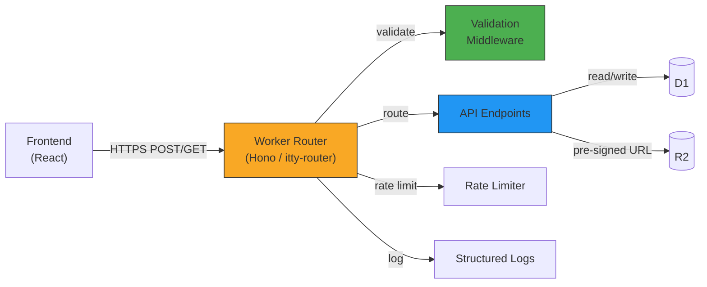
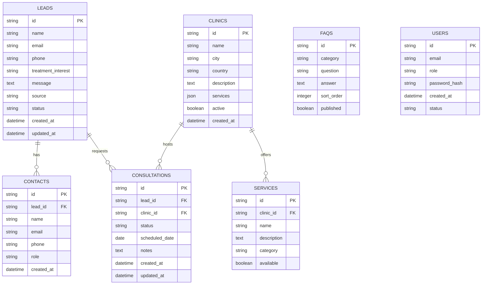
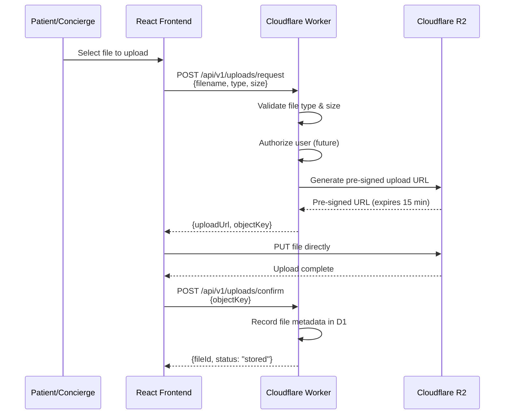
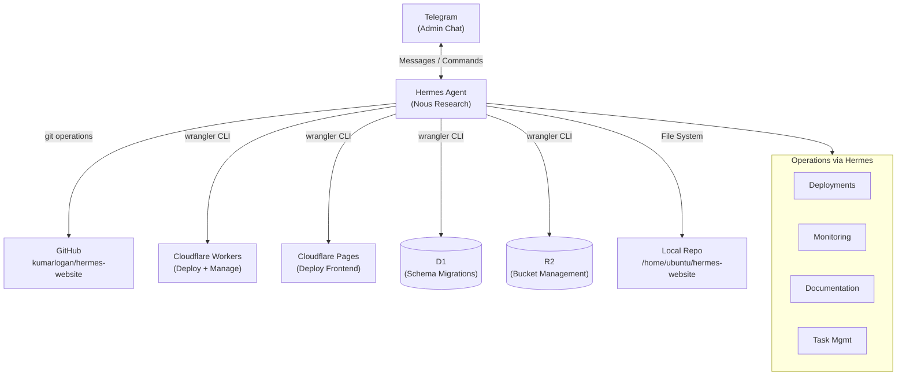
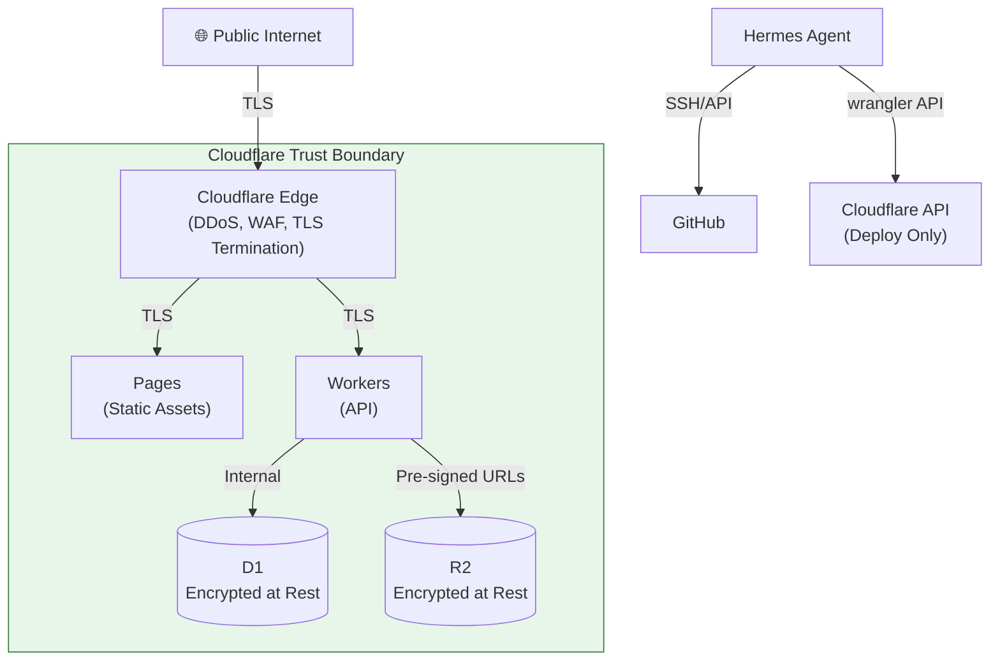

# AG Synergy Platform — System Architecture

> Version 2.0 | 2026-07-18
>
> Defines the technical architecture for AG Synergy Phase 1: Concierge Platform
> Foundation. This document describes how platform components interact and
> establishes the structural foundation for all Phase 1 development.
>
> **Related Documents:**
> - [`PROJECT.md`](./PROJECT.md) — Project constitution (highest authority)
> - [`PRODUCT_BOUNDARIES.md`](./PRODUCT_BOUNDARIES.md) — Product scope and phase boundaries
> - [`AI_OPERATING_MODEL.md`](./AI_OPERATING_MODEL.md) — AI agent roles and authority
> - [`DECISIONS.md`](./DECISIONS.md) — ADR index
> - [`docs/decisions/ADR-001-cloudflare-migration.md`](./docs/decisions/ADR-001-cloudflare-migration.md) — Governing migration strategy

---

## 1. Architecture Overview

AG Synergy is a **Cloudflare-first digital fertility concierge platform** that connects
Canadian patients with carefully selected fertility clinics in India. The
architecture prioritizes low operational cost, simplicity, security, and
modularity — enabling rapid MVP development while preserving a clear path to
future expansion.

### Core Architectural Principle

> **The public website is only one interface into a larger operational platform.**

The static marketing website at agsynergy.ca is the patient-facing entry point.
Behind it sits a structured platform of APIs, databases, storage, and an
AI-assisted operations layer. Each component has a single, well-defined
responsibility. Components communicate through documented contracts. No component
reaches across its boundary to assume another component's role.

### Design Goals

| Goal | Architecture Response |
|---|---|
| Low-cost MVP | Free-tier-first: Cloudflare Pages, Workers, D1, and R2 all offer generous free allowances. Pay-as-you-go scaling — no upfront infrastructure investment. |
| Future scalability | Serverless compute (Workers) and edge-native storage (D1, R2) scale automatically with demand. No server provisioning, no capacity planning. |
| Security | Least-privilege at every layer. Encryption in transit (TLS) and at rest. PHI protection by design. Access controls enforced at the API boundary. |
| Modularity | Independent components with defined interfaces. Frontend, API, database, storage, and operations are separable. Any component can be replaced without redesigning the system. |
| AI-assisted operations | Hermes Agent integrates at the operations layer — not in the critical data path. AI assists development, deployment, and administration without touching patient data directly. |

---

## 2. High-Level Architecture Diagram

```mermaid
graph TD
    User["🧑 User / Patient"]
    Concierge["👩‍💼 Concierge Staff"]
    Clinic["🏥 Partner Clinic"]

    User -->|HTTPS| CFPages["Cloudflare Pages<br/>(Static Hosting + CDN)"]
    CFPages -->|Serves| Frontend["React + Vite<br/>(TypeScript)"]

    Frontend -->|REST / fetch| CFWorkers["Cloudflare Workers<br/>(API + Business Logic)"]

    CFWorkers -->|SQL (D1 Client API)| D1[("Cloudflare D1<br/>(SQLite-Compatible)")]
    CFWorkers -->|S3-Compatible API| R2[("Cloudflare R2<br/>(Object Storage)")]

    Concierge -->|Telegram| HermesLayer["Hermes AI<br/>Operations Layer"]
    Clinic -->|Future: Clinic Portal| CFWorkers

    HermesLayer -->|wrangler / gh CLI| CFWorkers
    HermesLayer -->|wrangler CLI| CFPages
    HermesLayer -->|gh CLI| GitHub["GitHub<br/>(Source Repository)"]
    HermesLayer -->|Notification / Command| Telegram["Telegram<br/>(Admin Interface)"]

    subgraph Cloudflare ["Cloudflare Ecosystem"]
        CFPages
        CFWorkers
        D1
        R2
    end

    subgraph Operations ["Operations & Admin"]
        HermesLayer
        Telegram
        GitHub
    end
```

### Component Summary

| Component | Technology | Role | Status |
|---|---|---|---|
| Static Hosting | Cloudflare Pages | Serve React frontend; global CDN; git-integrated deploys | **Deployed** |
| Frontend | React 18 + Vite 7 + TypeScript | Patient-facing UI; forms; information presentation | **Deployed** |
| API Layer | Cloudflare Workers | REST endpoints; business logic; validation; DB access | **Planned** (Phase 1) |
| Database | Cloudflare D1 (SQLite) | Structured data: leads, contacts, consultations, clinics, FAQs | **Planned** (Phase 1) |
| Object Storage | Cloudflare R2 (S3-compatible) | Documents, images, files | **Planned** (Phase 1) |
| Admin Interface | Telegram + Hermes Agent | Repository operations; deployment; monitoring | **Active** |
| Source Control | GitHub (`kumarlogan/hermes-website`) | Canonical source; CI/CD; PR workflow | **Active** |

---

## 3. Frontend Architecture

### Technology Stack

| Layer | Technology | Version |
|---|---|---|
| UI Framework | React | 18.x |
| Build Tool | Vite | 7.x |
| Language | TypeScript | Latest |
| Styling | Tailwind CSS | 4.x |
| Package Manager | pnpm | 11.13.1 |
| Hosting | Cloudflare Pages | — |

### Responsibilities

The frontend is responsible for **presentation and user interaction only**. It
does not contain sensitive business logic, database access, or authorization
decisions.

| Responsibility | Description |
|---|---|
| User interface | Render pages, components, and layouts that present AG Synergy's services and content to patients |
| Information presentation | Display treatment information, clinic profiles, FAQs, educational content, and journey guidance — all sourced from typed data modules in `src/data/` |
| Forms | Capture user input (consultation requests, contact forms) with client-side validation |
| Client-side validation | Validate form inputs before submission — field requirements, format checks, completeness |
| API communication | Send validated form data to Cloudflare Workers endpoints via `fetch`; receive and display API responses |
| Routing and navigation | Client-side routing for multi-page experience |
| Accessibility | Semantic HTML, ARIA labels, keyboard navigation, screen-reader compatibility |

### Explicitly Excluded from Frontend

- ❌ Database queries or direct database access
- ❌ Business logic (eligibility rules, workflow decisions, pricing calculations)
- ❌ Authentication or authorization decisions (token verification belongs in Workers)
- ❌ PHI processing or storage (all sensitive data flows through the API layer)
- ❌ Server-side rendering or API endpoint logic
- ❌ Email sending or notification dispatch

### Architectural Boundaries

```
┌─────────────────────────────────────────────────┐
│                 Cloudflare Pages                 │
│  ┌───────────────────────────────────────────┐  │
│  │         React + Vite Application          │  │
│  │                                           │  │
│  │  ┌─────────┐  ┌─────────┐  ┌──────────┐  │  │
│  │  │  Pages  │  │  Forms  │  │   Data   │  │  │
│  │  │(routes) │  │(capture)│  │(content) │  │  │
│  │  └────┬────┘  └────┬────┘  └──────────┘  │  │
│  │       │            │                      │  │
│  │       └─────┬──────┘                      │  │
│  │             │                              │  │
│  │    ┌────────┴────────┐                    │  │
│  │    │  API Client     │                    │  │
│  │    │  (fetch)        │                    │  │
│  │    └────────┬────────┘                    │  │
│  └─────────────┼─────────────────────────────┘  │
└────────────────┼────────────────────────────────┘
                 │ HTTPS
                 ▼
┌────────────────┼────────────────────────────────┐
│    Cloudflare Workers (API Boundary)             │
└─────────────────────────────────────────────────┘
```

---

## 4. Backend Architecture

### Technology Stack

| Layer | Technology | Status |
|---|---|---|
| Compute | Cloudflare Workers | Planned (Phase 1) |
| Runtime | Workers (V8 isolates) | — |
| Language | TypeScript | — |
| Framework | Hono or itty-router (TBD) | — |
| Deployment | wrangler@4 CLI | Active |

### Responsibilities

The Workers API layer is the **authoritative backend** — all business logic,
validation, and data access flow through it. The frontend never communicates
directly with D1 or R2.

| Responsibility | Description |
|---|---|
| API endpoints | RESTful endpoints for form submissions, content retrieval, and administrative operations |
| Business logic | Workflow rules, data transformation, lead routing, consultation eligibility checks |
| Validation | Server-side validation of all incoming data — required fields, format, business rules, referential integrity |
| Authentication & authorization | **Live (EPIC-002-002):** provider-agnostic `src/auth/` engine enforces RBAC at the Worker edge — `authorize()`/`requirePermission()` guards, data-driven permission resolution (deny-wins, OWNER short-circuit), and `audit_logs` on every decision. Opt-in: applied per-route, existing Epic 1 endpoints untouched. |
| Database communication | All D1 reads and writes go through Workers; Workers own the database connection |
| Storage orchestration | Generate pre-signed URLs for R2 uploads; manage file metadata; enforce storage policies |
| Rate limiting | Protect API endpoints from abuse; enforce per-endpoint rate limits |
| Error handling | Consistent error responses; no stack traces or internal details leaked to clients |
| Logging | Structured logs for debugging, auditing, and monitoring |

### Explicitly Excluded from Backend

- ❌ Rendering HTML or serving static assets (Cloudflare Pages handles this)
- ❌ Medical decisions, diagnosis, or clinical logic (see PRODUCT_BOUNDARIES.md)
- ❌ Patient-facing AI interactions (Hermes is operations-only)
- ❌ Direct external SMTP/email sending in Phase 1 (defer to a service or future worker)
- ❌ Payment processing (not in Phase 1 scope)

#### Authorization Engine (EPIC-002-002 — Live)

The Worker owns authorization via a standalone, provider-agnostic engine in
`workers/src/auth/`. It is **opt-in** (applied per route with `authorize()` or
`requirePermission()` guards) and does **not** auto-wire into existing Epic 1
endpoints.

- **Identity resolution** — `IdentityResolver` registry; ships
  `TelegramIdentityResolver` mapping the `X-Telegram-Chat-Id` header to
  `users.external_id`. New providers (dashboard, mobile) register their own
  resolver without touching permission logic.
- **Principal** — `buildPrincipal()` resolves the `users` row → role → a
  `Principal` that exposes only the logical `provider` name (never the raw
  identity-provider identifier).
- **Permission resolution** — `resolveEffectivePermissions()` / `hasPermission()`
  read `role_permissions` + `user_permissions` from D1. **Deny wins** (a
  `revoke` override removes a role-granted capability), and `OWNER` short-circuits
  to authorized. No hardcoded role→permission maps (ADR-003).
- **Audit** — `AuditMiddleware` appends a row to `audit_logs` on every allow and
  deny decision.
- **Tests** — 14 unit + 11 integration (real Miniflare D1) tests; 74 Epic 1
  tests remain green.

See `docs/database/RBAC_DESIGN.md` §6 for the full contract, module layout, and
resolution flow.

#### Operations API (EPIC-002-003A — Live)

The first consumer of the authorization engine. Internal operations endpoints
under `/api/v1/ops/*` power the **Operations Telegram Bot** (live since 1.5.0),
future dashboard, and mobile interface. The bot is a pure client of these
endpoints — it dispatches to the same handler functions via `callOps()` inside
the Worker, no separate process or HTTP round-trip. All handlers live in `workers/src/routes/ops.ts` and call a thin
service layer in `workers/src/services/opsService.ts`; RBAC is enforced entirely
by the `requirePermission()` guard wired in `workers/src/index.ts` — no role
logic in the route or service code.

- **Endpoints** — `GET /leads`, `GET /leads/mine`, `GET /leads/:id`,
  `PATCH /leads/:id`, `POST /leads/:id/assign`, `GET /dashboard`,
  `GET /timeline`. Permissions: `leads.read` (list/detail/mine/dashboard/
  timeline), `leads.update` (patch), `leads.assign` (assign).
- **Service layer** — pure functions over D1 (`listLeads`, `getLead`,
  `updateLead`, `assignLead`, `myLeads`, `getDashboard`, `getTimeline`).
  `opsService` is provider-agnostic and unit-testable without HTTP.
- **Audit** — assignment and every permission decision are written to
  `audit_logs` (the audit write now sets `updated_at` to match the
  `audit_logs` schema added in migration 0002).
- **Tests** — 21 Ops API integration tests (authorization, listing, detail, update,
  assign, me, dashboard, timeline) on real Miniflare D1 via
  `@cloudflare/vitest-pool-workers`. **Plus 21 Operations Bot integration tests**
  (command parsing, identity, RBAC enforcement, user-safe formatting) in
  `workers/tests/telegram/bot.integration.test.ts`. Full suite: **141 tests passing**.

### API Design Principles

- **RESTful** — resource-oriented endpoints with standard HTTP methods and status codes
- **JSON-only** — request and response bodies are JSON; no form-encoded, XML, or GraphQL in Phase 1
- **Versioned** — API paths include a version prefix (`/api/v1/`) to allow non-breaking evolution
- **Stateless** — Workers are inherently stateless; session state (when added) uses signed tokens or D1-backed sessions
- **Idempotent where possible** — `GET`, `PUT`, and `DELETE` are idempotent; `POST` creates new resources
- **Consistent error format** — all errors return `{ "error": { "code": "...", "message": "..." } }`

### API Architecture Diagram



---

## 5. Database Architecture

### Technology

| Attribute | Detail |
|---|---|
| Database | Cloudflare D1 |
| Engine | SQLite (VFS over Cloudflare's distributed storage) |
| Access Pattern | Via D1 Client API from Workers only |
| Free Tier | 5 GB storage, 5 million reads/day |
| Schema Management | SQL migration files, applied via wrangler CLI |

### Initial Entity Model (Phase 1)



### Entity Summary

| Entity | Purpose | Phase 1 Status |
|---|---|---|
| `leads` | Consultation requests, contact form submissions, inquiry tracking | **Active** — migrated from existing form |
| `contacts` | Additional contacts associated with a lead (partners, referrals) | **Active** |
| `consultations` | Scheduled and completed consultations between patients and clinics | **Active** |
| `clinics` | Partner clinic profiles: location, services, status | **Active** — replaces static TypeScript arrays |
| `services` | Treatments and services offered by each clinic | **Active** |
| `faqs` | Frequently asked questions with categories and ordering | **Active** — replaces static TypeScript arrays |
| `users` | Authentication and authorization (concierge staff, clinic staff) | **Live** — RBAC engine enforces authorization at the Worker edge (EPIC-002-002); `users` resolved via `external_id` |

### Schema Governance

- **Schema evolves through ADRs.** Any structural change to the database — new
  tables, column changes, relationship modifications — must be accompanied by an
  Architecture Decision Record in `docs/decisions/`.
- **Migration files are the source of truth.** The D1 schema is defined by SQL
  migration files in `migrations/`. The live database matches the applied
  migration set. No manual schema changes.
- **All access through Workers.** No component other than a Cloudflare Worker
  connects to D1. The frontend never queries D1 directly.
- **No foreign keys in D1.** D1 is SQLite-based — foreign key constraints are
  enforced at the application layer in Workers, not at the database engine level.
  Referential integrity is maintained through API-level validation.

---

## 6. Storage Architecture

### Technology

| Attribute | Detail |
|---|---|
| Service | Cloudflare R2 |
| API | S3-compatible |
| Free Tier | 10 GB storage, 10 million Class A operations/month, 10 million Class B operations/month |
| Access Pattern | Pre-signed URLs generated by Workers; direct upload/download by clients |

### Planned Usage (Phase 1)

| Category | Examples |
|---|---|
| Documents | Patient-uploaded medical records, consent forms, test results (PDF, DOCX) |
| Images | Clinic photos, treatment diagrams, educational illustrations |
| Files | Export files, reports, administrative documents |

### Security Considerations

| Concern | Protection |
|---|---|
| Unauthorized access | All R2 access goes through Workers, which enforce authentication and authorization before generating pre-signed URLs |
| Direct bucket exposure | R2 buckets are not publicly accessible; no public bucket policies |
| Upload validation | Workers validate file type, size, and ownership before issuing upload URLs |
| Encryption at rest | R2 provides server-side encryption; all objects are encrypted at rest |
| Encryption in transit | All transfers use TLS; pre-signed URLs are time-limited |

---

## 7. Workforce Persistence (EPIC-005 Phase 5)

The workforce persistence layer implements durable storage for workforce-specific agent state, activation requests, and audit events using Cloudflare D1 (SQLite).

### Schema

The D1 schema includes three tables:

1. `workforce_agents` - Stores workforce-specific agent state
2. `agent_activation_requests` - Tracks agent activation requests for workflow tasks
3. `agent_audit_events` - Records audit events for agent lifecycle and activation
4. `workforce_metrics` - Stores operational metrics for observability

### Implementation

The persistence layer follows a repository pattern with a provider-neutral backend interface:

- `WorkforceRepository` - The public API for workforce persistence
- `WorkforcePersistenceBackend` - Provider-neutral interface for persistence backends
- `D1WorkforceBackend` - Cloudflare D1 implementation of the backend
- `MemoryWorkforceBackend` - In-memory implementation for development/testing

### Data Ownership Model

- Agent lifecycle state is primarily owned by the agent-state-store but replicated to `workforce_agents` for workforce-specific queries
- Activation requests are owned by the workforce service and stored in `agent_activation_requests`
- Audit events are owned by the workforce service and stored in `agent_audit_events`
- Metrics are owned by the workforce service and stored in `workforce_metrics`

### Recovery Behavior

- State persists across process restarts
- Approved activations survive restarts
- Audit history is preserved
- Metrics are preserved for operational visibility
- Permanent disable states are preserved
- Failed transactions do not partially update state due to D1's ACID compliance

## 8. Workforce Activation Workflow (EPIC-005 Phase 5)

The workforce activation workflow implements a controlled process for safely activating workforce agents with proper approvals and validation.

### Activation Command Workflow

The activation workflow provides the following operator actions:

- `listEligibleAgents()` - List all agents eligible for activation
- `requestActivation(agentId, requestedBy, reason)` - Request activation for an agent
- `approveActivation(requestId, approvedBy)` - Approve an activation request
- `rejectActivation(requestId, rejectedBy, reason)` - Reject an activation request
- `assignTestTask(agentId, taskSpec)` - Assign a test task to verify agent functionality
- `reviewExecutionResult(taskId)` - Review the results of a test task execution

### Activation Readiness Validation

Before activation, the system verifies:

- Agent exists in the registry
- Agent is not permanently disabled
- Required capabilities exist
- Approval reference exists
- Safety checks pass
- Observability is connected

### Activation Checklist

Required items before first activation:

- [x] Lifecycle approved
- [x] Persistence confirmed
- [x] Audit enabled
- [x] Metrics enabled
- [x] Capability providers available
- [x] Rollback path available

### Dry-Run Mode

The `simulateActivation(agentId)` function provides a dry-run mode that shows:

- Required approvals
- Capabilities needed
- Potential risks
- Expected execution path

Without changing any state.

### Safety Features

The activation workflow includes several safety features:

- **Approval-based activation** - All activations require explicit approval
- **Validation checks** - Multiple validation points before activation
- **Audit trail** - Complete audit logging of all activation-related actions
- **Observability integration** - Metrics and health monitoring during activation
- **Safety violation detection** - Automatic detection of safety violations
- **Rollback capability** - Ability to deactivate agents if needed

This workflow ensures that agents are only activated after proper validation and approval, maintaining the safety and integrity of the workforce platform.

### Storage Flow



> **Note:** Direct client-to-R2 uploads reduce Worker egress costs and latency.
> Workers mediate access (authorization, URL generation, metadata) without
> handling the file bytes themselves.

---

## Workforce Approval Lifecycle & Notification (Recovery 2026-07-26)

The workforce orchestration layer manages a complete approval lifecycle for
every task that requires human authorization before execution. Notifications
are emitted at every lifecycle transition through the existing notification
service.

### Approval Lifecycle

Each task in a workflow passes through the following approval states:

```
requested → [granted | rejected | expired]
```

| State | Trigger | Effect |
|-------|---------|--------|
| **requested** | `requestTaskApproval()` called during dispatch | Task enters `waiting` state; pending approval recorded in `wf.approvals`; notification sent |
| **granted** | `grantTaskApproval()` called by an authorized approver | Task removed from pending set; added to `wf.grantedApprovals`; queue may now execute it; notification sent |
| **rejected** | `rejectTaskApproval()` called by an authorized approver | Task removed from pending set; workflow stays `waiting` if other approvals remain, or transitions to `failed` if this was the last pending approval; notification sent |
| **expired** | `runTask()` finds a pending request past its `expiresAt` | Pending request removed automatically; task cannot run; re-request required; notification sent |

### Authorization Model

Approval operations require specific permissions enforced at the function
boundary:

| Operation | Required Permission | Authorized Principals |
|-----------|--------------------|-----------------------|
| Request approval | `hermes:admin:workforce-write` | Assigned workflow principals |
| Grant approval | `hermes:admin:workforce-write` | Human administrators |
| Reject approval | `hermes:admin:workforce-write` | Human administrators |
| Execute approved task | `hermes:admin:workforce-write` + in `wf.grantedApprovals` | Human operators (granted approval) |

No principal may autonomously execute a task that has a pending or un-granted
approval request. The `runTask()` function enforces **two independent fail-closed
gates**:
1. A pending approval ALWAYS blocks execution, regardless of environment.
2. A task flagged `requiresApproval` (production environment or
   capability-flagged) MUST have an explicit human grant in `grantedApprovals`.

### Expiration Policy

Approval requests expire **15 minutes** after creation (`APPROVAL_TTL_MS`).
Expired requests are detected at `runTask()` time — the pending entry is removed
from `wf.approvals` and an `Approval Expired` notification is emitted. The caller
must re-request approval to proceed.

### Notification Flow

The orchestration layer reuses the existing `notify()` service from
`hermes/services/notification/notification.ts`, which fans out through a
`NotificationProvider` interface. Four lifecycle events trigger notifications:

| Event | Notification Subject | Channel | Recipient |
|-------|---------------------|---------|-----------|
| Approval requested | `Approval Requested` | telegram | The actor who requested |
| Approval granted | `Approval Granted` | telegram | The approver |
| Approval rejected | `Approval Rejected` | telegram | The rejector |
| Approval expired | `Approval Expired` | telegram | The executor attempting the run |

Notifications are fire-and-forget (`void notify(...)`) — delivery failures do
not block the orchestration lifecycle. Every notification is also recorded in
the audit trail via `emitAudit("notification.send", ...)`.

### rejectTaskApproval()

Added during recovery (2026-07-26). Rejects a pending approval by:

1. Validating the task exists in the workflow
2. Validating a pending approval exists for the task
3. Marking the request state as `rejected`
4. Removing the request from `wf.approvals`
5. Emitting `workflow.approval.rejected` audit event
6. Transitioning the workflow to `failed` if no approvals remain, or staying
   in `waiting` if other pending approvals exist
7. Sending an `Approval Rejected` notification

```ts
rejectTaskApproval(workflowId, itemId, rejector): Promise<Workflow>
```

---

## 7. Hermes Integration Architecture

Hermes Agent (by Nous Research) is the **AI orchestration and operations
assistant** for the AG Synergy platform. It operates via Telegram as the primary
administrative interface — executing repository operations, automating workflows,
and assisting the development and concierge teams.

### What Hermes Is Not

- ❌ Hermes is **not** a replacement for healthcare professionals
- ❌ Hermes is **not** a patient-facing AI
- ❌ Hermes does **not** make medical decisions, diagnoses, or clinical recommendations
- ❌ Hermes does **not** access or process patient data directly
- ❌ Hermes does **not** approve deployments or production changes without human confirmation

### Integration Architecture



### Hermes Responsibilities

| Domain | Activities |
|---|---|
| Repository operations | Branch management, PR creation, code review, merge coordination |
| Workflow automation | CI/CD pipeline management, build verification, deployment orchestration |
| Notifications | Deployment status, error alerts, build failures, documentation drift warnings |
| Administrative assistance | Task tracking, sprint planning, documentation generation and validation |
| Content workflows | Copy updates, SEO review, accessibility checks on static content |
| System monitoring | Uptime checks, error rate alerting, performance observation |
| Schema management | D1 migration application, schema validation, data integrity verification |

### Operational Boundaries

The following actions require **explicit human confirmation** before Hermes executes:

| Category | Examples |
|---|---|
| Production deployments | `wrangler deploy` to production Workers or Pages |
| Database migrations | D1 schema changes against production data |
| DNS changes | Domain or subdomain record modifications |
| Security configuration | Token creation, access policy changes, encryption key rotation |
| Data operations | Bulk updates, deletions, or exports of patient data |
| Financial changes | Service tier upgrades, paid feature activation |

### Hermes in the Data Flow

```
Patient Data Flow:     Patient → Frontend → Workers → D1/R2
                               ↑                    ↑
                               │                    │
                         Hermes does NOT        Hermes does NOT
                         touch this path        touch this path

Operations Flow:       Developer → Telegram → Hermes → GitHub/Cloudflare
                         ↑               ↑          ↑
                         │               │          │
                    Human initiates   Hermes     Hermes executes
                    via Telegram      reasons    via tools
```

Hermes operates in a **parallel, isolated operations plane** — it manages the
platform without processing the data the platform handles. This separation
ensures that patient data never touches an AI model and that AI operations
cannot inadvertently expose or corrupt sensitive information.

---

## 8. Security Architecture

### Security Principles

| Principle | Implementation |
|---|---|
| **Least privilege** | Every component operates with the minimum permissions required. Workers have access only to the D1 databases and R2 buckets they need. Hermes has no access to D1 or R2 data. GitHub tokens are scoped to the repository. |
| **Secure API design** | All API endpoints require HTTPS. Input validation occurs at the Worker boundary. Rate limiting protects against abuse. Error responses never leak stack traces, internal paths, or database details. |
| **Data minimization** | Only necessary data is collected. Every form field, database column, and log entry must be justified. Regular audits identify and purge unnecessary data. See PRODUCT_BOUNDARIES.md §5. |
| **Encryption** | TLS for all data in transit. Server-side encryption for all data at rest (D1, R2). Secrets managed through Cloudflare's secrets storage — never in code, config files, or environment variables. |
| **Access controls** | API-level authentication and authorization (prepared now, activated in Phase 2). Role-based access: patients, concierge staff, clinic staff, administrators. Access is revocable and auditable. |
| **Auditability** | All security-relevant events are logged: access to patient data, schema changes, deployments, configuration modifications. Logs answer: who did what, when, and from where. |

### Security Boundaries



### Phase 1 Security Posture

| Area | Phase 1 Implementation | Future Enhancement |
|---|---|---|
| Transport security | ✅ TLS enforced at Cloudflare edge | — |
| API authentication | None (public informational API) | **Live RBAC** — `src/auth/` engine enforces authorization on protected routes via `requirePermission()` guards (EPIC-002-002); public endpoints remain open |
| Secrets management | ✅ Cloudflare Worker secrets | — |
| Rate limiting | Per-endpoint rate limits in Workers | Advanced bot detection (Phase 3) |
| Input validation | ✅ Worker middleware (type + content checks) | Schema-based validation |
| Database access | ✅ Workers only; no external D1 access | — |
| Object storage | Pre-signed URLs; no public buckets | — |
| Audit logging | ✅ Structured logs in Workers | Centralized log retention (Phase 3) |
| PHI protection | ✅ No PHI collected in Phase 1 | Full PHI controls (Phase 2) |

---

## 9. Future Expansion Compatibility

The Phase 1 architecture is designed to evolve without requiring a complete
redesign. Each future capability maps to existing architectural seams.

### Expansion Pathways

| Future Capability | How the Architecture Supports It | What Changes |
|---|---|---|
| **Patient Portal** (Phase 2) | Workers already provide an API boundary; D1 schema includes a `users` table; the RBAC authorization engine (`src/auth/`) is live and enforces provider-agnostic RBAC | Add a Patient `IdentityResolver` (e.g. `PatientIdentityResolver`) + patient-facing routes; expand `users` table with patient profile fields; apply `requirePermission()` guards to new routes |
| **Clinic Portal** (Phase 3) | Workers support role-based routing; D1's `clinics` and `consultations` tables already exist; the authorization engine already resolves `role_permissions` + `user_permissions` from D1 | Add a Clinic-staff `IdentityResolver`; add clinic-specific API endpoints; apply `requirePermission()` guards — no new authorization framework needed |
| **AI Concierge** (Phase 4) | Hermes already demonstrates the AI integration pattern; Workers can route to AI services without architectural change | Add AI service integration (separate Worker or Worker binding); AI operates on structured D1 data — no architecture change needed |
| **Analytics** | D1 contains structured operational data; Workers can aggregate and expose metrics; R2 can store exported reports | Add analytics-specific Workers or Worker endpoints; add analytics dashboard to React app; no database schema change — just queries |
| **Automation** (Phase 4) | Hermes already handles operational automation; Workers are inherently event-driven (Cron Triggers, Queues) | Add Cloudflare Queues or Cron Triggers for scheduled workflows; Workers execute automated tasks using existing D1 and R2 access |

### Architectural Seams (Extension Points)

| Seam | Purpose | How to Extend |
|---|---|---|
| Worker Router | All API traffic passes through a single routing layer | Add new route handlers for new domains (patient, clinic, analytics) without modifying existing routes |
| D1 Schema | Structured data model with prepared expansion tables | Add new tables and columns via migration files; existing tables are designed to accommodate new relationships |
| React Router | Client-side routing separates concerns by audience | Add new route groups (`/patient/`, `/clinic/`, `/admin/`) that render different component trees |
| Hermes Skills | Operational capabilities are modular skills | Add new skills for new operational domains (analytics reporting, clinic onboarding) without changing core Hermes integration |

### Immutable Architectural Commitments

These decisions will **not** change as the platform expands:

- ✗ The frontend will never connect directly to D1 or R2
- ✗ Patient data will never flow through Hermes or any AI model
- ✗ The Workers API will remain the sole backend entry point
- ✗ The platform will remain Cloudflare-first — no multi-cloud complexity without an ADR
- ✗ TypeScript will remain the single language across frontend and backend
- ✗ Healthcare provider responsibilities (diagnosis, treatment, prescribing) will never shift to the platform or to AI

---

## 10. Phase 1 Non-Goals

The following capabilities are **explicitly excluded** from Phase 1. They are not
in scope, not planned, and not designed for in the current architecture — though
the architecture does not preclude their future addition.

### Not Included in Phase 1

| Non-Goal | Rationale |
|---|---|
| **Medical decision systems** | The platform is a concierge tool, not a medical device. Clinical decisions remain exclusively with healthcare providers. See PRODUCT_BOUNDARIES.md §3. |
| **Clinical diagnosis** | AI does not diagnose. The platform does not assess, suggest, or imply any medical condition. |
| **Full healthcare records / EMR** | AG Synergy organizes journey-related documents — it is not an electronic medical record system. No integration with hospital EMR systems in Phase 1. |
| **Payment platform** | No payment processing, invoicing, or financial transactions. The platform may link to external payment services but does not process payments itself. |
| **Clinic SaaS portal** | Partner clinics do not have platform accounts in Phase 1. Clinic data is managed internally by concierge staff. Clinic-facing dashboards arrive in Phase 3. |
| **Patient authentication** | Patients do not create accounts or log in. The public website is informational with a consultation form. Patient accounts arrive in Phase 2. |
| **Real-time messaging** | No chat, WebSocket connections, or real-time notifications. Communication flows through email and structured form submissions. |
| **Telemedicine / video consultation** | No video, audio, or real-time clinical communication. Consultations are scheduled through the platform but conducted externally. |
| **Multi-language i18n** | The platform is English-only in Phase 1. Internationalization infrastructure can be added later without architectural change. |
| **Mobile application** | No native iOS or Android app. The responsive web application serves all devices. |

### Phase 1 Scope Boundary

```
┌─────────────────────────────────────────────────────────────┐
│                     PHASE 1 SCOPE                           │
│                                                             │
│  ✅ Static marketing website (deployed)                     │
│  ✅ Consultation request form (deployed)                    │
│  ✅ Automated deployment pipeline (active)                  │
│  ✅ Hermes admin operations (active)                        │
│  ✅ Engineering documentation (in progress)                 │
│  ⬜ Cloudflare Workers API (to build)                       │
│  ⬜ D1 database + schema (to build)                         │
│  ⬜ R2 storage configuration (to build)                     │
│  ⬜ Worker API: lead capture, clinic listing, FAQ serving   │
│  ⬜ Concierge workflow tools (Hermes-managed)               │
│                                                             │
├─────────────────────────────────────────────────────────────┤
│                     OUT OF SCOPE                            │
│                                                             │
│  ❌ Patient accounts and authentication                     │
│  ❌ Patient portal / dashboard                              │
│  ❌ Clinic-facing interfaces                                │
│  ❌ Payment processing                                      │
│  ❌ Medical decision support                                │
│  ❌ EMR integration                                         │
│  ❌ Real-time messaging                                     │
│  ❌ Native mobile apps                                      │
│                                                             │
└─────────────────────────────────────────────────────────────┘
```

---

## Appendix A: Technology Stack Reference

| Layer | Technology | Status | Free Tier Limit |
|---|---|---|---|
| Frontend Hosting | Cloudflare Pages | **Deployed** | Unlimited sites, 500 builds/month |
| Frontend Framework | React 18 + Vite 7 + TypeScript | **Deployed** | — |
| Styling | Tailwind CSS 4 | **Deployed** | — |
| Backend Compute | Cloudflare Workers | **Deployed** | 100,000 requests/day |
| Database | Cloudflare D1 | **Deployed** | 5 GB, 5M reads/day |
| Object Storage | Cloudflare R2 | **Configured** | 10 GB, 10M ops/month |
| Source Control | GitHub | **Active** | Unlimited public repos |
| CI/CD | GitHub Actions (via wrangler) | **Active** | 2,000 min/month |
| Admin Interface | Telegram + Hermes Agent | **Active** | — |
| Package Manager | pnpm 11.13.1 | **Active** | — |

## Appendix B: Document History

| Version | Date | Changes |
|---|---|---|
| 1.0 | 2026-07-18 | Placeholder — high-level diagram and component map |
| 2.0 | 2026-07-18 | Complete architecture document: all 10 sections, diagrams, entity model, security boundaries, expansion pathways |

---

*End of System Architecture. Version 2.0, ratified 2026-07-18.*