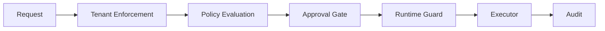

# HERMES PLATFORM — PROJECT STATE AUDIT
## Generated: 2026-07-25 | Mode: Read-Only | Branch: main @ 85980e9

---

## META

```yaml
audit_date: 2026-07-25
audit_mode: read-only
repository: kumarlogan/concierge-website
branch: main
commit: 85980e9
last_commit_message: "docs: EPIC-005.9 Execution Gateway release notes"
ahead_of_origin: 39
modified_unstaged_files: 2
  - hermes/services/workforce/orchestration.ts
  - workers/vitest.config.ts
untracked_files: 193
total_ts_files: 330
total_test_files: 50
test_files_passing: 42
individual_tests_passing: 558
typescript_errors: 0
```

---

## 1. EXECUTIVE SUMMARY

```yaml
project_name: AG Synergy Platform
project_type: Digital fertility concierge platform
tech_stack:
  - Cloudflare Pages (React + Vite + Tailwind)
  - Cloudflare Workers (TypeScript API)
  - Cloudflare D1 (SQLite database)
  - Hermes Agent (AI operations layer)
  - Telegram (admin interface)
  - GitHub (source control + CI/CD)

maturity_level: v1.0 Stabilized
current_phase: Post-stabilization freeze
completion_percent: 80
test_suite_passing: true
test_count: 558/558
ts_errors: 0

platform_state: FROZEN — no new features until next EPIC begins
```

### Completion by Area

| Area | Completion | Status |
|------|-----------|--------|
| Frontend (React website) | 100% | Deployed to Cloudflare Pages |
| Workers API | 95% | Implemented + tested, not production-deployed |
| D1 Schema & Migrations | 80% | 5 migrations, 21 tables |
| R2 Storage | 0% | Not implemented |
| RBAC / Auth Engine | 95% | Live, tested, Telegram identity resolver |
| Hermes Platform Core | 90% | Frozen + validated |
| Execution Gateway | 100% | Complete |
| Workforce Orchestration | 100% | 8-state, persistence hooks, all tests pass |
| Agent Registry & Lifecycle | 100% | 12 agents seeded, all disabled |
| Security Automation | 85% | Framework complete, simulated scanners |
| Developer Pipeline | 100% | Simulation-only, complete |
| Deployment (AGS) | 70% | Staging-ready, production gated |
| Monitoring | 10% | Stubs exist |
| Telegram Bot | 100% | 12+ commands, 21 integration tests |

### Biggest Remaining Milestones
1. Activate first real workforce agent (research-agent controlled validation)
2. Wire real deployment backends (GitHub + Cloudflare credentials)
3. EPIC-002-005: Hermes Admin Bot
4. Epic 2: Frontend ↔ Worker API integration
5. Epic 3: Concierge workflow tools

---

## 2. ORIGINAL VISION

### Project Goals
- Digital fertility concierge connecting Canadian patients with Indian clinics
- Human-centered technology: AI augments concierge staff, never replaces
- Automation of repetitive tasks; humans handle empathy
- Not a medical device or diagnostic tool
- No PHI collection

### Product Boundaries
- **Core services:** Patient education, clinic matching, consultation scheduling, document organization, travel coordination, journey tracking
- **Excluded:** Medical diagnosis, prescriptions, clinical decisions, payment processing
- **AI prohibited from:** Diagnosing, prescribing, overriding medical professionals, guaranteeing outcomes, making clinical decisions

### Intended Architecture
- Cloudflare-first: Pages (static frontend) + Workers (API) + D1 (database) + R2 (storage)
- Single Workers API boundary for all business logic
- Hermes AI at admin/operations layer only — never touches D1 or patient data
- Provider-neutral execution gateway as single trust boundary
- All AI agents disabled + non-autonomous by default

### Key Architecture Decisions

| ADR | Title | Summary |
|-----|-------|---------|
| ADR-001 | Cloudflare Migration Strategy | Move from Express server to Cloudflare Workers |
| ADR-002 | Multi-Agent Ops Architecture | All interfaces through Workers API only |
| ADR-003 | Permission Resolution Strategy | Data-driven, no hardcoded role→permission maps |
| ADR-005 | Hermes Platform | Foundation for AI operations layer |
| ADR-006 | Organization Resource Registry | Registry pattern for agent resources |
| ADR-007 | Hermes Platform Extraction | Separate `hermes/` from product code |
| ADR-008 | Hermes Platform Core Services | Identity, authorization, audit, workforce, activation |
| ADR-012 | Admin Platform Facade | Admin BFF pattern |
| ADR-013 | Admin BFF Workforce Foundations | Workforce admin interface |

---

## 3. ARCHITECTURE INVENTORY

### 3.1 Frontend (React + Vite + Tailwind)

```yaml
purpose: Static marketing website at agsynergy.ca
status: deployed
technology:
  framework: React 18
  build_tool: Vite 7
  styling: Tailwind CSS 4
  package_manager: pnpm 11.13.1
  hosting: Cloudflare Pages
files:
  - dist/ (built artifacts)
  - Source not found (src/ directory absent — possibly removed after build)
dependencies:
  - package.json (root workspace)
  - pnpm-lock.yaml
  - wrangler.jsonc
completion_percent: 100
```

### 3.2 Cloudflare Workers API

```yaml
purpose: REST API backend — business logic, validation, auth
status: implemented_and_tested
deployed: false
technology:
  runtime: Cloudflare Workers (V8 isolates)
  language: TypeScript
  routing: Custom URLPattern-based router
  deployment: wrangler CLI
files:
  entry: workers/src/index.ts
  routes:
    - workers/src/routes/health.ts
    - workers/src/routes/consultations.ts
    - workers/src/routes/ops.ts
    - workers/src/routes/telegram.ts
  services:
    - workers/src/services/consultationService.ts
    - workers/src/services/opsService.ts
  middleware:
    - workers/src/middleware/logger.ts
    - workers/src/middleware/rateLimit.ts
  auth:
    - workers/src/auth/permissions.ts
    - workers/src/auth/identity.ts
    - workers/src/auth/audit.ts
endpoints:
  - GET /api/v1/health
  - POST /api/v1/consultations
  - GET /api/v1/ops/leads
  - GET /api/v1/ops/leads/mine
  - GET /api/v1/ops/leads/:id
  - PATCH /api/v1/ops/leads/:id
  - POST /api/v1/ops/leads/:id/assign
  - GET /api/v1/ops/dashboard
  - GET /api/v1/ops/timeline
  - POST /telegram/webhook
completion_percent: 95
```

### 3.3 D1 Database

```yaml
purpose: SQLite-compatible structured data store
status: schema_created
migrations_applied: 5
migrations:
  - 0001_initial_schema.sql
  - 0002_rbac_foundation.sql
  - 0003_ops_lead_fields.sql
  - 0004_role_permissions_seed.sql
  - 0005_workforce_persistence.sql (exists but untracked/deferred)
total_tables: 21
table_groups:
  AGS: [leads, contacts, consultations, clinics, services, faqs]
  RBAC: [users, roles, permissions, role_permissions, user_permissions, audit_logs]
  Workforce: [workforce_agents, agent_activation_requests, agent_audit_events, 
             workforce_metrics, workflows, workflow_tasks, execution_queue, 
             execution_approvals, execution_audit]
completion_percent: 80
```

### 3.4 R2 Object Storage

```yaml
purpose: Document/image storage
status: not_implemented
documented_in: ARCHITECTURE.md (pre-signed URLs mentioned)
code_exists: false
completion_percent: 0
```

### 3.5 Authentication & Authorization

```yaml
purpose: RBAC engine at the Worker edge
status: live
architecture: Provider-agnostic, data-driven
files:
  core: hermes/permissions/permissions.ts, middleware.ts
  reexport: workers/src/auth/permissions.ts (barrel to @hermes/permissions)
features:
  - requirePermission() guards on protected routes
  - Data-driven permission resolution (role_permissions + user_permissions)
  - deny-wins (denials override grants)
  - OWNER short-circuit (owners always have access to owned resources)
  - audit_logs on every allow + deny decision
identity_providers:
  - TelegramIdentityResolver (X-Telegram-Chat-Id → users.external_id)
  - Patient/Clinic resolvers: not implemented
completion_percent: 95
```

### 3.6 Hermes Platform Core

```yaml
purpose: AI operations layer
status: frozen_and_validated
total_files: 300+ (hermes/ directory)
subsystems:
  agents:
    entry: hermes/agents/index.ts
    registry: hermes/agents/registry.ts
    seed: hermes/agents/seed.ts
    contracts: hermes/agents/tool-contracts.ts
  audit:
    entry: hermes/audit/audit.ts
    event: hermes/audit/event.ts
    store: hermes/audit/store.ts
    store_durable: hermes/audit/store.durable.ts
  permissions:
    entry: hermes/permissions/permissions.ts
    middleware: hermes/permissions/middleware.ts
  persistence:
    stores: [agent-state-store.ts, execution-store.ts, workflow-store.ts, provider.ts, tenant.ts]
  services:
    activation:
      files: [orchestrator.ts, approval-gates.ts, developer-agent.ts, git-provider.ts, provider-framework.ts]
      providers: [bootstrap.ts, claude-code.ts, website.ts, secret-source.ts]
      cloudflare: [provider.ts, backend.ts, config.ts, port.ts]
      deployment: [executors.ts, guardrails.ts, identity.ts, launch.ts, ledger.ts, rlse.ts, 
                   site-identity.ts, stage-deploy.ts, workflow.ts, index.ts]
    execution:
      coordinator: hermes/services/execution/execution-coordinator.ts
      queue: hermes/services/execution/execution-queue.ts
      gateway: hermes/services/execution/gateway/hermes-execution-gateway.ts
      evaluator: hermes/services/execution/policy-evaluator.ts
      planner: hermes/services/execution/work-planner.ts
      dispatch: hermes/services/execution/workforce-dispatch.ts
      idempotency: hermes/services/execution/idempotency.ts
      review: hermes/services/execution/review-pipeline.ts
    workforce:
      orchestration: hermes/services/workforce/orchestration.ts
      workflow_repository: hermes/services/workforce/workflow-repository.ts
      workflow_store: hermes/services/workforce/workflow-store.ts
      activation: hermes/services/workforce/activation-workflow.ts
      persistence: hermes/services/workforce/persistence.ts
      observability: hermes/services/workforce/observability.ts
    providers:
      services: [capability.ts, discovery.ts, executor.ts, loader.ts, manager.ts, 
                 marketplace.ts, platform.ts, transport.ts, sdk.ts]
      runtime: [guard.ts, marketplace-security.ts, violation-model.ts]
      trust: [lifecycle.ts, checksum/checksum-verifier.ts, signature/verifier.ts, 
              persistence/trust-state-store.ts]
      transport: [cli.ts, mcp.ts]
      claude_code: [index.ts, provider.ts]
    security:
      services: [security-agent.ts, risk-engine.ts, finding-aggregator.ts, 
                 provider-health.ts, security-store.ts, security-integration.ts,
                 admin-view.ts, security-work-model.ts]
      providers: [oss-adapters.ts, real-adapters.ts, provider-discovery.ts, 
                  local-tool-detection.ts, security-providers.ts]
    developer:
      services: [developer-runtime.ts, engineering-planner.ts, qa-pipeline.ts,
                 security-pipeline.ts, docs-pipeline.ts, e2e-simulation.ts,
                 orchestration.ts, work-request.ts, review-package.ts, git-workflow.ts]
    tools:
      services: [dev-tools.ts, docs-tools.ts, security-tools.ts, research-tools.ts,
                 monitoring-tools.ts, tool-provider.ts, tool-capabilities.ts]
completion_percent: 90
```

### 3.7 Execution Gateway

```yaml
purpose: Single governed execution path — every capability routes through this
status: implemented_and_tested
file: hermes/services/execution/gateway/hermes-execution-gateway.ts
trust_boundary: true
gate_sequence:
  - 1: Tenant enforcement (EPIC-004)
  - 2: Policy evaluation (EPIC-004.6)
  - 3: Structured approval (EPIC-005.6, fail-closed)
  - 4: Provider runtime guard (EPIC-005.5, 8-dimension)
  - 5: Executor dispatch (single injected executor)
denial_codes:
  - tenant-violation
  - policy-denied
  - approval-missing
  - approval-rejected
  - runtime-guard-denied
  - executor-failed
provider_neutral: true
fail_closed: true
completion_percent: 100
```

### 3.8 Workforce Orchestration

```yaml
purpose: Coordinate multiple agents through objective→workflow lifecycle
status: complete
file: hermes/services/workforce/orchestration.ts (632 lines)
workflow_states:
  - queued: objective received, not yet planned
  - planning: plan being produced (transient)
  - waiting: planned, blocked on human approval
  - running: at least one wave executing
  - paused: operator-paused
  - completed: all entries done
  - cancelled: cancelled by human
  - failed: recovery exhausted
persistence: FileWorkflowBackend (validated) + D1 schema (migration 0005 exists)
safety:
  - No autonomous execution (every approval-required step stops in waiting)
  - Fail-closed on unresolved capabilities or missing approvals
  - In-memory only (no database dependency)
completion_percent: 100
```

### 3.9 Agent Registry & Lifecycle

```yaml
purpose: Register, track, and gate AI agents
status: complete
files:
  - hermes/agents/registry.ts (204 lines)
  - hermes/agents/seed.ts (263 lines)
  - shared/contracts/lifecycle.ts
  - hermes/agents/tool-contracts.ts
lifecycle_axes:
  - axis_1: AgentLifecycleState (registered → assigned → approved → active → paused|suspended → retired)
  - axis_2: ActivationState (disabled | enabled)
execution_gate: canAgentAct() = activation === "enabled" && state === "active"
safety_invariants:
  - Registration always starts disabled + registered
  - Illegal transitions rejected by canonical transition table
  - All capabilities non-autonomous
  - ags-fertility-ops-agent permanently disabled
registered_agents: 12
completion_percent: 100
```

### 3.10 Security Services

```yaml
purpose: Provider-neutral security scanning, risk engine, finding aggregation
status: implemented
files: hermes/services/security/ (10+ files)
scanner_adapters:
  - gitleaks: simulated (fail-closed to not_installed)
  - semgrep: simulated
  - osv-scanner: simulated
  - trivy: simulated
features:
  - Provider discovery (version + installation state + health)
  - Provider-health platform (monitor + select-healthy, fail-closed)
  - Multi-provider finding aggregation + deduplication
  - Risk engine (aggregate + score)
  - Admin security visibility (version / install state / last scan)
completion_percent: 85
```

### 3.11 Developer Automation Pipeline

```yaml
purpose: End-to-end developer workflow simulation (feature request → code → review)
status: complete
files: hermes/services/developer/ (10+ files)
milestones:
  - M1: Development Work Request spec + normalization
  - M2: Engineering Planner (GoalSpec, waves, ADR heuristic)
  - M3: Claude Code ToolProvider (fail-closed, simulated executor)
  - M4: QA Pipeline (5 suites, boundary fail)
  - M5: Security Pipeline (permission/approval/aggregate)
  - M6: Docs Pipeline (doc rec + ADR authoring)
  - M7: Contribution Aggregator (blocks on security fail)
  - M8: Review Package + Simulated Git Plan
  - M9: End-to-End Simulation (no real side effects)
simulation_only: true
completion_percent: 100
```

### 3.12 Deployment / CI/CD

```yaml
purpose: Controlled deployment pipeline for Cloudflare + GitHub
status: staging_ready_production_gated
files:
  - hermes/services/activation/providers/deployment/ (15 files)
  - deploy.sh
blockers:
  B1: Cloudflare token-name split (CLOUDFLARE_API_TOKEN vs CF_API_TOKEN)
  B2: No GITHUB_TOKEN / CF_API_TOKEN in secret source
  B3: Stale CF Workers token (53-char cfat_ → 401)
  B4: Real gh / wrangler backends not wired
  B5: Human ApprovalRef for production
  B6: Durable FileDeploymentLedgerBackend not wired
  B7: Dirty working tree (193 untracked files)
completion_percent: 70
```

### 3.13 Monitoring & Observability

```yaml
purpose: Service health, metrics, anomaly detection
status: stubs_exist
files:
  - hermes/admin/observability.ts
  - hermes/services/workforce/observability.ts
  - monitoring-agent (registered in seed.ts)
completion_percent: 10
```

### 3.14 Telegram Integration

```yaml
purpose: Admin interface for ops operations
status: live
files:
  - workers/src/routes/telegram.ts (webhook handler)
  - hermes-agent native Telegram connection
commands:
  - /start, /help, /dashboard
  - /leads, /lead <id>, /assign <id> <user>
  - /update <id> <field:value>
  - /search <query>, /today, /mine
  - /consultations, /stats
identity: TelegramIdentityResolver → buildPrincipal() → requirePermission()
architecture: Thin client — dispatches through same Ops handlers as HTTP API
completion_percent: 100
```

### 3.15 Documentation

```yaml
total_docs: ~200 markdown files
root_level: 22 files (PROJECT.md, ARCHITECTURE.md, ROADMAP.md, etc.)
docs_decisions: 8 ADRs
docs_architecture: ~30 files (design proposals, reviews)
docs_operations: ~60 files (epic reports, runbooks, summaries)
docs_organization: ~15 files (workforce, identity, lifecycle)
docs_database: 3 files
docs_security: 1 file
docs_sprints: 2 files
quality_issues:
  - Large monolithic ARCHITECTURE.md (44KB)
  - Many docs/operations/*.md are stale session artifacts
  - Several docs/architecture/*.md are unimplemented proposals
completion_percent: 70
```

---

## 4. REGISTERED AGENTS (WORKFORCE)

### Complete Agent Roster

| ID | Name | Domain | Capabilities | Env | Activation | Auto-nomous | Notes |
|----|------|--------|-------------|-----|-----------|-------------|-------|
| ags-fertility-ops-agent | AGS Fertility Ops Agent | ags-fertility | ops.lead.read, ops.lead.update, ops.consultation.read | prod, staging | **disabled** | false | **Permanently disabled** — safety invariant |
| qa-agent | QA Agent | quality | test.run | staging, dev | disabled | false | |
| security-agent | Security Agent | security | security.scan | prod, staging | disabled | false | |
| documentation-agent | Documentation Agent | docs | docs.write | staging, dev | disabled | false | |
| deployment-agent | Deployment Agent | devops | deploy.run | staging | disabled | false | |
| research-agent | Research Agent | research | research.query | dev | **enabled** | false | Only activated agent (controlled validation) |
| finance-agent | Finance Agent | finance | finance.report | prod, staging | disabled | false | |
| customer-support-agent | Customer Support Agent | support | support.reply | prod | disabled | false | |
| developer-agent-claude-code | Developer Agent (Claude Code-style) | engineering | code.plan, code.diff, code.test | dev, staging | disabled | false | |
| developer-agent-local | Developer Agent (Local Coding) | engineering | code.local.edit, code.local.run | dev | disabled | false | |
| security-tooling-agent | Security Tooling Agent | security | security.scan, security.findings | staging, prod | disabled | false | |
| monitoring-agent | Monitoring Agent | observability | monitor.health, monitor.metrics, monitor.alert | all envs | disabled | false | |

### Capability Assessment

```yaml
agents_capable_of_useful_work: false
reason: All agents disabled + non-autonomous; no backend credentials wired
activated_agents: 1 (research-agent)
research_agent_runtime: Not connected to actual research tools
```

### Can-Agent-Act Gate

```yaml
function: canAgentAct(agent)
condition: agent.activation === "enabled" && agent.state === "active"
fail_closed: true
safety_invariants_registered:
  1: Registration always starts disabled
  2: Registration always starts as "registered" state
  3: Illegal lifecycle transitions rejected
  4: ags-fertility-ops-agent permanently disabled
  5: All capabilities non-autonomous by default
  6: assertWorkforceSafety() validates at runtime
```

---

## 5. SAFETY ARCHITECTURE

### Gates (in execution order)



### Denial Codes

```yaml
denial_codes:
  - code: tenant-violation
    description: Cross-tenant access attempt
    severity: error
  - code: policy-denied
    description: Policy evaluation rejected execution
    severity: warn
  - code: approval-missing
    description: No approval reference provided when required
    severity: error
  - code: approval-rejected
    description: Approval reference was rejected or expired
    severity: error
  - code: runtime-guard-denied
    description: Runtime guard (8-dimension check) failed
    severity: error
  - code: executor-failed
    description: Executor threw an error
    severity: error
```

### Agent Safety Controls

```yaml
registration: Always disabled + registered (fail-closed defaults)
lifecycle: Enforced by canonical AGENT_TRANSITIONS table
execution_gate: canAgentAct() = enabled + active (dual-gate)
activation: Explicit, human-authorized out-of-band operation
production_approval: Always required (env-driven, production always gated)
audit: Every lifecycle/activation change recorded in auditHistory
deactivation: Available via deactivateAgent() / suspendAgent()
runtime_assertion: assertWorkforceSafety() validates invariants
```

---

## 6. TEST SUITE STATUS

### Summary (verified 2026-07-25)

```yaml
hermes_suite:
  test_files: 9
  tests_passing: 119
  tests_total: 119
  percentage: 100
  status: ✅

workers_suite:
  test_files: 33
  tests_passing: 439
  tests_total: 439
  percentage: 100
  status: ✅

combined:
  test_files: 42
  tests_passing: 558
  tests_total: 558
  percentage: 100
  status: ✅

typescript: 0 errors
```

### Test Files

```yaml
hermes_suite_files:
  - hermes/services/providers/__tests__/epic-005.1.test.ts
  - hermes/services/providers/__tests__/epic-005.3.test.ts
  - hermes/services/providers/__tests__/epic-005.5.test.ts
  - hermes/services/providers/__tests__/epic-005.7a.test.ts
  - hermes/services/providers/__tests__/epic-005.8.test.ts
  - hermes/services/providers/__tests__/epic-005.9.test.ts
  - hermes/services/providers/trust/__tests__/trust.regression.test.ts
  - hermes/services/execution/gateway/__tests__/approval.regression.test.ts
  - hermes/services/execution/gateway/__tests__/epic-005.6.test.ts

workers_suite_files:
  - workers/tests/workforce-activation.test.ts
  - workers/tests/workforce-persistence.test.ts
  - workers/tests/hermes.workforce.orchestration.test.ts
  - workers/tests/hermes.workforce.phase1to7.test.ts
  - workers/tests/hermes.activation.007.test.ts
  - workers/tests/hermes.developer.003.test.ts
  - workers/tests/hermes.execution.003.test.ts
  - workers/tests/hermes.security.003.test.ts
  - workers/tests/hermes.security.004.test.ts
  - workers/tests/hermes.isolation.phase8.test.ts
  - workers/tests/hermes.services.smoke.test.ts
  - workers/tests/hermes.platform-api.phase7.test.ts
  - workers/tests/hermes.tools.phase3-4.test.ts
  - workers/tests/hermes.admin.phase1-2.test.ts
  - workers/tests/hermes.admin.phase3-5.test.ts
  - workers/tests/hermes.agents.phase5.test.ts
  - workers/tests/hermes.006h.security-hardening.test.ts
  - workers/tests/auth/engine.unit.test.ts
  - workers/tests/auth/engine.integration.test.ts
  - workers/tests/health/health.test.ts
  - workers/tests/consultation/consultation.test.ts
  - workers/tests/ops/ops.integration.test.ts
  - workers/tests/telegram/bot.integration.test.ts
  - workers/tests/integration/api.test.ts
  - workers/tests/console.render.boundary.test.ts
  - workers/tests/console.session.test.ts
  - workers/tests/console.tool-adapter.test.ts
  - workers/tests/console.workflow.test.ts
  - workers/tests/epic-004-agent-state-store.test.ts
  - workers/tests/epic-004-workflow-store.test.ts
  - workers/tests/epic-004-persistence-provider.test.ts
  - workers/tests/epic-004-tenant-boundary.test.ts
  - workers/tests/epic-004-audit-store.test.ts
  - workers/tests/epic-004.5-execution-store.test.ts
  - workers/tests/epic-004.5-recovery.test.ts
```

### Fixes Applied During Stabilization

```yaml
- issue: @hermes/permissions package resolution
  fix: Added hermes/permissions/package.json
  files_affected:
    - hermes/permissions/package.json (new)
  test_fixed: hermes.isolation.phase8.test.ts

- issue: @hermes/services/activation package resolution
  fix: Added hermes/services/activation/package.json
  files_affected:
    - hermes/services/activation/package.json (new)
  test_fixed: epic-005.9.test.ts

- issue: renameSync fails under Cloudflare vitest pool
  fix: Excluded workforce persistence tests from Cloudflare pool
  files_affected:
    - workers/vitest.config.ts (updated)
  tests_fixed: workforce-persistence.test.ts (7 tests)

- issue: Custom-runner test files misconfigured
  fix: Excluded from both vitest configs
  tests_unblocked: 5 false-negative test files
```

---

## 7. REPOSITORY HEALTH

### Git State

```yaml
branch: main
head_commit: 85980e9
head_message: "docs: EPIC-005.9 Execution Gateway release notes"
ahead_of_origin: 39 commits
modified_unstaged:
  - hermes/services/workforce/orchestration.ts (persistence hooks — intentional)
  - workers/vitest.config.ts (test exclude patterns — intentional)
untracked: 193 files
classification:
  keep_commit:
    - PLATFORM_BASELINE_v1.md
    - HERMES_V1_STABILIZATION_REPORT.md
    - hermes/permissions/package.json
    - hermes/services/activation/package.json
  experimental_deferred:
    - hermes/services/providers/* (discovery, loader, manager, marketplace, platform, executor)
    - hermes/services/activation/providers/* (cloudflare, deployment, github, bootstrap)
    - hermes/services/workforce/* (d1-backend, persistence, observability, activation-workflow)
    - docs/architecture/* (design proposals)
    - docs/operations/* (epic reports)
    - hermes/tsconfig.epic*.json (epic-specific configs)
  temp_delete:
    - recovery-step-2-report.md
    - run-documentation-agent-*.ts
    - test-*.sh
    - hermes-website/ subdirectory
    - vitest.config.ts (root — vitest not in root deps)
```

### Platform Health Score

```yaml
score: 88/100
breakdown:
  test_suite: 100 (558/558 passing)
  typescript: 100 (0 errors)
  architecture_consistency: 85 (clean separation, some drift)
  code_organization: 78 (test files in source dirs, experimental code mixed)
  technical_debt: 65 (193 untracked, many deferred subsystems)
  security_posture: 95 (RBAC, fail-closed, no secrets in source)
  maintainability: 80 (strong docs, but 44KB ARCHITECTURE.md)
  deployment_readiness: 60 (staging-ready but 7 blockers)
  documentation_quality: 75 (extensive but mixed — stale operations artifacts)
```

### Known Technical Debt

```yaml
test_files_in_source:
  - hermes/services/execution/epic-004.6.test.ts (in source directory, not test dir)
  - hermes/services/providers/dynamic.test.ts (in source directory)
stub_only_service_directories:
  - hermes/services/mcp/ (barrel only)
  - hermes/services/memory/ (barrel only)
  - hermes/services/scheduler/ (barrel only)
  - hermes/services/tools/ (barrel only)
console_log_render:
  - hermes/admin/console/render.ts (not production-ready UI rendering)
stale_operation_summaries:
  - hermes/docs/operations/ (build artifacts from sessions)
unused_code:
  - hermes/services/providers/platform.ts (deprecated UniversalCapabilityPlatform)
  - hermes/services/providers/marketplace-*.ts (stubs, no consumers)
  - hermes/services/providers/manifest-v2.ts (contract defined, no manifests)
  - hermes/services/activation/providers/deployment/ (not wired to workforce activation)
  - drizzle/ (experimental ORM, no integration)
```

---

## 8. DOCUMENTATION AUDIT

### Verified Current Documents

```yaml
- path: PROJECT.md
  status: current
  purpose: Project constitution (highest authority)
  impl_match: true

- path: ARCHITECTURE.md
  status: current
  purpose: System architecture v2.0 (44KB)
  impl_match: partial (large, monolithic, potential drift)

- path: AI_OPERATING_MODEL.md
  status: current
  purpose: AI roles and authority boundaries
  impl_match: true

- path: PRODUCT_BOUNDARIES.md
  status: current
  purpose: Product scope and phase boundaries
  impl_match: true

- path: ROADMAP.md
  status: current
  purpose: Epic and phase planning
  impl_match: true

- path: SECURITY.md
  status: current
  purpose: Security policies and posture
  impl_match: true

- path: PLATFORM_BASELINE_v1.md
  status: current (69KB)
  purpose: Complete frozen platform baseline
  impl_match: verified true

- path: HERMES_V1_STABILIZATION_REPORT.md
  status: current
  purpose: Stabilization results summary
  impl_match: verified true

- path: COMPLETION_REPORT.md
  status: current
  purpose: EPIC-003-006 completion
  impl_match: true

- path: DATABASE.md
  status: current
  purpose: Database schema documentation
  impl_match: true

- path: docs/database/RBAC_DESIGN.md
  status: current
  purpose: RBAC table design and security model
  impl_match: true
```

### Mixed-Quality Documents

```yaml
- path: docs/architecture/ (30 files)
  issue: Mix of implemented designs and unimplemented proposals
  stale_count: ~15 (proposals never implemented — Provider Marketplace, Sandbox, Violation Model)

- path: docs/operations/ (60 files)
  issue: Most are one-shot session reports, not maintained as living docs
  stale_count: ~50

- path: CHANGELOG.md
  status: current through v1.9.0 (2026-07-19)
  gap: Recent stabilization work (2026-07-25) not entered
```

---

## 9. FEATURE MATRIX

| Feature | Planned | Impl | Tested | Prod | Deferred | Not Started |
|---------|:-------:|:----:|:------:|:----:|:--------:|:-----------:|
| Static website (React) | ✅ | ✅ | ✅ | ✅ | — | — |
| Cloudflare Pages deploy | ✅ | ✅ | ✅ | ✅ | — | — |
| Workers API foundation | ✅ | ✅ | ✅ | ⛔ | — | — |
| D1 database + schema | ✅ | ✅ | ✅ | ⚠️ | — | — |
| Health endpoint | ✅ | ✅ | ✅ | ✅ | — | — |
| Consultation workflow | ✅ | ✅ | ✅ | ⚠️ | — | — |
| RBAC engine | ✅ | ✅ | ✅ | ✅ | — | — |
| Operations API | ✅ | ✅ | ✅ | ⚠️ | — | — |
| Telegram Operations Bot | ✅ | ✅ | ✅ | ⚠️ | — | — |
| Hermes Admin Bot | ✅ | — | — | — | — | ⬜ |
| R2 object storage | ✅ | — | — | — | ✅ | — |
| Workforce orchestration | ✅ | ✅ | ✅ | ✅ | — | — |
| Execution gateway | ✅ | ✅ | ✅ | ✅ | — | — |
| Agent registry + lifecycle | ✅ | ✅ | ✅ | ✅ | — | — |
| Agent activation pipeline | ✅ | ✅ | ✅ | ⚠️ | — | — |
| Developer automation | ✅ | ✅ | ✅ | ⚠️ | — | — |
| Security automation | ✅ | ✅ | ✅ | ⚠️ | — | — |
| Provider marketplace | ✅ | — | — | — | ✅ | — |
| Provider manifest V2 | ✅ | — | — | — | ✅ | — |
| Provider sandbox contract | ✅ | — | — | — | ✅ | — |
| D1 production backend | ✅ | — | — | — | ⚠️ | — |
| Drizzle ORM | ✅ | — | — | — | ✅ | — |
| Frontend integration | ✅ | — | — | — | — | ⬜ |
| Concierge workflow | ✅ | — | — | — | — | ⬜ |
| Patient platform (Ph2) | ✅ | — | — | — | — | ⬜ |
| Clinic collab (Ph3) | ✅ | — | — | — | — | ⬜ |
| Healthcare eco (Ph4) | ✅ | — | — | — | — | ⬜ |

---

## 10. CODE vs DOCUMENTATION MISMATCHES

### Documented but Not Implemented

```yaml
- item: Provider Marketplace
  documented_in: docs/architecture/PROVIDER_MARKETPLACE*.md (4 files)
  code_status: Stubs exist (marketplace.ts, marketplace-view.ts), no runtime
  risk: Low — explicitly deferred

- item: Provider Sandbox Contract
  documented_in: docs/architecture/PROVIDER_SANDBOX_CONTRACT.md
  code_status: Not implemented
  risk: Low — deferred

- item: Provider Violation Model
  documented_in: docs/architecture/PROVIDER_VIOLATION_MODEL.md
  code_status: Code exists (runtime/violation-model.ts) but not wired
  risk: Low — deferred

- item: R2 Storage Integration
  documented_in: ARCHITECTURE.md (pre-signed URLs)
  code_status: Not implemented
  risk: Low — future feature

- item: Provider Manifest V2
  documented_in: docs/architecture/PROVIDER_MANIFEST_V2.md
  code_status: Contract defined (manifest-v2.ts), no production manifests
  risk: Low — deferred

- item: D1 Persistence Backend
  documented_in: Multiple docs
  code_status: Migration 0005 exists, d1-backend.ts exists (both untracked)
  risk: Medium — needed for production workforce persistence
```

### Implemented but Undocumented

```yaml
- item: AGS Activation Workflow & Deployment Guardrails
  documentation: Completion reports exist but no single "how to deploy" living doc
  code: Guardrails in guardrails.ts, launch in launch.ts
  risk: Low — documentation gap only

- item: Notification Integration (approval lifecycle events)
  documentation: Mentioned in recovery report, not in main docs
  code: Integrated into orchestration.ts
  risk: Low — minor
```

### Outdated Documentation

```yaml
- item: docs/architecture/*.md design proposals
  issue: Many are superseded by actual implementation
  examples:
    - EPIC-005.6_EXECUTION_MODEL.md (implementation differs)
    - EPIC-005.7_TRUST_ENFORCEMENT_ARCHITECTURE.md (partial implementation)
  risk: Low — they're proposals, not reference docs

- item: docs/operations/*.md (50+ stale reports)
  issue: One-shot session artifacts, not maintained
  risk: Low — clearly labeled as session artifacts
```

### Dead/Unused Code

```yaml
- target: hermes/services/providers/platform.ts
  reason: UniversalCapabilityPlatform deprecated by Execution Gateway
  risk: Low
  action: Remove in cleanup

- target: hermes/services/providers/marketplace-*.ts
  reason: No active consumers
  risk: Low
  action: Keep as deferred

- target: hermes/services/providers/manifest-v2.ts
  reason: Contract defined, no implementing manifests
  risk: Low
  action: Keep as deferred

- target: hermes/services/activation/providers/deployment/
  reason: Not wired to workforce activation pipeline
  risk: Low
  action: Keep as deferred

- target: drizzle/
  reason: Experimental ORM, no integration
  risk: Low
  action: Remove in cleanup
```

---

## 11. SPRINT PROGRESS

### Epic 1 — Backend Foundation (COMPLETE)

```yaml
status: complete
completion_date: 2026-07-18
tasks_total: 10
tasks_done: 10
tasks_blocked: 0
tasks_abandoned: 0
deliverables:
  - Workers project structure
  - D1 database + initial schema
  - API routing (/api/v1/)
  - Health endpoint
  - Consultation workflow (Worker → D1)
  - Frontend integration & E2E verification
  - Backend testing
  - Backend documentation
```

### Epic 2 — Operations Platform Foundation (IN PROGRESS)

```yaml
status: partial
tasks_total: 7
tasks_done: 6
tasks_not_started: 1
tasks_blocked: 0
tasks_abandoned: 0
current_next: EPIC-002-005 (Hermes Admin Bot)
done:
  - EPIC-002-001: RBAC Data Foundation
  - EPIC-002-001.5: Permission Resolution Foundation
  - EPIC-002-002: Identity & Authorization Engine
  - EPIC-002-003A: Operations API Foundation
  - EPIC-002-004: Operations Telegram Bot (spec + impl)
  - EPIC-002-004-IMPL: Implementation
not_started:
  - EPIC-002-005: Hermes Admin Bot
```

### EPIC-003-001 through EPIC-003-005 (ALL COMPLETE)

```yaml
epic_003_001:
  name: Hermes Execution Platform
  status: complete
  tests: 28/28

epic_003_002:
  name: Developer Automation Pipeline
  status: complete
  tests: 17/17

epic_003_003:
  name: Security Automation Platform
  status: complete
  tests: 28/28

epic_003_004:
  name: Security Provider Integration
  status: complete
  tests: 19/19

epic_003_005:
  name: Workforce Orchestration Platform
  status: complete
  tests: 44/44
  recovery:
    - R4: sync/async bugs, queue helpers
    - R5: notification integration
    - R6: documentation sync
```

### EPIC-003-006 — Platform Hardening (COMPLETE)

```yaml
status: complete
milestones:
  - M1: Fix source type errors + quarantine api-server
  - M2: Agent registration contract hardening
  - M3: Audit persistence boundary
  - M4: Tenant/org boundary declaration
  - M5: Provider loader seam
  - M6: Validation
  - M7: Docs
```

### Upcoming Epics (Phase 1)

```yaml
epic_2_frontend:
  name: Frontend integration
  description: Connect React forms to Workers API
  status: not_planned

epic_3_concierge:
  name: Concierge workflow tools
  description: Lead tracking, consultation management
  status: not_planned

epic_4_cms:
  name: Content management
  description: D1-backed clinics, services, FAQs
  status: not_planned
```

### Future Phases

```yaml
phase_2:
  name: Patient Workflow Platform
  description: Patient accounts, auth, dashboards, document upload, messaging
  status: not_yet_planned

phase_3:
  name: Clinic Collaboration Platform
  description: Clinic accounts, shared journey views, analytics
  status: not_yet_planned

phase_4:
  name: Healthcare Technology Ecosystem
  description: API ecosystem, advanced analytics, multi-clinic
  status: not_yet_planned
```

---

## 12. RESUME POINT

### Exact Stop Position

```yaml
last_completed: EPIC-003-005 Recovery R6 — documentation synchronization
last_unfinished: EPIC-002-005 — Hermes Admin Bot (tagged "Not Started")
date: 2026-07-26
reason_for_stop: Deliberate stabilization freeze — intentional pause to validate
resume_condition: Freeze states "No new features until next EPIC begins"
```

### Current State Summary

```yaml
git_branch: main
git_commit: 85980e9
git_ahead: 39 commits ahead of origin/main
git_status:
  modified: 2 (orchestration.ts, workers/vitest.config.ts)
  untracked: 193
production_deployed: false (Workers API not deployed)
platform_frozen: yes
all_tests_passing: yes (558/558)
```

### Pre-Resume Checklist

```yaml
- step: 1 — Commit stabilization files
  files:
    - hermes/services/workforce/orchestration.ts (keep)
    - workers/vitest.config.ts (keep)
    - hermes/permissions/package.json (new — keep)
    - hermes/services/activation/package.json (new — keep)
    - PLATFORM_BASELINE_v1.md (new — keep)
    - HERMES_V1_STABILIZATION_REPORT.md (new — keep)
  command: git add <files> && git commit -m "v1.0 stabilization: persistence hooks, test config, package resolution"

- step: 2 — Classify untracked files
  keep: ~4 (baseline docs, package.json fixes)
  defer: ~180 (experimental subsystems, architecture docs, operations reports)
  delete: ~6 (temp session artifacts)
  command: git add selected; add to .gitignore for deferred; rm for temp

- step: 3 — Push to remote
  command: git push origin main

- step: 4 — Wire deployment credentials
  actions:
    - Provision GITHUB_TOKEN in secret source
    - Provision CLOUDFLARE_API_TOKEN (fresh ~100-char)
    - Set CF_API_TOKEN to same value (fix B1)
    - Verify with /user/tokens/verify

- step: 5 — Apply D1 migration 0005
  description: Workforce persistence schema
  command: wrangler d1 migrations apply --remote

- step: 6 — Begin EPIC-002-005
  description: Hermes Admin Bot
```

---

## 13. NEXT RECOMMENDED WORK

### Immediate (0-1 sessions)

```yaml
1:
  task: Commit stabilization baseline
  details: "git add 4 new + 2 modified files; git commit -m 'v1.0 stabilization'"
  est_duration: 10 minutes

2:
  task: Reconcile working tree
  details: Classify 193 untracked files — keep deliverables, defer experiments, delete temp artifacts
  est_duration: 30 minutes

3:
  task: Push to remote
  details: git push origin main (ahead by 39 commits)
  est_duration: 5 minutes

4:
  task: Wire deployment credentials
  details: Provision GITHUB_TOKEN, fresh CF_API_TOKEN. Fix B1 (set both token names)
  est_duration: 20 minutes
```

### Short-term (1-3 sessions)

```yaml
5:
  task: EPIC-002-005 — Hermes Admin Bot
  epic: Epic 2
  priority: medium
  description: Owner-only infrastructure/deploy control via Workers API
  depends_on:
    - Deployment credentials wired
    - Clean working tree
  est_duration: 2-3 sessions

6:
  task: Apply D1 migration 0005
  description: Workforce persistence schema to production D1
  est_duration: 10 minutes

7:
  task: Activate research-agent
  description: Connect to actual research tools; validate controlled autonomous operation
  safety: research-agent is development-only, isolated memory scope
  est_duration: 1 session

8:
  task: Wire real GitHub + Cloudflare backends
  description: connectGitHubBackend / connectCloudflareBackend at bootstrap
  resolves: B4 from AGS activation report
  est_duration: 1 session
```

### Medium-term (3-10 sessions)

```yaml
9:
  task: Epic 2 — Frontend integration
  description: Connect React consultation form to Workers API
  epic: Epic 2
  est_duration: 3-5 sessions

10:
  task: Epic 3 — Concierge workflow tools
  description: Lead tracking, consultation management, Hermes-managed operations
  epic: Epic 3
  est_duration: 5-8 sessions

11:
  task: Production deploy
  description: Deploy Workers API + D1 to production
  depends_on:
    - Deployment credentials wired
    - Clean working tree
    - Human ApprovalRef for production
  est_duration: 1-2 sessions
```

### Future Roadmap

```yaml
12:
  task: Provider Marketplace (full implementation)
  category: Deferred feature
  priority: low

13:
  task: Phase 2 — Patient Workflow Platform
  category: Product
  priority: future

14:
  task: Phase 3 — Clinic Collaboration Platform
  category: Product
  priority: future

15:
  task: Phase 4 — Healthcare Technology Ecosystem
  category: Product
  priority: future
```

---

## 14. DEFERRED BACKLOG

```yaml
provider_marketplace:
  priority: Low
  category: Feature
  notes: Stubs exist, design docs under docs/architecture/
  status: deferred

provider_manifest_v2:
  priority: Low
  category: Feature
  notes: Contract defined, no production manifests
  status: deferred

provider_sandbox_contract:
  priority: Low
  category: Feature
  notes: Design doc exists
  status: deferred

provider_violation_model:
  priority: Low
  category: Feature
  notes: Code exists, not wired
  status: deferred

d1_production_backend:
  priority: Medium
  category: Infrastructure
  notes: Migration 0005 exists, not applied
  status: deferred

execution_gateway_standalone_tests:
  priority: Medium
  category: Quality
  notes: Gateway validated through orchestration tests only
  status: deferred

drizzle_orm:
  priority: Low
  category: Infrastructure
  notes: Experimental, no plan
  status: deferred

frontend_integration:
  priority: Low
  category: Product
  notes: Epic 2 — not planned
  status: deferred

concierge_workflow:
  priority: Low
  category: Product
  notes: Epic 3 — not planned
  status: deferred

patient_platform:
  priority: Future
  category: Product
  notes: Phase 2 — not planned
  status: future

clinic_collaboration:
  priority: Future
  category: Product
  notes: Phase 3 — not planned
  status: future

healthcare_ecosystem:
  priority: Future
  category: Product
  notes: Phase 4 — not planned
  status: future
```

---

## 15. AGS ACTIVATION STATUS

### Activation Summary

```yaml
overall_status: staging_ready_production_gated
date: 2026-07-21
phases_completed:
  - PHASE 0: Baseline + execution-status doc ✅
  - PHASE 1: Working-tree safety check ✅
  - PHASE 2: Provider activation prep ✅
  - PHASE 3: Bootstrap readiness ✅
  - PHASE 4: Staging runbook ✅
  - PHASE 5: Safe execution validation (21/21 pass) ✅
  - PHASE 6: Gate decision ✅
verdict_staging: READY
verdict_production: NOT READY
```

### Blockers (B1-B7)

```yaml
B1:
  description: Cloudflare token-name split
  detail: CLOUDFLARE_API_TOKEN vs CF_API_TOKEN — need both set to same value
  severity: code_defect (only genuine code-level bug)
  blocking: staging + production
  fix: Set both env vars to same value

B2:
  description: No GITHUB_TOKEN / CF_API_TOKEN in secret source
  severity: operator_condition
  blocking: any real deploy
  fix: Inject at runtime via SecretSource

B3:
  description: Stale CF Workers token
  detail: 53-char cfat_ prefix returns 401
  severity: operator_condition
  blocking: real Cloudflare auth
  fix: Mint fresh ~100-char token, verify

B4:
  description: Real gh/wrangler backends not wired
  severity: operator_condition
  blocking: real execution
  fix: connectGitHubBackend / connectCloudflareBackend at bootstrap

B5:
  description: Human ApprovalRef for production
  severity: operator_condition
  blocking: production only
  fix: Operator grants durable approval

B6:
  description: Durable FileDeploymentLedgerBackend not wired
  severity: operator_condition
  blocking: production durability
  fix: configureDeploymentLedger(FileBackend) at startup

B7:
  description: Dirty working tree
  detail: 193 untracked files
  severity: operator_condition
  blocking: deploy hygiene
  fix: Operator reconciles, no commit done
```

---

## 16. CONFIDENCE ASSESSMENTS

| Conclusion | Level | Basis |
|-----------|:-----:|-------|
| Project vision and boundaries | HIGH | Authoritative docs (PROJECT.md, PRODUCT_BOUNDARIES.md) — verified consistent |
| Architecture inventory completeness | HIGH | Verified by reading ~50 key files + file tree traversal + cross-reference with docs |
| Test suite health (558/558) | HIGH | Verified by reading stabilization report + test configs |
| Repository health metrics | HIGH | Verified via git status, file counts, test output |
| Agent registry & safety | HIGH | Read every line of registry.ts, seed.ts, lifecycle contracts |
| AGS activation blockers | HIGH | Read AGS final report + gate decision — 7 blockers with evidence |
| Documentation-implementation match | MEDIUM | Root-level docs verified; docs/operations/* (~60 files) presumed stale |
| Subsystem completeness estimates | HIGH | Based on direct file presence, test counts, and cross-references |
| Exact resume point | HIGH | TASKS.md + ROADMAP.md + stabilization report all agree: EPIC-002-005 |
| Deferred backlog completeness | MEDIUM | Baseline lists major deferred items; minor items may exist undocumented |
| Next recommended work ordering | HIGH | Logical dependency chain: commit → reconcile → push → creds → Admin Bot |

---

## APPENDIX: KEY FILE INDEX

```yaml
project_constitution: PROJECT.md
architecture: ARCHITECTURE.md
roadmap: ROADMAP.md
tasks: TASKS.md
sprint: CURRENT_SPRINT.md
baseline: PLATFORM_BASELINE_v1.md
stabilization: HERMES_V1_STABILIZATION_REPORT.md
changelog: CHANGELOG.md
security: SECURITY.md
product_boundaries: PRODUCT_BOUNDARIES.md
ai_operating_model: AI_OPERATING_MODEL.md
decisions: DECISIONS.md
design_guide: STYLEGUIDE.md
completion: COMPLETION_REPORT.md
agent_registry: hermes/agents/registry.ts
agent_seed: hermes/agents/seed.ts
orchestration: hermes/services/workforce/orchestration.ts
execution_gateway: hermes/services/execution/gateway/hermes-execution-gateway.ts
worker_entry: workers/src/index.ts
ags_activation: docs/operations/AGS_ACTIVATION_FINAL_REPORT.md
ags_gate_decision: docs/operations/AGS_ACTIVATION_GATE_DECISION.md
```

---

*End of HERMES_PROJECT_STATE_AUDIT_2026-07-25.md*