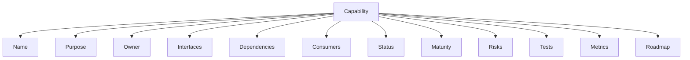
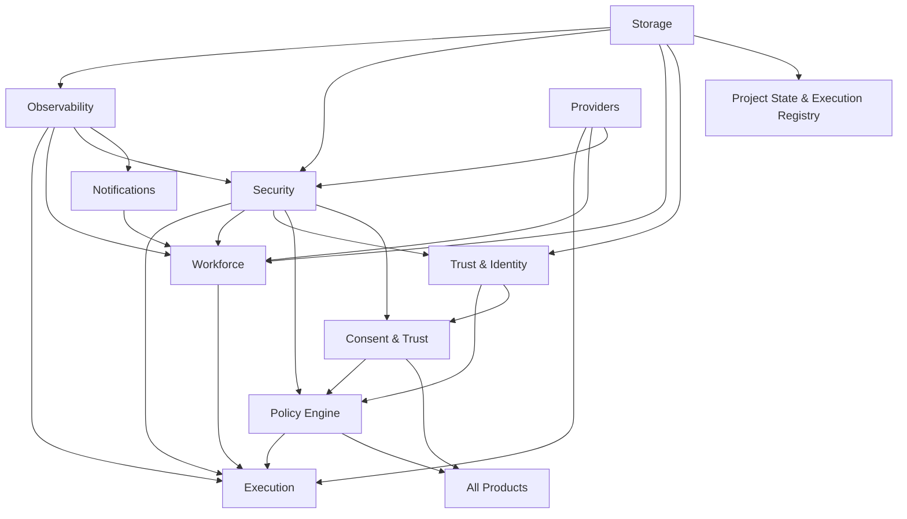

# AI Platform Capability Registry

> **Canonical registry of all AI Platform capabilities.**
> Every capability is documented with name, purpose, owner, interfaces, dependencies, consumers, status, maturity, risks, tests, metrics, and roadmap.
> Products discover and consume platform capabilities through this registry.
>
> **Status:** Phase 2 — Wave 2 (Architecture)
> **Version:** 1.1.0
> **Last Updated:** 2026-07-30

---

## Governance Header

```
Company:        AGS
Platform:       AI Platform
Product:        Concierge (consumer)
Public Brand:   AG Synergy
Repository:     concierge-website
Document:       AI Platform Capability Registry
Phase:          Phase 2 — Wave 2 (Architecture)
Status:         Complete — Living Document
```

---

## 1. Purpose

The AI Platform Capability Registry is the **single source of truth** for all reusable platform capabilities. Every capability is independently versioned, maturity-assessed, and documented with:

- **Name** — Canonical capability name
- **Purpose** — What the capability provides
- **Owner** — Responsible team/individual
- **Interfaces** — Provider-neutral contracts exposed to consumers
- **Dependencies** — Other capabilities this capability depends on
- **Consumers** — Products and services that consume this capability
- **Status** — Live / Architecture / Planned
- **Maturity** — Level in the Capability Maturity Model (Concept → Retired)
- **Risks** — Known risks and mitigations
- **Tests** — Test coverage summary
- **Metrics** — Key performance indicators
- **Roadmap** — Planned evolution

---

## 2. Capability Model



---

## 3. Capability Inventory

### 3.12 Project State & Execution Registry

| Field | Value |
|---|---|
| **Name** | Project State & Execution Registry |
| **Purpose** | Canonical machine-readable source of truth for project state, execution history, workforce assignments, resume points, and governance gates. Eliminates markdown-parsing dependency for workforce agents. |
| **Owner** | AI Platform |
| **Interfaces** | `ProjectStateService`, `RoadmapRegistry`, `ExecutionRegistry`, `ResumeService`, `PhaseService`, `WaveService`, `SprintService`, `WorkforceAssignmentService`, `ExecutionHistoryService`, `GateService`, `ProgressService` (11 interfaces) |
| **Dependencies** | Storage (D1/KV/R2), Security (Auth Engine, RBAC), Observability (Health, Audit), Notifications (approval channels), Workforce Orchestration (agent registry) |
| **Consumers** | All AGS Workforce agents, human operators, admin tools, future products |
| **Status** | ✅ Architecture Complete |
| **Maturity** | Architecture |
| **Risks** | Concurrency on gate transitions; cache staleness on KV reads; D1 5GB limit for execution history |
| **Tests** | N/A (architecture phase) |
| **Metrics** | Context query latency (<50ms P99), execution record throughput (per session), approval turnaround time |
| **Roadmap** | Wave 1: Implementation (D1 schema, service layer, interfaces), Wave 2: Workforce adoption, Wave 3: Dashboard auto-generation, Wave 4: Multi-product support |

---

### 3.1 Execution

| Field | Value |
|---|---|
| **Name** | Execution |
| **Purpose** | Plan, dispatch, queue, and review execution of autonomous workforce tasks |
| **Owner** | AI Platform |
| **Interfaces** | `WorkPlanner`, `WorkforceDispatcher`, `ExecutionQueue`, `ReviewPipeline` |
| **Dependencies** | Workforce, Providers, Security, Observability |
| **Consumers** | Hermes agents, workflow tasks, admin tools |
| **Status** | ✅ Live |
| **Maturity** | Production Ready |
| **Risks** | Queue overflow under high load; single Worker bottleneck |
| **Tests** | 17+28+19 = 64 integration tests |
| **Metrics** | Tasks queued/sec, avg execution time, failure rate, queue depth |
| **Roadmap** | Durable execution store (D1-backed), retry policies, priority queues |

### 3.2 Workforce

| Field | Value |
|---|---|
| **Name** | Workforce |
| **Purpose** | Manage AI agent lifecycle, state transitions, human approval gates, and coordination |
| **Owner** | AI Platform |
| **Interfaces** | `Coordinator`, `AgentLifecycle`, `AgentRegistry`, `HumanApprovalGates`, `NotificationIntegration` |
| **Dependencies** | Execution, Providers, Security, Observability |
| **Consumers** | All AI agents (Hermes, Operations Bot, Admin Bot, future agents) |
| **Status** | ✅ Live |
| **Maturity** | Production Ready |
| **Risks** | Agent state drift; approval gate latency |
| **Tests** | 17+44 = 61 integration tests |
| **Metrics** | Agents registered, agents active, approval gate pass rate, avg activation time |
| **Roadmap** | Workforce identity integration (Wave 3+), multi-agent coordination, agent auto-scaling |

### 3.3 Providers

| Field | Value |
|---|---|
| **Name** | Providers |
| **Purpose** | Provider-neutral abstraction for all external tool and service integrations |
| **Owner** | AI Platform |
| **Interfaces** | `CapabilityRegistry`, `ProviderLoader`, `ProviderDiscovery`, `TransportLayer` |
| **Dependencies** | Security, Observability |
| **Consumers** | All capabilities that integrate external services (Security, Execution, Workforce) |
| **Status** | ✅ Live |
| **Maturity** | Production Ready |
| **Risks** | Provider version drift; vendor API breaking changes |
| **Tests** | ~47 integration tests across 4 OSS adapters |
| **Metrics** | Providers registered, provider health, avg load time, adapter pass rate |
| **Roadmap** | Provider marketplace expansion, third-party provider SDK, version negotiation |

### 3.4 Security

| Field | Value |
|---|---|
| **Name** | Security |
| **Purpose** | Security automation including RBAC enforcement, audit logging, secret scanning, OSS vulnerability detection |
| **Owner** | AI Platform |
| **Interfaces** | `SecurityAgent`, `RiskEngine`, `AuditService`, `OSSScannerAdapter` (gitleaks/semgrep/osv-scanner/trivy) |
| **Dependencies** | Providers, Observability |
| **Consumers** | All platform capabilities, developer pipeline, admin visibility |
| **Status** | ✅ Live |
| **Maturity** | Production Ready |
| **Risks** | Scanner false positives; new CVE response time |
| **Tests** | ~47 integration tests |
| **Metrics** | Secrets detected, findings resolved, scan pass rate, time-to-remediate |
| **Roadmap** | Runtime anomaly detection, automated remediation, compliance reporting |

### 3.5 Trust & Identity

| Field | Value |
|---|---|
| **Name** | Trust & Identity |
| **Purpose** | Provider-agnostic authentication, authorization, session management, consent, workforce identity, zero trust evaluation |
| **Owner** | AI Platform |
| **Interfaces** | `IdentityProvider`, `IdentityResolver`, `AuthenticationService`, `AuthorizationService`, `SessionManager`, `ConsentService`, `TrustEvaluator`, `RiskEngine`, `IdentityRegistry`, `AgentIdentity`, `AuditService`, `FederationGateway` (12 interfaces) |
| **Dependencies** | Security, Observability, Storage |
| **Consumers** | All products (Concierge, future products), workforce agents, external identity providers |
| **Status** | ✅ Architecture Complete |
| **Maturity** | Architecture |
| **Risks** | PHI compliance complexity, identity provider API changes, workforce identity uniqueness |
| **Tests** | N/A (architecture phase) |
| **Metrics** | TBD — defined at implementation |
| **Roadmap** | Wave 3: Patient Identity Implementation, Wave 4: Provider integration, Wave 5+: Portal, Documents, Journey |

### 3.6 Policy Engine

| Field | Value |
|---|---|
| **Name** | Policy Engine |
| **Purpose** | Centralized, deterministic policy evaluation combining RBAC, ABAC, time-based, context-aware, and delegated permission models |
| **Owner** | AI Platform |
| **Interfaces** | `PolicyEngineService`, `PolicyRepository`, `ABACEvaluator`, `ContextProvider` |
| **Dependencies** | Trust & Identity (principals), Security (audit), Consent & Trust (consent verification), Observability |
| **Consumers** | All products (Concierge, future products), workforce agents, administration tools |
| **Status** | ✅ Architecture Complete (Wave 2) |
| **Maturity** | Architecture |
| **Risks** | Evaluation latency, policy explosion, conflict resolution complexity |
| **Tests** | N/A (architecture phase) |
| **Metrics** | TBD — defined at implementation |
| **Roadmap** | Wave 3+ implementation, OPA/Cedar external provider support, policy simulation |

### 3.7 Consent & Trust

| Field | Value |
|---|---|
| **Name** | Consent & Trust |
| **Purpose** | Reusable consent management (privacy, medical, marketing, cookie, research) and trust evaluation for all products |
| **Owner** | AI Platform |
| **Interfaces** | `ConsentService`, `TrustService`, `ConsentType` registration, `ConsentSnapshot`, `DeletionRequest` |
| **Dependencies** | Trust & Identity (principals), Policy Engine (consumes consent decisions), Security (audit), Storage (D1/KV) |
| **Consumers** | All products (Concierge, future products), patient-facing applications, compliance tools |
| **Status** | ✅ Architecture Complete (Wave 2) |
| **Maturity** | Architecture |
| **Risks** | Regulatory changes, re-consent fatigue, right-to-delete complexity |
| **Tests** | N/A (architecture phase) |
| **Metrics** | TBD — defined at implementation |
| **Roadmap** | Wave 3+ implementation, automated expiry, analytics dashboard, multi-language consent forms |

### 3.8 Observability

| Field | Value |
|---|---|
| **Name** | Observability |
| **Purpose** | Health monitoring, structured logging, rate limiting, deployment monitoring, audit logs, error metrics |
| **Owner** | AI Platform |
| **Interfaces** | `HealthEndpoint`, `StructuredLogging`, `RateLimiter`, `AuditStore`, `MetricsCollector` |
| **Dependencies** | Storage (audit logs in D1) |
| **Consumers** | All platform capabilities, administration tools, incident response |
| **Status** | ✅ Live |
| **Maturity** | Production Ready |
| **Risks** | Per-isolate rate limiting (approximate); Memory audit store (restart loss) |
| **Tests** | Health: 10 tests; Audit: via RBAC tests |
| **Metrics** | Health endpoint uptime, audit log volume, rate limit triggers, error rate |
| **Roadmap** | D1-backed audit store (Phase 2+), zone-level Cloudflare Rate Limiting, structured log analytics |

### 3.9 Notifications

| Field | Value |
|---|---|
| **Name** | Notifications |
| **Purpose** | Multi-channel notification delivery (Telegram, email, SMS) for approvals, alerts, events |
| **Owner** | AI Platform |
| **Interfaces** | `NotificationChannel`, `NotificationDispatcher`, `NotificationTemplate` |
| **Dependencies** | Workforce (approval gates), Security (alerts), Observability (event triggers) |
| **Consumers** | Workforce approval gates, security alerts, workflow events |
| **Status** | ⚠️ Partial |
| **Maturity** | Development |
| **Risks** | Channel reliability; rate limiting from Telegram/email providers |
| **Tests** | N/A (via Workforce integration tests) |
| **Metrics** | Delivery success rate, avg delivery latency, channel health |
| **Roadmap** | Durable notification store, email/SMS channels via Workers, notification templates, retry logic |

### 3.10 Storage

| Field | Value |
|---|---|
| **Name** | Storage |
| **Purpose** | Persistent state for platform capabilities — D1 for structured data, KV for ephemeral, R2 for objects |
| **Owner** | AI Platform |
| **Interfaces** | `D1Database` (Workers API), `KVNamespace`, `R2Bucket` |
| **Dependencies** | Cloudflare D1, R2, KV |
| **Consumers** | All platform capabilities |
| **Status** | ✅ Live |
| **Maturity** | Production Ready |
| **Risks** | D1 5GB free limit; R2 egress costs at scale |
| **Tests** | D1 migrations: 5 applied, 24 tables live; R2: configured, not actively used |
| **Metrics** | D1 read/write ops, R2 storage used, KV TTL hit rate |
| **Roadmap** | D1 migration beyond 5GB; R2 document storage activation; Postgres backend (Phase 3+) |

### 3.11 Platform Hardening

| Field | Value |
|---|---|
| **Name** | Platform Hardening |
| **Purpose** | Agent lifecycle management, audit persistence, tenant boundaries, provider seam isolation |
| **Owner** | AI Platform |
| **Interfaces** | `canAgentAct()`, `withinTenantScope()`, `ProviderManifest`, `CapabilityRegistry` |
| **Dependencies** | All platform capabilities |
| **Consumers** | All platform capabilities, tenant isolation |
| **Status** | ✅ Live |
| **Maturity** | Production Ready |
| **Risks** | Insufficiently tested cross-tenant boundaries |
| **Tests** | ~38 platform hardening tests |
| **Metrics** | Tenant isolation enforcement points, audit persistence rate, provider seam health |
| **Roadmap** | Multi-tenant enforcement, independent tenant databases, cross-tenant audit consolidation |

### 3.13 Release Management

| Field | Value |
|-------|-------|
| **Name** | Release Management |
| **Purpose** | Standardized preview and production deployment workflows for all AGS products. Eliminates environment ambiguity, deployment inconsistencies, and ad-hoc release practices. |
| **Owner** | AI Platform |
| **Interfaces** | `ReleaseService`, `EnvironmentService`, `DeploymentService`, `PromotionService`, `RollbackService`, `SmokeTestService`, `ReleaseRegistry`, `VersionResolver`, `DeploymentHistory`, `PromotionGate` (10 interfaces) |
| **Dependencies** | PSER (execution registry, checkpoints, resume points), Storage (D1/KV), Security (auth, audit), Observability (health, monitoring), Workforce Orchestration (approval gates) |
| **Consumers** | All AGS products (Concierge, future products), pipeline operators, workforce agents |
| **Status** | ✅ Architecture Complete |
| **Maturity** | Architecture |
| **Risks** | Environment drift between Preview and Production; D1 migration order dependency; rollback checkpoint staleness |
| **Tests** | N/A (architecture phase) |
| **Metrics** | Deployment frequency, promotion gate pass rate, rollback frequency, mean time to recovery (MTTR), smoke test pass rate |
| **Roadmap** | Wave 1: Architecture (current), Wave 2: Implementation (D1 schema, service layer, interfaces), Wave 3: CI/CD integration, Wave 4: Multi-product adoption |

### 3.17 WAS — Workforce Activation Service

| Field | Value |
|-------|-------|
| **Name** | WAS — Workforce Activation Service |
| **Purpose** | Activation boundary between EPCL (strategic planning) and WEF (autonomous execution). Validates, gates, and orchestrates the transition from approved plans to autonomous batch execution. Fail-closed by default. |
| **Owner** | AI Platform |
| **Interfaces** | `WorkforceActivationService`, `PlanConsumer`, `ConstitutionalValidator`, `ExecutionStateManager`, `WEFDelegator`, `VerificationRouter`, `KnowledgeCaptureTrigger`, `ExecutiveStatusUpdater`, `WASObservability` (9 interfaces) |
| **Dependencies** | EPCL (ExecutionPlan, flags), WEF (batch delegation), Observability (events, metrics), Feature Flag System (7 WAS flags + EPCL sync) |
| **Consumers** | Hermes Agent, autonomous execution pipeline, human operators |
| **Status** | ✅ Implementation Complete |
| **Maturity** | Implementation |
| **Risks** | No persistent state (in-memory only — lost on restart); auto-resume experimental; serial batch delegation default |
| **Tests** | 68/68 integration tests |
| **Metrics** | Activation success rate, batch completion rate, delegation latency, verification pass rate, recovery success rate |
| **Roadmap** | Phase 2: Documentation (current), Milestones 5-8: Production hardening, parallel delegation, persistent state, dashboard integration |

---

## 4. Capability Dependency Map



---

## 5. Capability to Product Mapping

|| Capability | Concierge | Future Product A | Future Product B |
|---|---|---|---|
|| Execution |Consumed | Consumed | Consumed |
|| Workforce | Consumed | Consumed | Consumed |
|| Providers | Consumed | Consumed | Consumed |
|| Security | Consumed | Consumed | Consumed |
|| Trust & Identity | Will Consume (Wave 3+) | Will Consume | Will Consume |
|| Policy Engine | Will Consume (Wave 3+) | Will Consume | Will Consume |
|| Consent & Trust | Will Consume (Wave 3+) | Will Consume | Will Consume |
|| Observability | Consumed | Consumed | Consumed |
|| Notifications | Partially Consumed | Will Consume | Will Consume |
|| Storage | Consumed | Consumed | Consumed |
|| Platform Hardening | Consumed | Consumed | Consumed |
|| Project State & Execution Registry | Will Consume (Phase D+) | Will Consume | Will Consume |
|| Release Management | Will Consume | Will Consume | Will Consume |

---

## 6. Capability Maturity Summary

|| Capability | Maturity | Status |
|---|---|---|
|| Execution | Production Ready | ✅ Live |
|| Workforce | Production Ready | ✅ Live |
|| Providers | Production Ready | ✅ Live |
|| Security | Production Ready | ✅ Live |
|| Platform Hardening | Production Ready | ✅ Live |
|| Observability | Production Ready | ✅ Live |
|| Storage | Production Ready | ✅ Live |
|| Notifications | Development | ⚠️ Partial |
|| Policy Engine | Architecture | ✅ Arch Complete (Wave 2) |
|| Consent & Trust | Architecture | ✅ Arch Complete (Wave 2) |
|| Project State & Execution Registry | Architecture | ✅ Architecture Complete |
|| Release Management | Architecture | ✅ Architecture Complete |

---

## 7. Risk Register

|| Capability | Risk | Severity | Mitigation |
|---|---|---|---|
|| Trust | Trust & Identity | Identity | PHI compliance gaps | High | Design review with security; PHI boundary segregation |
| Policy Engine | Evaluation latency under high load | Medium | Caching; stateless evaluation for horizontal scaling |
|| Consent | Consent & Trust | Trust | Regulatory change requiring rapid re-consent | Medium | Versioned consent types; automated re-consent trigger |
|| Notifications | Channel deliverability | Medium | Multi-channel fallback; retry logic |
|| Execution |Queue overflow | Low | Backpressure; monitoring alerts |
|| Storage | D1 5GB limit | Low | Migration planning; R2 for large objects |

---

## 8. Registry Maintenance

| Activity | Frequency | Owner |
|---|---|---|
| Add new capabilities | As created | AI Platform |
| Update maturity levels | Per completion of maturity gate | Capability Owner |
| Update consumer list | Per new product launch | Product Owner |
| Update dependencies | Per capability modification | Capability Owner |
| Update risk register | Per risk identification | AI Platform |
| Full registry audit | Quarterly | AI Platform |

---

*This registry is the authoritative source for all AI Platform capabilities. It must be updated whenever a capability is created, modified, or achieves a new maturity level.*
*Living document — Last updated: 2026-07-26*
*Governance document — GOV-002 / Phase 2 Wave 2*