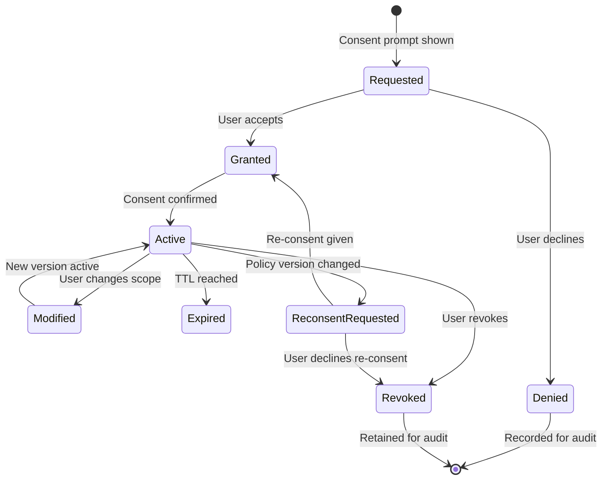

# Consent & Trust — AI Platform Capability

> **Reusable, provider-agnostic consent management and trust verification for all AGS products.**
> The Consent & Trust capability is an AI Platform capability — NOT a Concierge-specific service. Every product (Concierge, future products) consumes Consent & Trust through stable contracts.
>
> **Status:** Phase 2 — Wave 2 (Architecture)
> **Version:** 1.0.0
> **Last Updated:** 2026-07-26

---

## Governance Header

```
Company:        AGS
Platform:       AI Platform
Product:        Concierge (consumer)
Public Brand:   AG Synergy
Repository:     concierge-website
Capability:     Consent & Trust (AI Platform)
Phase:          Phase 2 — Wave 2 (Architecture)
Status:         Architecture Complete — Awaiting Implementation
```

---

## 1. Design Principles

| # | Principle | Why |
|---|---|---|
| 1 | **Provider-agnostic** | Consent storage and trust evaluation are swappable backends |
| 2 | **Independent from Identity** | Consent records are separate from identity records; consent is not tied to a specific login method |
| 3 | **Independent from Policy** | The Policy Engine consumes consent decisions but does not own consent definitions |
| 4 | **Every future product consumes this capability** | No product builds its own consent system |
| 5 | **Immutable consent records** | Consent changes are append-only; never UPDATE, only INSERT with version increment |
| 6 | **Auditable by design** | Every consent action produces an audit event |
| 7 | **Revocable by design** | All consents are reversible at any time |
| 8 | **Versioned** | Consent versions track policy changes that require re-consent |

---

## 2. Consent Types

### 2.1 Core Consent Types

| Consent Type | Description | Regulatory Basis | Re-consent Trigger |
|---|---|---|---|
| **Privacy Consent** | Permission to collect and store personal data | PIPEDA, Privacy Act | Policy change, annual renewal |
| **Medical Consent** | Permission to collect, store, and process PHI | PHIPA, PIPEDA | Policy change, new treatment |
| **Marketing Consent** | Permission to send promotional communications | CASL | Policy change, 2-year renewal |
| **Cookie Consent** | Permission for non-essential cookies/tracking | Canadian Privacy Law | Policy change, 6-month renewal |
| **Terms Acceptance** | Acceptance of terms of service | Contract law | Terms update |
| **Research Consent** | Permission to use de-identified data for research | Tri-Council Policy | New study, annual renewal |
| **Document Consent** | Permission to store and share uploaded documents | PHIPA | New document type |
| **Data Sharing (Clinic)** | Permission to share data with partner clinics | PHIPA, PIPEDA | New clinic partner |
| **Data Sharing (Third Party)** | Permission to share with third-party services | PIPEDA | New service provider |
| **Communication Consent** | Permission for email/SMS notifications | CASL | Per-message type |

### 2.2 Consent Classification

```
                 ┌─────────────┐
                 │  All AGS    │  ← Cookie consent, terms acceptance (product-agnostic)
                 │  Products   │
                 ├─────────────┤
                 │  Product-   │  ← Medical, document, communication (Concierge-specific)
                 │  Specific   │
                 └─────────────┘
```

- **Product-agnostic** consents are defined in the platform for all products to consume
- **Product-specific** consents are registered by products in the platform consent registry
- Every product registers its consent types; none owns the consent engine

---

## 3. Consent Model

### 3.1 Core Data Model

```typescript
interface ConsentType {
  id: string;                           // e.g., "privacy", "medical_data_processing"
  name: string;                         // Human-readable display name
  description: string;                  // What this consent covers
  category: ConsentCategory;            // privacy | medical | marketing | etc.
  product: string;                      // Owning product (or "platform")
  version: number;                      // Current version for re-consent detection
  required: boolean;                    // Mandatory (cannot use service without)
  regulatoryBasis: string;              // PIPEDA, PHIPA, CASL, etc.
  retentionPeriodDays: number;          // How long to retain records after revocation
  reconsentRequired: boolean;           // Whether version changes require re-consent
  metadata: Record<string, unknown>;
}

enum ConsentCategory {
  PRIVACY = "privacy",
  MEDICAL = "medical",
  MARKETING = "marketing",
  COOKIE = "cookie",
  TERMS = "terms",
  RESEARCH = "research",
  DOCUMENT = "document",
  DATA_SHARING = "data_sharing",
  COMMUNICATION = "communication",
}

interface ConsentRecord {
  id: string;                           // Unique record ID
  principalId: string;                  // Identity who gave/revoked consent
  consentTypeId: string;                // References ConsentType.id
  consentTypeVersion: number;           // Version of consent type at time of grant
  granted: boolean;                     // true = granted, false = revoked
  scope: ConsentScope;                  // What this consent covers
  grantedAt: DateTime;
  expiresAt?: DateTime;
  revokedAt?: DateTime;
  replacedBy?: string;                  // When modified, points to new record
  version: number;                      // Append-only version (1, 2, 3...)
  ipAddress: string;                    // Where consent was given
  userAgent: string;                    // How consent was given
  method: ConsentMethod;                // How consent was captured
  auditId: string;                      // Audit event ID
  metadata: Record<string, unknown>;
}

enum ConsentMethod {
  CHECKBOX = "checkbox",                // Opt-in checkbox
  TOGGLE = "toggle",                    // Settings toggle
  FORM_SIGNATURE = "form_signature",    // Signed form
  ELECTRONIC_SIGNATURE = "e_sig",       // Digital signature
  VERBAL = "verbal",                    // Verbal (recorded by staff)
  IMPLIED = "implied",                  // Implied by action
  API = "api",                          // Programmatic consent
}

interface ConsentScope {
  product: string;                      // Which product this applies to
  resources?: string[];                 // Specific resource types
  treatments?: string[];                // Medical treatments (for medical consent)
  clinics?: string[];                   // Specific clinic partners
  dataCategories?: string[];            // Data categories included
  duration?: string;                    // "perpetual" / "session" / "treatment" / specific days
}
```

### 3.2 Consent Versioning

Consent types are versioned independently. When a consent type version changes:

1. Active consents of the previous version remain valid
2. Users are prompted for re-consent on next relevant action
3. The `ConsentSnapshot` captures which version was active at decision time
4. Re-consent creates a new `ConsentRecord` with the new version; old version is linked via `replacedBy`

```typescript
interface ConsentTypeVersion {
  id: string;
  consentTypeId: string;
  version: number;
  changes: string;                      // What changed in this version
  publishedAt: DateTime;
  requiredReconsent: boolean;
}
```

### 3.3 Consent Snapshot

Consent state is captured as a snapshot and bound to sessions:

```typescript
interface ConsentSnapshot {
  snapshotId: string;
  principalId: string;
  timestamp: DateTime;
  activeConsents: {
    consentId: string;
    consentTypeId: string;
    version: number;
    granted: boolean;
    scope: ConsentScope;
    expiresAt?: DateTime;
  }[];
  hash: string;                         // Integrity check across all records
}
```

---

## 4. Consent Lifecycle

### 4.1 Lifecycle Flow



### 4.2 Consent Action Types

| Action | Description | Audit Required |
|---|---|---|
| **Grant** | User accepts consent | ✅ |
| **Deny** | User declines (optional consent) | ✅ |
| **Modify** | User changes scope | ✅ |
| **Revoke** | User withdraws consent | ✅ |
| **Re-consent** | User accepts updated version | ✅ |
| **Expire** | Time-based expiry | ✅ |
| **Admin revoke** | Platform revokes (violation) | ✅ |
| **Bulk update** | Regulatory change affecting many users | ✅ |

---

## 5. Consent Revocation

### 5.1 Revocation Model

| Revocation Type | Effect | Data Retention |
|---|---|---|
| **Voluntary (user)** | User withdraws consent | Data retained per retention policy; processing stops |
| **Expiry (time)** | TTL reached | Same as voluntary |
| **Admin (compliance)** | Platform revokes due to policy violation | Data retained for investigation |
| **Account deletion** | Right to delete | Data deleted (retention period may apply) |
| **Version revocation** | User declines re-consent | Same as voluntary |

### 5.2 Revocation Handling

When consent is revoked:

1. **Status changed** — `granted: false`, `revokedAt` set
2. **Audit event** — `consent.revoked` recorded
3. **Session update** — Active sessions with consent snapshot are notified (async)
4. **Policy evaluation** — Subsequent policy checks use revoked consent
5. **Data handling** — Processing stops; data retained per policy (or deleted per right to delete)

---

## 6. Audit Evidence

Every consent action produces an audit event with full evidence:

```typescript
interface ConsentAuditEvent {
  id: string;
  eventType: "consent.granted" | "consent.denied" | "consent.modified" |
             "consent.revoked" | "consent.expired" | "consent.reconsent";
  principalId: string;
  consentRecordId: string;
  consentTypeId: string;
  version: number;
  
  // Full evidence
  evidence: {
    ipAddress: string;
    userAgent: string;
    method: ConsentMethod;
    recordedBy: string;                  // Who recorded it (user, staff, system)
    sessionId: string;
    formSnapshot?: string;               // Copy of consent form shown (if form-based)
    signatureHash?: string;              // If electronically signed
  };
  
  // Previous state
  previousConsentId?: string;
  
  timestamp: DateTime;
  outcome: "SUCCESS" | "FAILURE";
}
```

---

## 7. Retention Policy

| Data Type | Retention Period | Rationale |
|---|---|---|
| Active consent records | Duration of consent + retention period | Processing requirement |
| Revoked consent records | 7 years after revocation | Regulatory (PHIPA, PIPEDA) |
| Consent audit events | 7 years | Regulatory (PHIPA, PIPEDA) |
| Consent type versions | Permanent | Audit trail |
| Consent form snapshots | 7 years | Legal evidence |
| De-identified consent analytics | Indefinite | No PII/PHI |

---

## 8. Right to Delete

When a data subject exercises their right to delete:

1. All **active consent records** are revoked (effect: processing stops)
2. Consent records are **anonymized** (principalId → hash, PII removed)
3. Audit events **retain** the consentRecordId but **anonymize** principalId
4. Consent type definitions are **not affected** (apply to all users)
5. De-identified consent analytics **retained** (no PII)
6. A deletion audit event is recorded with anonymized reference

```typescript
interface DeletionRequest {
  id: string;
  principalId: string;
  requestedAt: DateTime;
  requestedBy: string;
  completedAt?: DateTime;
  scope: DeletionScope;                  // "all" | specific data categories
  consentAnonymization: {
    originalPrincipalId: string;
    anonymizedReference: string;         // Hash for audit traceability
  };
  status: "PENDING" | "IN_PROGRESS" | "COMPLETED" | "FAILED";
}
```

---

## 9. Data Export

```typescript
interface ConsentExportRequest {
  principalId: string;
  format: "json" | "csv" | "pdf";
  includeAudit: boolean;
  dateRange?: { start: DateTime; end: DateTime };
}

interface ConsentExport {
  principalId: string;
  generatedAt: DateTime;
  format: string;
  records: ConsentRecord[];
  auditEvents: ConsentAuditEvent[];
  activeSummary: {
    consentTypeId: string;
    name: string;
    granted: boolean;
    grantedAt: DateTime;
    expiresAt?: DateTime;
  }[];
}
```

---

## 10. Compliance Considerations

### 10.1 Canadian Regulations

| Regulation | Relevant Consents | Requirements |
|---|---|---|
| **PIPEDA** | Privacy, Data Sharing, Research | Meaningful consent, purpose specification, withdrawal mechanism |
| **PHIPA** | Medical, Document, Clinic Sharing | Express consent for PHI, limited use, audit trail |
| **CASL** | Marketing, Communication | Express consent (opt-in), identification, unsubscribe mechanism |
| **Canadian Privacy Act** | Privacy | Accountability, identifying purposes, consent, limiting collection |

### 10.2 Compliance Controls

| Control | Implementation |
|---|---|
| **Purpose limitation** | Consent scope per type — granular, not blanket |
| **Consent withdrawal** | `revokeConsent()` available through UI and API |
| **Data minimization** | Only collect what consent scope permits |
| **Retention limits** | Auto-expiry based on consent type configuration |
| **Audit evidence** | Full evidence capture for regulatory defence |
| **Right to access** | `getConsentHistory()` + `ConsentExport` |
| **Right to delete** | `DeletionRequest` workflow |
| **Consent by design** | No PHI access without `verifyConsent()` passing |

---

## 11. Trust Evaluation

### 11.1 Trust Model

Trust scoring operates at the request level, evaluating multiple dimensions:

| Trust Dimension | Source | Evaluation |
|---|---|---|
| **Identity Trust** | Trust & Identity | Authentication method, credential age, verification level |
| **Device Trust** | Device fingerprint | Known device, MFA enrollment, security posture |
| **Location Trust** | IP geolocation | Expected region, country, geo-velocity |
| **Behavioral Trust** | Past actions | Violation history, anomaly detection |
| **Session Trust** | Session context | Session age, activity pattern, delegation depth |
| **Consent Trust** | Consent status | Active consents, consent age, re-consent required |

### 11.2 Trust Evaluation API

```typescript
interface TrustService {
  /** Evaluate trust for a request */
  evaluateTrust(request: TrustRequest): Promise<TrustDecision>;
  
  /** Get trust factors for a principal */
  getTrustFactors(principalId: string): Promise<TrustFactor[]>;
  
  /** Report a trust-relevant event */
  reportEvent(event: TrustEvent): Promise<void>;
  
  /** Get trust configuration */
  getTrustPolicy(product: string): Promise<TrustPolicy>;
  
  /** Configure trust thresholds per product */
  configureTrustPolicy(product: string, policy: TrustPolicy): Promise<void>;
}

interface TrustRequest {
  principalId: string;
  identityType: IdentityType;
  sessionId?: string;
  action: string;
  resourceSensitivity: ResourceSensitivity;
  ipAddress?: string;
  deviceFingerprint?: string;
  userAgent?: string;
}

interface TrustDecision {
  trusted: boolean;
  score: number;                    // 0.0 – 1.0
  level: "low" | "medium" | "high" | "critical";
  factors: { name: string; score: number; weight: number }[];
  challangeRequired: boolean;
  challangeMethod?: "MFA" | "REAUTH" | "CONSENT";
}
```

---

## 12. Session Binding

Consent and trust are bound to sessions as snapshots:

```
Authentication → Consent Snapshot → Trust Evaluation → Session Created
                                                          │
                                                   Policy Engine checks
                                                   consent snapshot + trust
                                                        │
                                              ALLOW / CHALLENGE / DENY
```

- Consent snapshots are taken at session creation
- Snapshots are periodically refreshed (configurable, default 15 minutes)
- Trust is evaluated per-request (not cached)
- Policy Engine combines consent + trust + RBAC/ABAC for final decision

---

## 13. API Integration

```typescript
interface ConsentService {
  /** Consent lifecycle */
  getConsentTypes(product?: string): Promise<ConsentType[]>;
  registerConsentType(type: ConsentTypeRegistration): Promise<ConsentType>;
  grantConsent(principalId: string, request: ConsentGrantRequest): Promise<ConsentRecord>;
  getActiveConsents(principalId: string): Promise<ConsentRecord[]>;
  getConsentHistory(principalId: string): Promise<ConsentRecord[]>;
  modifyConsent(consentId: string, changes: Partial<ConsentRecord>): Promise<ConsentRecord>;
  revokeConsent(consentId: string, reason: string): Promise<void>;
  verifyConsent(principalId: string, consentTypeId: string, scope?: ConsentScope): Promise<ConsentVerification>;
  
  /** Snapshots */
  createSnapshot(principalId: string): Promise<ConsentSnapshot>;
  verifySnapshot(snapshot: ConsentSnapshot): Promise<boolean>;
  
  /** Compliance */
  exportConsentData(principalId: string, format: string): Promise<ConsentExport>;
  requestDeletion(principalId: string, scope: DeletionScope): Promise<DeletionRequest>;
  getDeletionStatus(requestId: string): Promise<DeletionRequest>;
  
  /** Product registration */
  registerConsentType(type: ConsentTypeRegistration): Promise<ConsentType>;
  updateConsentTypeVersion(consentTypeId: string, changes: string): Promise<ConsentTypeVersion>;
}
```

---

## 14. Multi-Product Support

| Feature | Implementation |
|---|---|
| **Product-specific consent types** | Each product registers its consent types with `product` field |
| **Cross-product consents** | Platform-level types (privacy, cookie) apply to all |
| **Product isolation** | Consent records scoped by `ConsentScope.product` |
| **Independent versioning** | Each product manages its consent type versions |
| **Shared platform types** | Privacy, cookie, terms — owned by platform, consumed by all |
| **Consumer independence** | Consent data is a platform resource; products access through API only |

---

## 15. Future Extensibility

| Extension | Design | Phase |
|---|---|---|
| **Consent API token** | Third-party consent verification | Phase 3+ |
| **Blockchain-backed consent** | Immutable consent hash registry | Future |
| **Automated consent expiry** | Cron-based expiry checker | Phase 3 |
| **Consent analytics dashboard** | Opt-in rates, trends, drop-off | Phase 3+ |
| **Multi-language consent forms** | L10n for consent presentation | Phase 4 |
| **Voice consent capture** | Recording for verbal consent evidence | Phase 4+ |

---

## 16. Risks

| Risk | Likelihood | Impact | Mitigation |
|---|---|---|---|
| Compliance requirement change | Medium | High | Versioned consent types enable rapid re-consent |
| Consent data breach | Low | Critical | Separate encrypted store; audit every access |
| Re-consent fatigue | Medium | Medium | Batch re-consent prompts; smart scheduling |
| Cross-product consent conflicts | Low | Medium | Clear product isolation in scope |
| Right to delete complexity | Low | Medium | Defined deletion workflow with audit preservation |

---

*This document is architecture-only. No application code, database migrations, API changes, or UI work is authorized by this document.*
*Status: Architecture Complete — Awaiting Implementation (Phase 2 Wave 3+)*