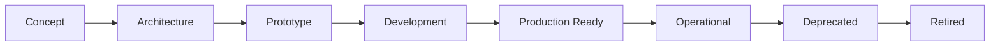

# AI Platform Capability Maturity Model

> **Measurable maturity levels for every AI Platform capability.**
> Every capability progresses through defined states with clear exit criteria. No capability may advance to the next maturity level without satisfying all criteria for the current level.
>
> **Status:** Phase 2 — Wave 2 (Architecture)
> **Version:** 1.0.0
> **Last Updated:** 2026-07-26

---

## Governance Header

```
Company:        AGS
Platform:       AI Platform
Product:        Concierge (consumer)
Public Brand:   AG Synergy
Repository:     concierge-website
Document:       AI Platform Capability Maturity Model
Phase:          Phase 2 — Wave 2 (Architecture)
Status:         Complete — Mandatory For All Capabilities
```

---

## 1. Maturity Levels



| Level | Description | Default? | Typical Duration |
|---|---|---|---|
| **Concept** | Idea identified, not yet designed | ✅ (new capabilities) | 1–7 days |
| **Architecture** | Design documented, interfaces defined | | 2–14 days |
| **Prototype** | Working proof-of-concept, not production-safe | | 1–4 weeks |
| **Development** | Being built for production, not yet deployed | | 2–8 weeks |
| **Production Ready** | Deployed, tested, monitored — safe for consumers | | Gate-dependent |
| **Operational** | Running in production with operational maturity | | Ongoing |
| **Deprecated** | Scheduled for removal, no new consumers | | 1–6 months |
| **Retired** | Removed from active service, preserved in history | | Permanent |

---

## 2. Concept Level

### 2.1 Description

The capability has been identified as a need. Initial scope and purpose are defined but no design work has begun.

### 2.2 Entry Criteria

None — a concept can be created at any time.

### 2.3 Exit Criteria

| # | Criterion | Verification |
|---|---|---|
| C-01 | Capability name and purpose documented | Entry in Capability Registry |
| C-02 | Stakeholder identified | Named owner |
| C-03 | Business value statement documented | 1–2 sentence value proposition |
| C-04 | Related capabilities identified | Dependencies noted |
| C-05 | Entry added to Capability Registry | Registry updated |

### 2.4 Artifacts

| Artifact | Required? |
|---|---|
| Capability Registry entry (name + purpose) | ✅ Required |
| Architecture document | ❌ Not required |

---

## 3. Architecture Level

### 3.1 Description

The capability has a complete design documented with interfaces, dependencies, data model, and risks. No implementation exists.

### 3.2 Entry Criteria

| # | Criterion | Verification |
|---|---|---|
| C-01 | Concept exit criteria satisfied | Registry check |

### 3.3 Exit Criteria

| # | Criterion | Verification | Standards |
|---|---|---|---|
| A-01 | Architecture document complete | Peer review | DOC-01, DOC-03 |
| A-02 | All interfaces defined | Architecture document | NAME-01, NAME-02 |
| A-03 | Dependencies identified and documented | Architecture document | |
| A-04 | Consumers identified | Architecture document | |
| A-05 | Data model designed (if applicable) | Architecture document | |
| A-06 | Risk assessment complete | Architecture document | |
| A-07 | ADR created for major decisions (if any) | ADR in `docs/decisions/` | DOC-03 |
| A-08 | Integration with existing capabilities mapped | Dependency map | |
| A-09 | Capability Registry entry updated with full fields | Registry check | |
| A-10 | Engineering Standards applicability assessed | Section 19 compliance gate | |

### 3.4 Artifacts

| Artifact | Required? |
|---|---|
| Self-contained architecture document | ✅ Required |
| Interface contracts (TypeScript or equivalent) | ✅ Required |
| ADR for significant decisions | ✅ If decisions needed |
| Capability Registry entry (complete) | ✅ Required |
| Engineering Standards compliance assessment | ✅ Required |

---

## 4. Prototype Level

### 4.1 Description

A working proof-of-concept exists. Core functionality is demonstrated but not production-safe. May use mock data, test infrastructure, or simplified implementations.

### 4.2 Entry Criteria

| # | Criterion | Verification |
|---|---|---|
| P-01 | Architecture exit criteria satisfied | Architecture completed |

### 4.3 Exit Criteria

| # | Criterion | Verification | Standards |
|---|---|---|---|
| P-01 | Core functionality demonstrated | Working prototype | |
| P-02 | Unit tests cover core logic | Test report | TEST-01 |
| P-03 | Integration tests cover API endpoints | Test report | TEST-02 |
| P-04 | Error handling implemented for core paths | Code review | ERR-01, ERR-02 |
| P-05 | Configuration externalized for test values | Config review | CONF-01, CONF-04 |
| P-06 | Secret detection run (no secrets in prototype) | Secret scan | SEC-01 |
| P-07 | Capability Registry updated with prototype status | Registry check | |

### 4.4 Artifacts

| Artifact | Required? |
|---|---|
| Working code in `workers/src/` or `hermes/services/` | ✅ Required |
| Unit tests | ✅ Required |
| Integration tests | ✅ Required |
| Prototype documentation (README) | ✅ Required |

---

## 5. Development Level

### 5.1 Description

The capability is being actively built for production. All engineering standards are being satisfied. Not yet deployed to production.

### 5.2 Entry Criteria

| # | Criterion | Verification |
|---|---|---|
| D-01 | Prototype exit criteria satisfied | Prototype completed |
| D-02 | Production implementation plan approved | Plan review |

### 5.3 Exit Criteria

| # | Criterion | Verification | Standards |
|---|---|---|---|
| D-01 | Full test suite passing (unit + integration + security) | `vitest run` green | TEST-01 through TEST-06 |
| D-02 | TypeScript compilation clean | `tsc --noEmit` | |
| D-03 | All error paths handled and documented | Code audit | ERR-01 through ERR-06 |
| D-04 | Audit logging implemented for all security-relevant actions | Integration test | AUD-01 through AUD-09 |
| D-05 | Secrets managed via platform secret store | Secret scan | SEC-01 through SEC-07 |
| D-06 | Logging implemented (structured, correlation IDs) | Code audit | LOG-01 through LOG-07 |
| D-07 | Health endpoint implemented | Integration test | OBS-01 |
| D-08 | Rate limiting implemented | Integration test | OBS-05 |
| D-09 | API contracts documented (OpenAPI) | Doc review | API-06 |
| D-10 | Feature flags implemented for new paths | Code audit | FLAG-01 through FLAG-04 |
| D-11 | Engineering Standards compliance verified | Full standards audit | All applicable |
| D-12 | Preview environment deployed and verified | Infra check | DEPL-02 |
| D-13 | Dependency vulnerabilities resolved | Dependency audit | DEP-01 through DEP-05 |
| D-14 | Naming conventions verified | Name audit | NAME-01 through NAME-06 |
| D-15 | Documentation updated (architecture, runbooks) | Doc inventory | DOC-01 through DOC-07 |

### 5.4 Artifacts

| Artifact | Required? |
|---|---|
| Production code | ✅ Required |
| Full test suite | ✅ Required |
| API documentation (OpenAPI) | ✅ Required |
| Production configuration | ✅ Required |
| Runbook (draft) | ✅ Required |
| Engineering Standards compliance report | ✅ Required |

---

## 6. Production Ready Level

### 6.1 Description

The capability is deployed to production, tested, monitored, and safe for consumers. This is the minimum level for any capability that other capabilities or products depend on.

### 6.2 Entry Criteria

| # | Criterion | Verification |
|---|---|---|
| PR-01 | Development exit criteria satisfied | Development completed |

### 6.3 Exit Criteria

| # | Criterion | Verification | Standards |
|---|---|---|---|
| PR-01 | All Development criteria verified in production | Full audit | All |
| PR-02 | Production deployment automated and verified | CI/CD check | DEPL-01, DEPL-05 |
| PR-03 | Rollback tested and timed (< 5 minutes) | DR test | DEPL-03 |
| PR-04 | Monitoring dashboards operational | Monitoring check | OBS-02 through OBS-04 |
| PR-05 | Alerting configured for error rate + latency + availability | Alert config | OBS-03 |
| PR-06 | Secrets configured for production environment | Infra audit | DEPL-06 |
| PR-07 | Performance baseline established | Perf test | TEST-07 |
| PR-08 | Security review completed | Security sign-off | |
| PR-09 | Runbook complete and tested | Runbook sign-off | |
| PR-10 | Capability Registry updated (maturity = Production Ready) | Registry check | |
| PR-11 | All consumers notified of production availability | Communication log | |
| PR-12 | Engineering Standards compliance verified for production | Full audit | All applicable |

### 6.4 Artifacts

| Artifact | Required? |
|---|---|
| Production deployment log | ✅ Required |
| Monitoring dashboard | ✅ Required |
| Alert configuration | ✅ Required |
| Security review sign-off | ✅ Required |
| Production runbook | ✅ Required |
| Performance baseline report | ✅ Required |
| Engineering Standards compliance sign-off | ✅ Required |

---

## 7. Operational Level

### 7.1 Description

The capability has been running in production with demonstrated operational maturity. Incidents are handled within SLAs. Performance is stable. Consumers are actively using the capability.

### 7.2 Entry Criteria

| # | Criterion | Verification |
|---|---|---|
| O-01 | Production Ready exit criteria satisfied | Production deployment verified |
| O-02 | Capability has been production for ≥ 30 days | Production tenure |

### 7.3 Exit Criteria

| # | Criterion | Verification |
|---|---|---|
| O-01 | No P0/P1 incidents in last 30 days | Incident log |
| O-02 | P95 latency within SLO for 30 consecutive days | Monitoring data |
| O-03 | Error rate < 0.1% for 30 consecutive days | Monitoring data |
| O-04 | Uptime ≥ 99.9% for 30 consecutive days | Monitoring data |
| O-05 | At least one incident response exercised | Drill log |
| O-06 | Runbook validated by at least one on-call rotation | Runbook review |
| O-07 | Capacity plan documented (headroom, growth rate) | Capacity doc |
| O-08 | At least 2 consumers actively using the capability | Consumption data |
| O-09 | Capability Registry updated (maturity = Operational) | Registry check |

### 7.4 Artifacts

| Artifact | Required? |
|---|---|
| Incident response drill report | ✅ Required |
| Capacity plan | ✅ Required |
| Consumer adoption data | ✅ Required |
| Monitoring dashboard (30-day view) | ✅ Required |

---

## 8. Deprecated Level

### 8.1 Description

The capability is scheduled for removal. No new consumers may depend on it. Existing consumers are notified and migrated.

### 8.2 Entry Criteria

| # | Criterion | Verification |
|---|---|---|
| DE-01 | Decision to deprecate documented | ADR or decision log |
| DE-02 | All consumers notified of deprecation | Communication record |

### 8.3 Exit Criteria

| # | Criterion | Verification |
|---|---|---|
| DE-01 | No active consumers remaining | Consumption data |
| DE-02 | Deprecation period observed (minimum 90 days) | Calendar check |
| DE-03 | Replacement capability documented for all consumers | Migration guide |
| DE-04 | All consumers migrated to replacement | Migration log |
| DE-05 | Capability Registry updated (maturity = Deprecated) | Registry check |

### 8.4 Artifacts

| Artifact | Required? |
|---|---|
| Deprecation notice (ADR or decision log) | ✅ Required |
| Migration guide for consumers | ✅ Required |
| Consumer migration log | ✅ Required |

---

## 9. Retired Level

### 9.1 Description

The capability has been removed from active service. Code may be archived. Data is retained per retention policies.

### 9.2 Entry Criteria

| # | Criterion | Verification |
|---|---|---|
| R-01 | Deprecated exit criteria satisfied | Deprecation completed |

### 9.3 Exit Criteria

| # | Criterion | Verification |
|---|---|---|
| R-01 | All production deployments removed | Infra audit |
| R-02 | All credential access revoked | Secret store audit |
| R-03 | Data retention policy applied (data preserved or deleted per policy) | Data audit |
| R-04 | Audit records preserved (append-only, no deletion) | Audit store |
| R-05 | Source code archived with final version tag | Git tag |
| R-06 | Capability Registry updated (maturity = Retired) | Registry check |

### 9.4 Artifacts

| Artifact | Required? |
|---|---|
| Decommissioning report | ✅ Required |
| Data retention verification | ✅ Required |
| Git archive tag | ✅ Required |

---

## 10. Maturity Progression Rules

### 10.1 Advancement Rules

1. A capability **must** satisfy all exit criteria for the current level before advancing
2. A capability **may** skip prototype level if the architecture is sufficiently mature (waiver required)
3. A capability **must not** reach Production Ready without full Engineering Standards compliance
4. A capability **must not** reach Operational without 30+ days of production data
5. Regression in quality or security causes automatic demotion to Development

### 10.2 Demotion Rules

| Scenario | Action |
|---|---|
| Critical security vulnerability found | Demote to Development (or Prototype if fix is major) |
| Repeated P0/P1 incidents | Demote to Development |
| Engineering Standards compliance failure | Demote to Development |
| Consumer migration to replacement | Demote to Deprecated |

### 10.3 Re-promotion

A demoted capability must re-satisfy all exit criteria for its new level before being re-promoted.

---

## 11. Maturity Verification Gates

| Gate | Verifier | Artifact |
|---|---|---|
| Concept → Architecture | Capability Owner | Architecture document review |
| Architecture → Prototype | Engineering Lead | Prototype demo |
| Prototype → Development | Engineering Lead | Implementation plan approval |
| Development → Production Ready | Security Review + Engineering Lead | Production readiness checklist |
| Production Ready → Operational | Platform Owner | Operational review sign-off |
| Operational → Deprecated | Platform Owner | Deprecation decision log |
| Deprecated → Retired | Platform Owner | Decommissioning report |

---

## 12. Current Capability Maturity

| Capability | Current Level | Date Achieved | Next Gate |
|---|---|---|---|
| Execution | Production Ready | 2026-07-19 | Operational (est. 2026-Q3) |
| Workforce | Production Ready | 2026-07-26 | Operational (est. 2026-Q3) |
| Providers | Production Ready | 2026-07-20 | Operational (est. 2026-Q3) |
| Security | Production Ready | 2026-07-20 | Operational (est. 2026-Q3) |
| Platform Hardening | Production Ready | 2026-07-26 | Operational (est. 2026-Q3) |
| Observability | Production Ready | 2026-07-18 | Operational (est. 2026-Q3) |
| Storage | Production Ready | 2026-07-18 | Operational (est. 2026-Q3) |
| Notifications | Development | 2026-07-26 | Production Ready (est. 2026-Q3) |
| Trust & Identity | Architecture | 2026-07-26 | Prototype (est. Wave 3) |
| Policy Engine | Architecture | 2026-07-26 | Prototype (est. Wave 3+) |
| Consent & Trust | Architecture | 2026-07-26 | Prototype (est. Wave 3+) |

---

## 13. Maturity Waiver Process

Any exit criterion may be waived only by explicit Platform Owner approval:

```markdown
## Maturity Waiver

**Capability:** 
**Gate:** Architecture → Prototype
**Waived Criterion:** A-03 (Dependencies identified)
**Rationale:** Dependencies not yet known; will be identified during prototype phase
**Compensating Control:** Regular dependency review during prototype phase
**Approved by:** [Platform Owner]
**Date:** YYYY-MM-DD
```

Waivers are recorded in the capability's risk register.

---

*This maturity model is mandatory for all AI Platform capabilities. Capability advancement gates are enforced by the Capability Registry.*
*Last updated: 2026-07-26*
*Governance document — GOV-002 / Phase 2 Wave 2*