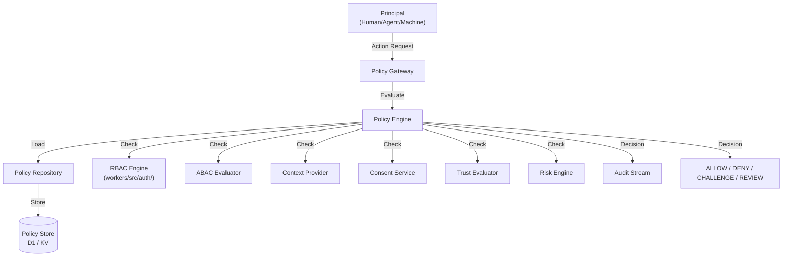
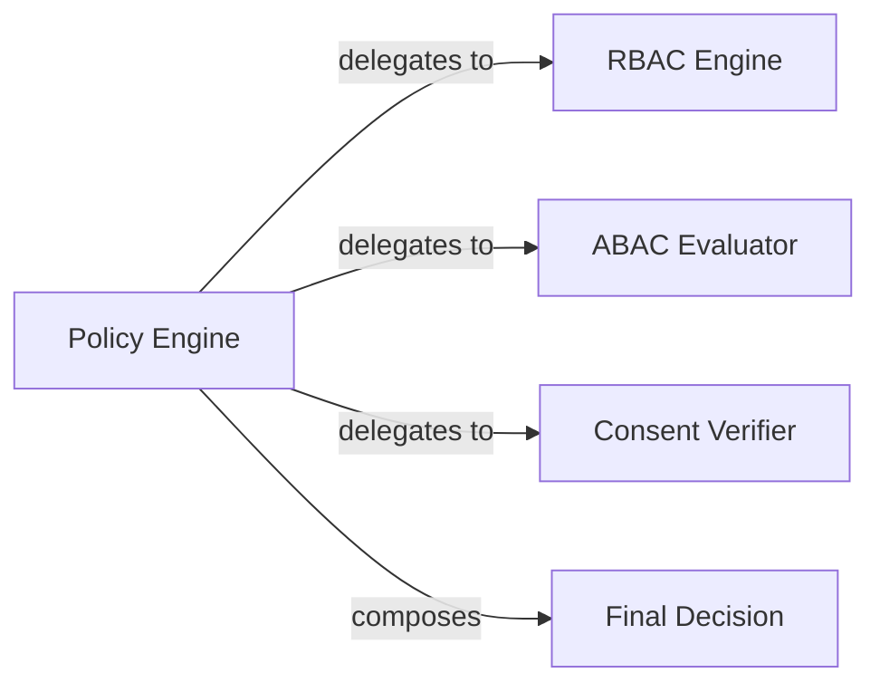
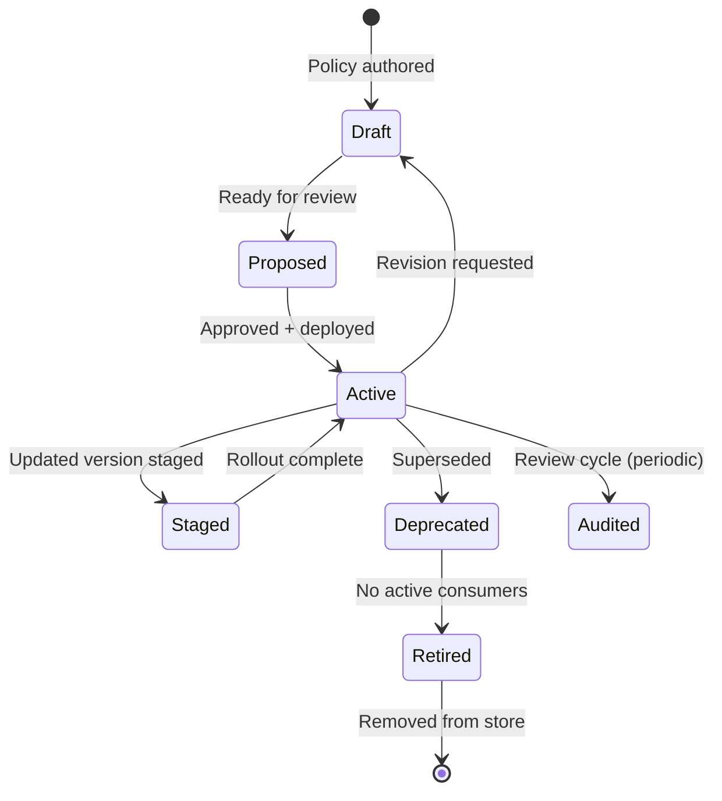
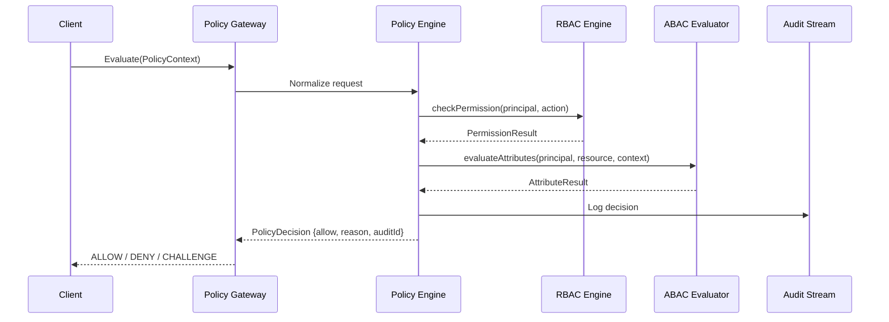
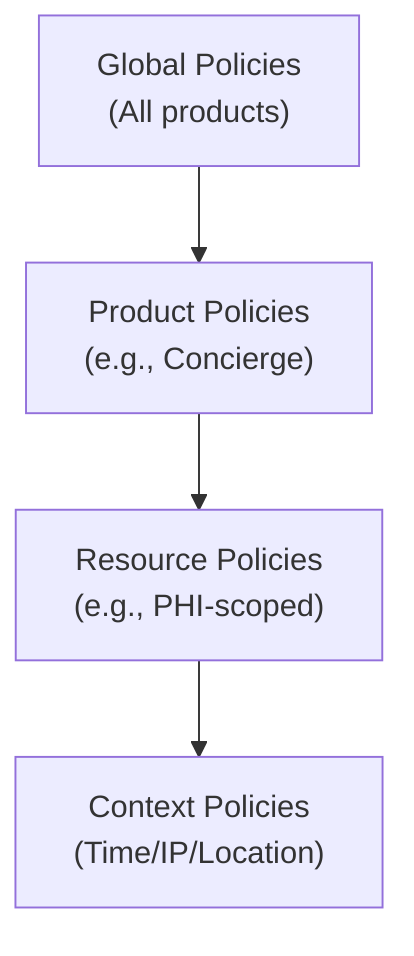

# Policy Engine — AI Platform Capability

> **Reusable, provider-agnostic policy evaluation for all AGS products.**
> The Policy Engine is an AI Platform capability — NOT a Concierge-specific service. Every product (Concierge, future products) consumes the Policy Engine through stable contracts.
>
> **Status:** Phase 2 — Wave 2 (Architecture)
> **Version:** 1.0.0
> **Last Updated:** 2026-07-26

---

## Governance Header

```
Company:        AGS
Platform:       AI Platform
Product:        Concierge (consumer)
Public Brand:   AG Synergy
Repository:     concierge-website
Capability:     Policy Engine (AI Platform)
Phase:          Phase 2 — Wave 2 (Architecture)
Status:         Architecture Complete — Awaiting Implementation
```

---

## 1. Platform Purpose

### 1.1 What the Policy Engine Is

The Policy Engine is the **centralized, deterministic policy evaluation service** for the entire AI Platform. It evaluates whether a given action by a given principal (human, agent, machine, service) should be permitted based on a hierarchy of policies that span RBAC, ABAC, resource constraints, context, time, and delegation.

### 1.2 What the Policy Engine Is NOT

| Anti-pattern | Correct approach |
|---|---|
| Policy logic embedded in product code | Policies are defined in the engine, consumed by products |
| Hardcoded role-to-permission maps | Data-driven policy definitions (ADR-003 principle) |
| Policy defined per-product in isolation | Shared policy hierarchy with product overrides |
| Product code calls RBAC directly | Products call the Policy Engine; RBAC is one strategy |

### 1.3 Separation Principles

```
Identity (who you are)
    ↓
Policy Engine (what you may do)
    ↓
Product Logic (execute action)
    ↓
Audit (record everything)
```

- **Identity is separated from Policy** — identities are owned by Trust & Identity; policies are owned by the Policy Engine
- **Consent is separated from Policy** — consent verification is a policy input, not a policy definition
- **Products consume platform contracts** — no product-specific policy logic inside the platform

---

## 2. Architecture

### 2.1 High-Level Architecture



### 2.2 Components

| Component | Responsibility | Status |
|---|---|---|
| **Policy Gateway** | Entry point for all policy evaluation requests. Normalizes request into evaluation context. | **Architecture** |
| **Policy Engine** | Core evaluation logic. Applies policy hierarchy, resolves conflicts, produces decision. | **Architecture** |
| **Policy Repository** | Stores and retrieves policy definitions. Supports versioning and history. | **Architecture** |
| **RBAC Evaluator** | Legacy role-permission engine (`workers/src/auth/`). Adopted as one evaluation strategy. | ✅ **Live** |
| **ABAC Evaluator** | Attribute-based policy matching. Evaluates principal, resource, context attributes. | **Architecture** |
| **Context Provider** | Supplies runtime context: time, location, device, resource sensitivity, risk score. | **Architecture** |
| **Consent Verifier** | Checks consent requirements (delegated to Consent & Trust capability). | **Architecture** |
| **Trust Evaluator** | Evaluates trust score and risk factors (delegated to Trust & Identity). | **Architecture** |
| **Audit Adapter** | Writes every evaluation result to the audit stream. | **Architecture** |

### 2.3 Policy vs. RBAC Relationship

The existing RBAC engine (`workers/src/auth/`) continues to operate unchanged. The Policy Engine **wraps** it as one evaluation strategy:



- Products may continue using RBAC directly for Phase 1 backward compatibility
- New products use the Policy Engine exclusively
- The Policy Engine is **opt-in** — existing RBAC routes are unaffected

---

## 3. Policy Lifecycle

### 3.1 Lifecycle States



| State | Description |
|---|---|
| **Draft** | Being authored. Not applied. |
| **Proposed** | Ready for review. Version pinned. |
| **Active** | Actively evaluated for all matching requests. |
| **Staged** | New version deployed alongside active version, not enforced. |
| **Deprecated** | Still evaluated but no new consumers may depend on it. |
| **Retired** | Removed from active evaluation. Preserved in history. |

### 3.2 Versioning

```
Policy {id}: {major}.{minor}.{patch}
- major: Breaking change (different evaluation result for same input)
- minor: Non-breaking addition (new condition, new effect)
- patch: Bug fix, clarification (no semantic change)
```

Every policy evaluation records the policy version that produced the decision.

---

## 4. Decision Flow

### 4.1 Evaluation Pipeline



### 4.2 Decision Types

| Decision | Meaning | Action |
|---|---|---|
| **ALLOW** | Policy permits the action. Proceed. | Execute |
| **DENY** | Policy prohibits the action. Block. | Return error, audit deny |
| **CHALLENGE** | Additional verification needed. | Prompt MFA, re-authenticate |
| **REVIEW** | Requires human approval. | Queue for human review |

### 4.3 Conflict Resolution

When multiple policies match, resolution follows this hierarchy:

1. **Explicit DENY always wins** — Any matching deny policy overrides all allows
2. **More specific policy wins** — Resource-specific > product-level > global
3. **Most restrictive wins** — Among equal specificity, the most restrictive applies
4. **Last resort: DENY** — If no policy matches, the default is deny

---

## 5. Policy Hierarchy

### 5.1 Policy Level Hierarchy



| Level | Scope | Example | Authoring Authority |
|---|---|---|---|
| **Global** | All products, all actions | "No agent may delete production data" | Platform Owner |
| **Product** | Specific product | "Concierge staff may read patient profiles" | Product Owner |
| **Resource** | Specific resource type/ID | "Only the assigned concierge may update lead notes" | Product Owner + RBAC |
| **Context** | Time/Location/Device dependent | "No PHI access outside Canada" | Security |

### 5.2 Policy Inheritance

Policies flow downward with additive and subtractive effects:

- **Global policies** apply to all products by default
- **Product policies** inherit global policies unless explicitly overridden
- **Resource policies** inherit product policies
- **Context policies** apply as additional constraints on resource policies
- **Override mechanism:** A product may relax a global policy only if the global policy declares `overridable: true`
- **Non-overridable policies** are enforced at the global level (e.g., "no export of PHI")

---

## 6. Rule Evaluation

### 6.1 Policy Rule Structure

```typescript
interface Policy {
  id: string;
  name: string;
  description: string;
  version: string;                  // semver
  status: PolicyStatus;
  level: PolicyLevel;               // global | product | resource | context
  
  // Matching conditions (ALL must match)
  conditions: PolicyCondition[];
  
  // Effect when conditions match
  effect: "ALLOW" | "DENY" | "CHALLENGE" | "REVIEW";
  
  // Priority for conflict resolution
  priority: number;
  
  // Inheritance behavior
  overridable: boolean;              // Can a lower level override?
  
  // Audit metadata
  createdBy: string;
  createdAt: DateTime;
  updatedAt: DateTime;
}

interface PolicyCondition {
  attribute: string;                 // e.g., "principal.type", "action.name"
  operator: "EQ" | "NEQ" | "IN" | "NOT_IN" | 
            "GT" | "GTE" | "LT" | "LTE" |
            "MATCHES" | "STARTS_WITH" | "CONTAINS" |
            "BEFORE" | "AFTER" | "BETWEEN";
  value: unknown;
}
```

### 6.2 Evaluation Strategies

| Strategy | Description | When to Use |
|---|---|---|
| **RBAC** | Role-based: principal has role → role has permissions | Simple, well-understood roles |
| **ABAC** | Attribute-based: match principal/resource/context attributes | Complex, context-dependent decisions |
| **Time-based** | Evaluate time-of-day, day-of-week, date range | Operational limits, scheduled access |
| **Rate-based** | Evaluate request rate, burst capacity | API protection, abuse prevention |
| **Consent-based** | Evaluate patient consent status | PHI access, data sharing |
| **Trust-based** | Evaluate trust score threshold | Agent autonomy, risk-sensitive actions |
| **Delegation** | Evaluate delegation chain validity | Proxy access, temp authority |

### 6.3 Context-Aware Evaluation

The Policy Engine supports runtime context conditions:

```typescript
interface PolicyContext {
  principal: Principal;                     // From Trust & Identity
  action: string;                           // e.g., "leads.update"
  resource: ResourceContext;                // Type + ID + sensitivity
  product: string;                          // Which product
  environment: Environment;                 // production | staging | development
  time: DateTime;                           // Current time
  location?: LocationContext;               // Geo/country
  device?: DeviceContext;                   // Device fingerprint
  session?: Session;                        // Current session
  riskScore?: number;                       // From Risk Engine
  consentSnapshot?: ConsentSnapshot;        // From Consent & Trust
  trustScore?: number;                      // From Trust Evaluator
  delegationChain?: Delegation[];           // From Trust & Identity
  metadata?: Record<string, unknown>;
}
```

---

## 7. Supported Policy Types

### 7.1 RBAC Policies

Delegated to existing `workers/src/auth/` engine. The Policy Engine calls `checkPermission()` / `requirePermission()` as an evaluation strategy.

### 7.2 ABAC Policies

Attribute-based conditions:

```typescript
// Example: "Concierge staff may only read leads assigned to them"
{
  conditions: [
    { attribute: "principal.type", operator: "EQ", value: "staff" },
    { attribute: "action.name", operator: "STARTS_WITH", value: "leads." },
    { attribute: "resource.ownerId", operator: "EQ", value: "{principal.id}" },
  ],
  effect: "ALLOW"
}
```

### 7.3 Resource Policies

Restrict actions to specific resource types or IDs:

```typescript
// Example: "Only PHI-signed agents may access PHI resources"
{
  conditions: [
    { attribute: "resource.sensitivity", operator: "EQ", value: "phi" },
    { attribute: "principal.capabilities", operator: "IN", value: ["phi_access"] },
  ],
  effect: "ALLOW"
}
```

### 7.4 Time-Based Policies

```typescript
// Example: "No PHI access outside business hours"
{
  conditions: [
    { attribute: "resource.sensitivity", operator: "EQ", value: "phi" },
    { attribute: "time.hour", operator: "BETWEEN", value: [8, 18] },
    { attribute: "time.dayOfWeek", operator: "NOT_IN", value: [0, 6] },  // No weekends
  ],
  effect: "DENY",
  priority: 100,     // Explicit high priority to always block
}
```

### 7.5 Delegated Permissions

Policy evaluation includes the full delegation chain:

```typescript
// Delegation check: "Is this agent authorized through a valid delegation?"
{
  conditions: [
    { attribute: "delegationChain", operator: "EXISTS" },
    { attribute: "delegationChain.maxDepth", operator: "GTE", value: 0 },
    { attribute: "delegationChain.anyExpired", operator: "EQ", value: false },
  ],
  effect: "ALLOW"
}
```

---

## 8. Fail-Closed Behaviour

| Scenario | Behaviour | Reason |
|---|---|---|
| No matching policy | **DENY** | Fail closed — unknown requests are blocked |
| Engine unavailable | **DENY** | Gateway returns deny, cached policy not used |
| Policy evaluation error | **DENY** | Runtime error → deny with audit |
| Unrecognized principal type | **DENY** | Unknown identities get no implicit access |
| Context data missing | **Treat as empty/zero** | Missing context cannot expand permissions |
| Delegation chain invalid | **DENY** | Broken chain = no delegated authority |
| Consent check failure | **DENY** | Missing consent = no PHI access |

---

## 9. Audit Integration

Every policy evaluation produces an audit event:

```typescript
interface PolicyAuditEvent {
  id: string;
  timestamp: DateTime;
  policiyId: string;
  policyVersion: string;
  principalId: string;
  action: string;
  resourceType: string;
  resourceId?: string;
  // Evaluation details
  conditionsEvaluated: number;
  matchedConditions: number;
  decision: "ALLOW" | "DENY" | "CHALLENGE" | "REVIEW";
  reason: string;                       // Which rule produced the decision
  
  // Conflict resolution
  matchingPolicies: string[];
  resolvedBy: string;                   // Conflict resolution strategy
  
  // Context snapshot
  contextSnapshot: {
    environment: string;
    riskScore: number;
    trustScore: number;
    delegationDepth: number;
  };
  
  // Error reporting
  errors: PolicyError[];
}
```

---

## 10. Workforce Integration

| Workforce Identity Type | Policy Evaluation Path |
|---|---|
| **AI Agent** | Agent identity → permission scope → Policy Engine → RBAC/ABAC → decision |
| **Human Staff** | Staff identity → Policy Engine → RBAC → decision |
| **Machine Identity** | Service account → Policy Engine → Time/Resource policies |
| **Delegated** | Principal → delegation chain → Policy Engine → validate chain length + scope |

Agents always pass through the full evaluation pipeline including trust score and execution gate checks.

---

## 11. API Integration

```typescript
interface PolicyEngineService {
  /** Evaluate a single policy decision */
  evaluate(request: PolicyEvaluationRequest): Promise<PolicyDecision>;
  
  /** Check multiple permissions (batch) */
  evaluateBatch(requests: PolicyEvaluationRequest[]): Promise<PolicyDecision[]>;
  
  /** Get effective policies for a principal */
  getEffectivePolicies(principalId: string): Promise<Policy[]>;
  
  /** Manage policy lifecycle */
  createPolicy(policy: PolicyCreateRequest): Promise<Policy>;
  updatePolicy(policyId: string, updates: Partial<Policy>): Promise<Policy>;
  deletePolicy(policyId: string): Promise<void>;
  getPolicy(policyId: string): Promise<Policy>;
  listPolicies(filter?: PolicyFilter): Promise<PaginatedResult<Policy>>;
  deployPolicy(policyId: string, environment: string[]): Promise<void>;
  
  /** Audit queries */
  getPolicyAuditHistory(policyId: string, since?: DateTime): Promise<PolicyAuditEvent[]>;
}
```

---

## 12. Multi-Product Support

The Policy Engine supports multiple products through:

1. **Product-scoped policies** — Each policy belongs to a product (or is global)
2. **Product isolation** — Concierge policies never apply to future products unless explicitly shared
3. **Product-specific conditions** — Policy conditions can match on `context.product`
4. **Independent policy lifecycles** — Each product's policies are versioned and deployed independently

```typescript
// Concierge policy evaluation
evaluate({
  principal, action, resource,
  product: "concierge",
  // Only concierge policies + global policies apply
});

// Future product X policy evaluation
evaluate({
  principal, action, resource,
  product: "product-x",
  // Only product-x policies + global policies apply
});
```

---

## 13. Future Extensibility

| Extension | Design | When |
|---|---|---|
| **External policy providers** | `PolicyProvider` interface for third-party policy engines (Open Policy Agent, Cedar) | Phase 3+ |
| **Policy simulation** | Evaluate policies without applying them | Phase 3+ |
| **Policy as code** | Git-ops for policy definitions | Phase 3+ |
| **Policy insights** | Analytics on denied vs allowed, most-common conditions | Phase 4+ |
| **Machine learning policy suggestions** | Anomaly detection on policy violations | Future |
| **ReBAC** | Relationship-based access control as additional strategy | Future |

---

## 14. Existing RBAC Migration Path

The existing `workers/src/auth/` RBAC engine is **not replaced**. It is **adopted** as one evaluation strategy:

| Phase | Change | Impact |
|---|---|---|
| Current | Products call `requirePermission()` directly | None |
| Wave 2 integration | Policy Engine wraps RBAC as a strategy | Backward-compatible |
| Wave 3 | New products use Policy Engine only | RBAC engine remains live for legacy |
| Future | Gradual migration of existing routes to Policy Engine | Controlled per product |

---

## 15. Risks

| Risk | Likelihood | Impact | Mitigation |
|---|---|---|---|
| Policy evaluation latency | Medium | Medium | Cache frequently-hit policies; async audit |
| Policy explosion (too many) | Low | Medium | Policy lifecycle enforcement; periodic review |
| Complex conflict resolution | Medium | Medium | Clear priority system; deny-wins as default |
| Migration from direct RBAC | Low | Medium | Dual-running mode during transition |
| Performance under multi-ABAC | Low | Low | Attribute indexing; condition pre-filtering |

---

## 16. Technical Debt

| Item | Impact | Plan |
|---|---|---|
| Policy store in D1 (SQLite) limits advanced querying | Medium | Evaluate KV for hot policies, D1 for cold store |
| No policy simulation tool | Low | Phase 3+ enhancement |
| Single-threaded evaluation (Workers limitation) | Low | Stateless evaluation enables horizontal scaling |

---

*This document is architecture-only. No application code, database migrations, API changes, or UI work is authorized by this document.*
*Status: Architecture Complete — Awaiting Implementation (Phase 2 Wave 3+)*