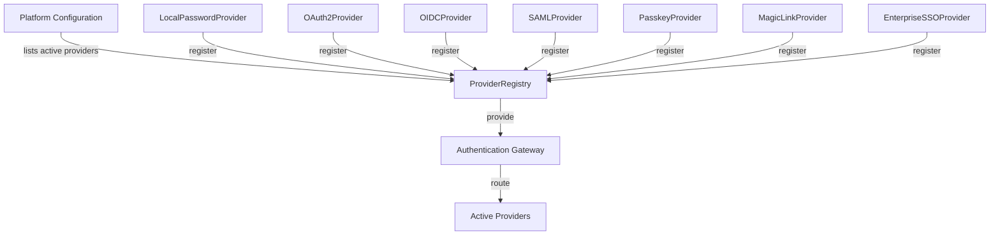
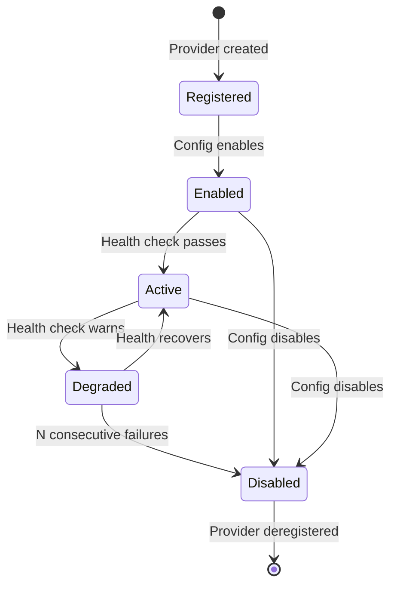
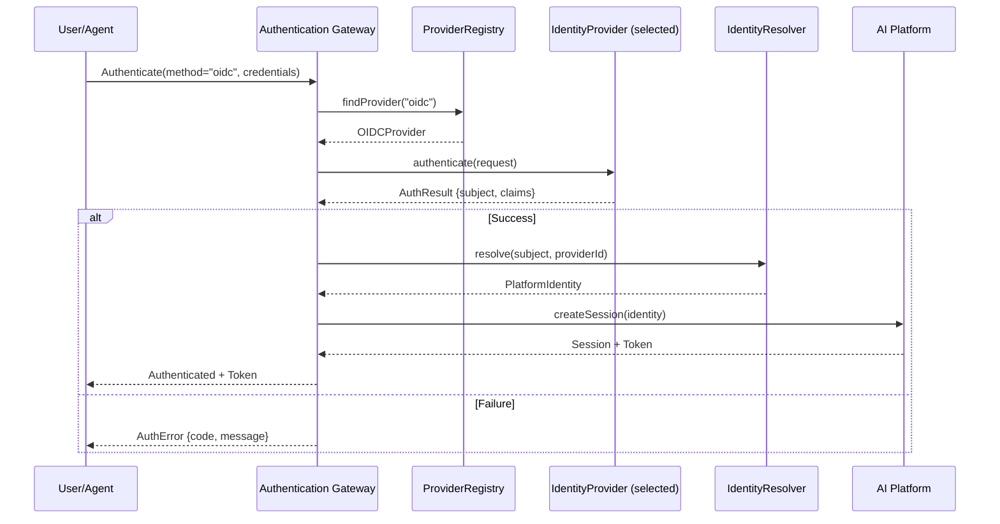

# Identity Provider Abstraction

> **Reusable AI Platform capability — provider-agnostic identity provider interfaces.**
> No vendor lock-in. Providers are discovered, registered, and selected at configuration time.
>
> **Status:** Phase 2 — Wave 1 (Architecture)
> **Version:** 1.0.0
> **Last Updated:** 2026-07-26

---

## Governance Header

```
Company:        AGS
Platform:       AI Platform
Product:        Concierge (consumer)
Public Brand:   AG Synergy
Repository:     concierge-website
Capability:     Trust & Identity — Identity Provider Abstraction
```

---

## 1. Design Principles

| Principle | Implementation |
|---|---|
| **Provider-neutral contracts** | All identity providers implement a common `IdentityProvider` interface. Product code never references a specific provider. |
| **Registration, not hardcoding** | Providers are registered in a `ProviderRegistry` at platform startup, not imported or wired in product code. |
| **Configuration-driven** | Active providers, their order, and their configuration are set via platform config, never in business logic. |
| **Fail-closed on unknown provider** | Unrecognized providers return `ProviderNotFound` — no fallback to a default. |
| **Independent provider lifecycle** | Each provider can be enabled/disabled, health-checked, and versioned independently. |
| **No credential storage in provider** | Credentials (secrets, keys, tokens) are stored in the platform secret store, never in provider manifests. |
| **Audit on every authentication** | Every provider invocation produces an audit event, regardless of outcome. |

---

## 2. Core Interfaces

### 2.1 IdentityProvider

The primary interface implemented by every identity provider:

```ts
interface IdentityProvider {
  /** Provider identifier (e.g., "google", "apple", "local") */
  readonly id: string;

  /** Human-readable display name */
  readonly displayName: string;

  /** Authentication methods this provider supports */
  readonly supportedMethods: AuthMethod[];

  /** Metadata about this provider */
  readonly metadata: ProviderMetadata;

  /** Initiate authentication */
  authenticate(request: AuthRequest): Promise<AuthResult>;

  /** Exchange authorization code for tokens (OAuth2/OIDC flow) */
  exchangeCode(code: string, redirectUri: string): Promise<TokenResult>;

  /** Validate and introspect an existing token */
  validateToken(token: string): Promise<TokenIntrospection>;

  /** Refresh an expired token */
  refreshToken(refreshToken: string): Promise<TokenResult>;

  /** Revoke a token */
  revokeToken(token: string): Promise<void>;

  /** Get provider health status */
  health(): Promise<ProviderHealth>;
}
```

### 2.2 AuthRequest / AuthResult

```ts
interface AuthRequest {
  method: AuthMethod;
  credentials: AuthCredentials;
  metadata?: RequestMetadata;
}

type AuthMethod =
  | "password"           // Email + Password
  | "magic_link_email"   // Magic link via email
  | "magic_link_sms"     // Magic link via SMS
  | "oauth2"            // OAuth 2.0 (Google, Apple, Microsoft)
  | "oidc"              // OpenID Connect
  | "saml"              // SAML 2.0
  | "passkey"           // WebAuthn / Passkeys
  | "api_token"         // API Token
  | "mtls"              // Mutual TLS
  | "ssh_key"           // SSH Key
  | "jwt"               // Self-issued JWT (workforce agents)

type AuthCredentials =
  | { type: "password"; email: string; password: string }
  | { type: "magic_link"; destination: string; channel: "email" | "sms" }
  | { type: "oauth2"; code: string; redirectUri: string; codeVerifier?: string }
  | { type: "oidc"; idToken: string; nonce?: string }
  | { type: "saml"; response: string; relayState?: string }
  | { type: "passkey"; credential: Credential; assertion: AuthenticatorAssertionResponse }
  | { type: "api_token"; token: string }
  | { type: "mtls"; certificate: Uint8Array; signature?: string }
  | { type: "ssh_key"; key: string; signature: string; data: string }
  | { type: "jwt"; token: string }

interface AuthResult {
  success: boolean;
  subject: string;             // Provider-specific user identifier
  claims: Record<string, unknown>;
  tokenSet?: TokenSet;
  mfaRequired?: boolean;
  mfaMethods?: AuthMethod[];
  error?: AuthError;
}

interface TokenSet {
  accessToken: string;
  refreshToken?: string;
  idToken?: string;
  expiresIn: number;
  tokenType: string;
}

interface TokenIntrospection {
  active: boolean;
  subject: string;
  expiresAt: DateTime;
  issuedAt: DateTime;
  scopes: string[];
  clientId?: string;
}

interface ProviderMetadata {
  version: string;
  vendor: string;
  authModel: "none" | "token" | "oauth" | "mtls" | "ssh-key" | "api-key";
  capabilities: string[];
  documentationUrl?: string;
}
```

### 2.3 ProviderRegistry

```ts
interface ProviderRegistry {
  /** Register a provider */
  register(provider: IdentityProvider): void;

  /** Get provider by ID */
  get(providerId: string): IdentityProvider | undefined;

  /** List all registered providers */
  list(): IdentityProvider[];

  /** List providers supporting a specific auth method */
  findByMethod(method: AuthMethod): IdentityProvider[];

  /** Enable a provider */
  enable(providerId: string): void;

  /** Disable a provider */
  disable(providerId: string): void;

  /** Check if a provider is enabled */
  isEnabled(providerId: string): boolean;
}
```

### 2.4 IdentityResolver

Resolves a provider-specific subject into a platform identity:

```ts
interface IdentityResolver {
  /** Resolve a provider subject to a platform identity */
  resolve(subject: string, providerId: string): Promise<PlatformIdentity>;

  /** Link an external identity to an existing platform identity */
  link(platformId: string, providerId: string, subject: string): Promise<void>;

  /** Unlink an external identity */
  unlink(platformId: string, providerId: string): Promise<void>;

  /** Find platform identity by external subject */
  findByExternalId(providerId: string, subject: string): Promise<PlatformIdentity | undefined>;
}

interface PlatformIdentity {
  id: string;
  identityType: "patient" | "staff" | "clinic" | "agent" | "machine" | "service_account";
  status: IdentityStatus;
  externalIds: ExternalId[];
  profile: IdentityProfile;
  createdAt: DateTime;
  updatedAt: DateTime;
  verifiedAt?: DateTime;
}

interface ExternalId {
  providerId: string;
  subject: string;
  linkedAt: DateTime;
}

interface IdentityProfile {
  displayName?: string;
  email?: string;
  phone?: string;
  avatarUrl?: string;
  locale?: string;
}
```

---

## 3. Plug-in Architecture

### 3.1 Provider Registration



### 3.2 Provider Discovery

Providers are:
1. **Built-in** — Shipped with the platform (local password, magic link, passkeys)
2. **Registered at startup** — Configured via platform config (OAuth2 clients, OIDC issuers, SAML metadata)
3. **Future — Marketplace** — Third-party providers registered via the Provider Framework

### 3.3 Provider Configuration Schema

```yaml
identity_providers:
  local:
    enabled: true
    type: local_password
    config:
      min_password_length: 12
      require_mfa: false
      password_reset_ttl_minutes: 15

  google:
    enabled: true
    type: oidc
    config:
      issuer: https://accounts.google.com
      client_id: ${GOOGLE_CLIENT_ID}
      client_secret: ${GOOGLE_CLIENT_SECRET}
      scopes:
        - openid
        - email
        - profile

  apple:
    enabled: true
    type: oidc
    config:
      issuer: https://appleid.apple.com
      client_id: ${APPLE_CLIENT_ID}
      team_id: ${APPLE_TEAM_ID}
      key_id: ${APPLE_KEY_ID}
      private_key: ${APPLE_PRIVATE_KEY}

  microsoft:
    enabled: false
    type: oidc
    config:
      issuer: https://login.microsoftonline.com/${TENANT_ID}/v2.0
      client_id: ${MS_CLIENT_ID}
      client_secret: ${MS_CLIENT_SECRET}

  passkeys:
    enabled: true
    type: webauthn
    config:
      rp_id: agsynergy.ca
      rp_name: AG Synergy
      origin: https://agsynergy.ca
      attestation: none

  magic_link:
    enabled: true
    type: magic_link
    config:
      ttl_minutes: 15
      channel: email
      template: magic-link-email
```

---

## 4. Provider Implementations (Planned)

### 4.1 Built-in Providers

| Provider | Auth Methods | Implementation Pattern |
|---|---|---|
| Local Password | password | bcrypt/argon2 hash comparison |
| Magic Link (Email) | magic_link_email | OTP via email, TOTP storage |
| Magic Link (SMS) | magic_link_sms | OTP via SMS, TOTP storage |
| Passkeys (WebAuthn) | passkey | Platform Authenticator + FIDO2 |
| API Token | api_token | Constant-time HMAC comparison |

### 4.2 Federation Providers

| Provider | Auth Methods | Backend Protocol |
|---|---|---|
| Google | oauth2, oidc | Google OAuth 2.0 / OIDC |
| Apple | oauth2, oidc | Sign in with Apple |
| Microsoft | oauth2, oidc | Microsoft Entra ID |
| Generic OIDC | oidc | Any OIDC-compliant IdP |
| Generic OAuth2 | oauth2 | Any OAuth2-compliant provider |
| SAML 2.0 | saml | SAML HTTP-POST / Redirect |
| Enterprise SSO | oidc, saml | Okta, Azure AD, ADFS |

### 4.3 Workforce Providers

| Provider | Auth Methods | Notes |
|---|---|---|
| Agent JWT | jwt | Self-issued platform tokens for AI agents |
| mTLS | mtls | Certificate-based service-to-service auth |
| SSH Key | ssh_key | Infrastructure access |

---

## 5. Provider Implementation Pattern

Every identity provider follows this pattern:

```ts
class OIDCProvider implements IdentityProvider {
  readonly id = "oidc-generic";
  readonly displayName = "OpenID Connect Provider";
  readonly supportedMethods = ["oidc", "oauth2"];
  readonly metadata: ProviderMetadata = {
    version: "1.0.0",
    vendor: "AGS AI Platform",
    authModel: "oauth",
    capabilities: ["oidc", "oauth2", "token_introspection"],
  };

  constructor(private config: ProviderConfig) {}

  async authenticate(request: AuthRequest): Promise<AuthResult> {
    // 1. Validate request method is supported
    // 2. Select authenticator based on credentials type
    // 3. Exchange credentials with external IdP
    // 4. Normalize result into AuthResult format
    // 5. Audit the authentication attempt
    throw new Error("Not implemented — Phase 2 implementation");
  }

  async exchangeCode(code: string, redirectUri: string): Promise<TokenResult> {
    // OAuth2 code exchange flow
    throw new Error("Not implemented — Phase 2 implementation");
  }

  // ... other interface methods
}
```

---

## 6. Provider Lifecycle



---

## 7. Authentication Flow (with Provider Abstraction)



---

## 8. Credential Security

| Concern | Mitigation |
|---|---|
| Password storage | bcrypt (cost >= 12) or argon2id — never plaintext or reversible hash |
| API token storage | HMAC-sha256 of token, not the token itself |
| OAuth2 secrets | Platform secret store, never in code or config files |
| Session tokens | Signed JWT with RS256/ES256, short TTL |
| Refresh tokens | Opaque tokens stored in D1, revocable |
| mTLS certificates | Auto-rotated, platform CA, short validity |
| Magic link OTPs | TOTP with 5-minute TTL, single-use, rate-limited |

---

## 9. Integration with Existing Authorization Engine

The existing `workers/src/auth/` engine (EPIC-002-002) already has an `IdentityResolver` registry pattern. The Trust & Identity provider abstraction integrates by:

1. **Extending the registry** — Adding the full `IdentityProvider` interface alongside the existing `IdentityResolver` pattern
2. **Authentication → Authorization pipeline** — The new auth gateway authenticates first, then feeds the authenticated principal into the existing RBAC engine
3. **Backward compatibility** — The existing `TelegramIdentityResolver` continues to work; it becomes a consumer of the Trust & Identity authentication service

```
Trust & Identity Authentication
  ↓ (authenticated principal)
Existing workers/src/auth/ Authorization Engine
  ↓ (permission decision)
Protected Route / Action
```

---

*This document is architecture-only. No application code, database migrations, API changes, or UI work is authorized by this document.*