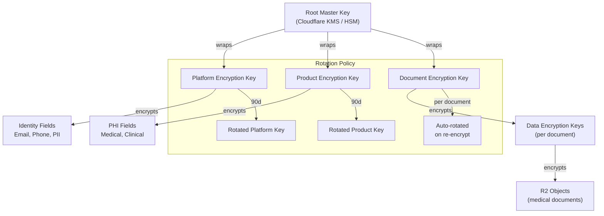
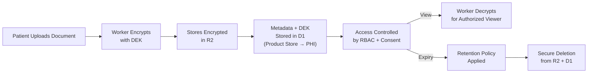
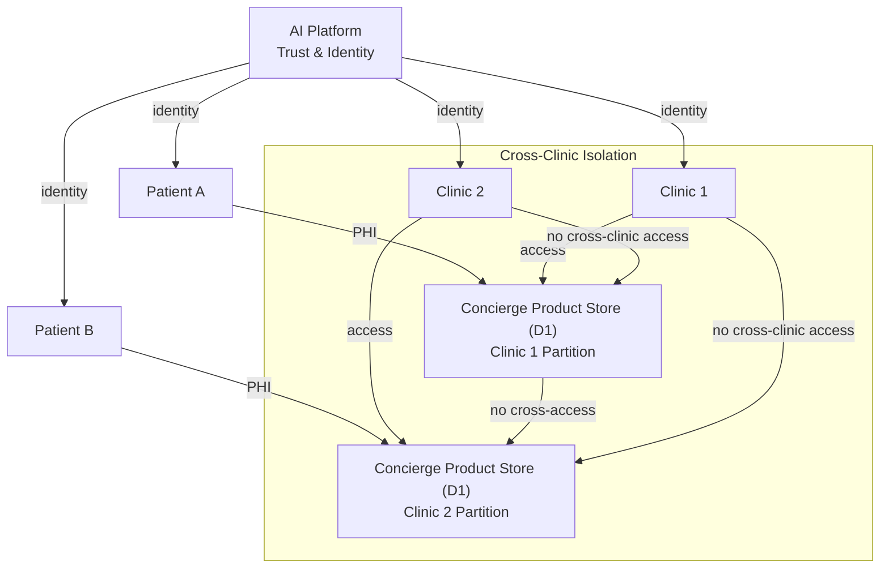
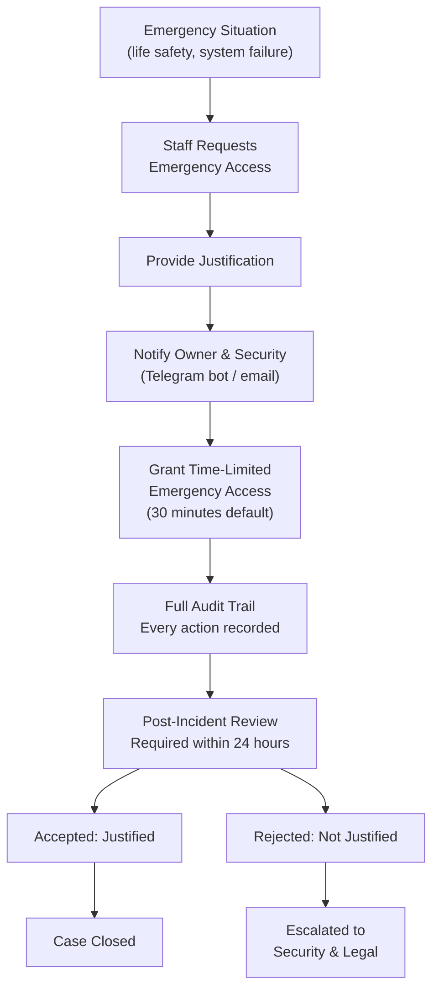

# PHI Security Architecture

> **Protected Health Information boundary design for the AI Platform.**
> Identity is strictly isolated from PHI. This document defines the security controls, encryption model, and compliance architecture for handling PHI-adjacent data.
>
> **Status:** Phase 2 — Wave 1 (Architecture)
> **Version:** 1.0.0
> **Last Updated:** 2026-07-26

---

## Governance Header

```
Company:        AGS
Platform:       AI Platform
Product:        Concierge (consumer)
Public Brand:   AG Synergy
Repository:     concierge-website
Capability:     Trust & Identity — PHI Security
```

---

## 1. PHI Boundary Principle

> **Identity data and PHI data must never coexist in the same store.**

This is the foundational principle of the PHI security architecture. The separation is:

```
┌─────────────────────┐      ┌──────────────────────┐
│   Identity Store    │      │    Product Store      │
│  (AI Platform)      │      │  (Concierge Product)  │
│                     │      │                       │
│  • User identity    │      │  • Medical records    │
│  • Authentication   │      │  • Consultation notes │
│  • Session data     │      │  • Treatment history  │
│  • Consent records  │      │  • Document metadata  │
│  • Audit log        │      │  • PHI content        │
│  • External IDs     │      │  • Clinical data      │
│                     │      │                       │
│  Encrypted at rest  │      │  Encrypted at rest    │
│  Key: Platform Key  │      │  Key: Product Key     │
└─────────────────────┘      └──────────────────────┘
        │                              │
        └────── Link by opaque ────────┘
                  principal_id
```

---

## 2. Data Classification

| Classification | Definition | Examples | Storage | Encryption |
|---|---|---|---|---|
| **Public** | No restrictions | FAQ content, clinic names, treatment descriptions | Cloudflare Pages | TLS only |
| **Internal** | Non-sensitive internal data | API documentation, deployment scripts | Repository | TLS (transit) |
| **Confidential** | Business-sensitive | Staff assignments, operational metrics, lead status | D1 (Identity Store) | AES-256-GCM at rest |
| **Restricted** | Personally identifiable | Patient name, email, phone, address | D1 (Identity Store) | AES-256-GCM + field-level encryption |
| **PHI** | Protected health info | Medical records, treatment history, clinical notes, test results | D1 (Product Store) + R2 | AES-256-GCM + envelope encryption |

### 2.1 PHI Data Elements (Applicable)

For Concierge Phase 2–3, PHI-adjacent data includes:

| Data Element | Classification | Phase | Notes |
|---|---|---|---|
| Patient name | Restricted | Phase 2 | Identity Store |
| Patient email | Restricted | Phase 2 | Identity Store |
| Patient phone | Restricted | Phase 2 | Identity Store |
| Patient address | Restricted | Phase 2+ | Identity Store |
| Date of birth | PHI | Phase 2+ | Product Store |
| Medical history | PHI | Phase 3+ | Product Store |
| Treatment records | PHI | Phase 3+ | Product Store |
| Consultation notes | PHI | Phase 2 | Product Store |
| Lab results | PHI | Phase 3+ | Product Store |
| Document uploads | PHI | Phase 2 | R2 (encrypted) |
| Insurance info | PHI | Phase 3+ | Product Store |

---

## 3. Encryption Architecture

### 3.1 Encryption Layers

```
    ┌──────────────────────────────────┐
    │         TLS 1.3 (in transit)     │  Cloudflare edge terminates TLS
    └──────────────────────────────────┘
                      │
    ┌──────────────────────────────────┐
    │   D1 / R2 Server-Side Encryption │  Cloudflare-managed (always on)
    └──────────────────────────────────┘
                      │
    ┌──────────────────────────────────┐
    │   Application-Layer Encryption   │  Platform-managed keys
    │   (field-level for PHI fields)   │
    └──────────────────────────────────┘
```

### 3.2 Key Hierarchy



### 3.3 Encryption Operations

| Operation | Algorithm | Key | Location |
|---|---|---|---|
| Field-level encrypt | AES-256-GCM | Platform/Product Key | Worker (before D1 write) |
| Field-level decrypt | AES-256-GCM | Platform/Product Key | Worker (on D1 read) |
| Document encrypt | AES-256-GCM + DEK | Document Encryption Key | Worker (before R2 upload) |
| Document decrypt | AES-256-GCM + DEK | Document Encryption Key | Worker (on R2 download) |
| Key wrapping | AES-256-KWP | Root Master Key | Cloudflare KMS |

---

## 4. Key Management

### 4.1 Key Lifecycle

| Stage | Action | Frequency |
|---|---|---|
| Generation | Create new key in Cloudflare KMS | Per requirement |
| Activation | Mark key as active for encryption | Immediate |
| Rotation | Generate new key, transition to new-primary | 90 days (app keys) |
| Retirement | Old key preserved for decryption, not used for encryption | After rotation |
| Revocation | Key marked as compromised, all data re-encrypted | On security event |
| Destruction | Key destroyed after re-encryption confirmed | After retention period |

### 4.2 Key Access Control

| Principal | Keys Accessible | Authorization |
|---|---|---|
| Platform Worker | Platform Key (encrypt/decrypt) | Service identity (mTLS) |
| Concierge Worker | Product Key (encrypt/decrypt) | Service identity (mTLS) |
| Admin (human) | Read-only key metadata | MFA + owner approval |
| Backup system | Read-only key for restore | Backup service identity |
| Audit system | Key metadata, no decrypt | Read-only audit log |

---

## 5. Audit Model

### 5.1 PHI Audit Events

| Event Type | Fields | Retention |
|---|---|---|
| `phi.read` | principal_id, patient_id, resource, timestamp, reason | 7 years |
| `phi.write` | principal_id, patient_id, resource, action, timestamp | 7 years |
| `phi.delete` | principal_id, patient_id, resource, timestamp, reason | Permanent |
| `phi.bulk_access` | principal_id, query_pattern, count, timestamp | 7 years |
| `consent.gate` | principal_id, patient_id, consent_type, outcome | 7 years |
| `emergency.access` | principal_id, patient_id, reason, duration, approver | Permanent |
| `phi.delegation` | delegator, delegate, scope, timestamp | 7 years |

### 5.2 Audit Storage

- PHI audit events stored in a **separate audit partition** from identity audit events
- Immutable append-only log
- Retention: 7 years minimum (compliance requirement)
- Annual export to cold storage
- Monthly integrity verification (hash chain validation)

---

## 6. Access Logging

### 6.1 Logged Dimensions

| Dimension | Detail |
|---|---|
| Who | Principal ID, identity type, session ID |
| What | Resource, action, query pattern |
| When | Timestamp (UTC, millisecond precision) |
| Where | IP address, geolocation, device fingerprint |
| Why | Authorization reason, consent snapshot ID |
| Outcome | ALLOW, DENY, CHALLENGE, ERROR |

### 6.2 Logging Requirements

- Every PHI access is logged before the response returns (not batched)
- Denied access is logged with the denial reason
- Bulk operations are logged with result count
- Logs are immutable (append-only, no update, no delete)
- Logs are queryable by authorized principals (audit role)
- Logs are exported to cold storage after retention period

---

## 7. Delegated Access

### 7.1 Patient Delegation

```
Patient → Proxy (family member, caregiver)
  - Scope: read-only, specific resources
  - Duration: time-bound
  - Revocable: at any time by patient
  - Audit: every proxy access logged twice (proxy + patient ID)
```

### 7.2 Staff Delegation

```
Staff A → Staff B (temporary coverage)
  - Scope: equal or narrower than Staff A's scope
  - Duration: max 30 days
  - Approvable: by clinic admin or owner
  - Audit: original staff ID attached to every action
```

### 7.3 AI Agent Delegation

```
Agent → Task (workforce execution)
  - Scope: exactly what the task requires (no broader)
  - Duration: task lifetime (max 24h)
  - No transitive delegation
  - Audit: agent ID, task ID, original delegator
```

---

## 8. Consent Records

### 8.1 Consent Storage

Consent records live in the **Identity Store** (not the Product Store) to maintain the identity-PHI boundary:

```ts
interface PHIConsentRecord {
  id: string;
  patientId: string;          // Platform identity ID
  consentType: PHIConsentType;
  scope: PHIConsentScope;
  granted: boolean;
  version: number;
  grantedAt: DateTime;
  expiresAt?: DateTime;
  revokedAt?: DateTime;
  dataProcessingDescription?: string;
  thirdPartyDisclosures?: string[];
  metadata: Record<string, unknown>;
  auditId: string;
}

enum PHIConsentType {
  DATA_COLLECTION = "data_collection",
  DATA_PROCESSING = "data_processing",
  DATA_STORAGE = "data_storage",
  DATA_SHARING = "data_sharing",
  CLINIC_DISCLOSURE = "clinic_disclosure",
  THIRD_PARTY = "third_party",
  RESEARCH = "research",
  MARKETING = "marketing",
}

interface PHIConsentScope {
  dataCategories: string[];
  purposes: string[];
  recipients: string[];
  retentionLimit?: string;
}
```

### 8.2 Consent Verification

Before any PHI operation:

1. Load consent snapshot (cached in session or fresh from store)
2. Verify the specific consent type is active and not expired/revoked
3. Verify the scope covers the specific data element being accessed
4. Log the consent verification outcome in audit
5. Reject if consent is missing, expired, or revoked

---

## 9. Secure Document Model

### 9.1 Document Lifecycle



### 9.2 Document Encryption

| Layer | Algorithm | Purpose |
|---|---|---|
| R2 default | AES-256 (Cloudflare-managed) | Server-side encryption at rest |
| Application | AES-256-GCM per document | Field-level encryption with per-document keys |
| Metadata | AES-256-GCM | Document metadata in D1 |
| Key wrapping | AES-256-KWP | DEK encrypted with Document Encryption Key |

### 9.3 Document Access Patterns

| Access Pattern | Authorization | Encryption |
|---|---|---|
| Patient views own document | Patient identity + consent check | Decrypted for session |
| Staff views patient document | Staff role + permission + patient consent | Decrypted for session |
| Clinic views patient document | Clinic role + permission + patient consent | Decrypted for session |
| Bulk export (admin) | Owner approval + audit | Re-encrypted with export key |
| Deletion | Owner or automated retention | Secure delete (overwrite + delete) |

---

## 10. Clinic Isolation

### 10.1 Multi-Clinic Data Isolation



### 10.2 Clinic Isolation Rules

- Each clinic's data is logically partitioned (separate tables/row-level tenant ID)
- No cross-clinic data access by default
- Staff at Clinic 1 cannot access Clinic 2 data even with identical role
- Platform audit enforces tenant boundary violations
- Tenant ID is assigned at identity creation and cannot change
- Emergency cross-clinic access requires owner approval and full audit

---

## 11. Patient Isolation

### 11.1 Patient Data Isolation

- Each patient's data is scoped to their identity
- No patient can access another patient's data
- Staff can access patient data only within explicit permission scope
- Bulk access requires elevated permissions and is fully audited
- De-identified data for analytics is a separate process (future phase)

---

## 12. Emergency Access Strategy

### 12.1 Break-Glass Protocol



### 12.2 Emergency Access Controls

| Control | Implementation |
|---|---|
| Time-limited | Default 30 minutes, max 4 hours |
| Single-tenancy-scoped | Access is to specific patient's data only |
| Fully audited | Every action recorded at the field level |
| Notification | Owner + security team notified immediately |
| Post-incident review | Mandatory within 24 hours |
| Automated flagging | System flags any attempt to export data during emergency |
| Dual-authorization | Emergency access requires second staff member to approve |

---

## 13. Compliance Roadmap

### 13.1 Current Compliance Baseline (Phase 2)

| Requirement | Status | Implementation |
|---|---|---|
| Encryption at rest | ✅ Designed | AES-256-GCM field-level + D1 SSE |
| Encryption in transit | ✅ Implemented | TLS 1.3 (Cloudflare edge) |
| Identity-PHI separation | ✅ Designed | Separate stores, separate keys |
| Access logging | ✅ Implemented | Audit events on every access |
| Consent management | ✅ Designed | Consent records in Identity Store |
| Session management | ✅ Designed | Time-limited, revocable sessions |
| MFA for staff | ✅ Designed | TOTP/WebAuthn, enforced at auth gateway |
| Rate limiting | ✅ Implemented | In-memory sliding window |

### 13.2 Phase 2+ Compliance (PHI-adjacent)

| Requirement | Target | Implementation |
|---|---|---|
| Field-level encryption | Phase 2 (Wave 2+) | AES-256-GCM on PHI fields |
| Document encryption | Phase 2 (Wave 3+) | Per-document DEK in R2 |
| Retention policy | Phase 2 (Wave 2+) | Automated document lifecycle |
| De-identified analytics | Phase 3+ | Separate de-identification pipeline |
| Breach notification | Phase 2+ | Automated detection + notification workflow |
| PIPEDA compliance | Phase 2 | Consent, access, correction, safeguards |
| PHIPA readiness (Ontario) | Phase 3+ | PHI custodian controls, clinic delegation |
| HIPAA readiness (US) | Phase 3+ (if expansion) | BAA, EDI, privacy rule, security rule |

### 13.3 PIPEDA Compliance Mapping

| PIPEDA Principle | Implementation |
|---|---|
| **Accountability** | AGS is responsible for PHI; platform enforces controls |
| **Identifying Purposes** | Consent types define purpose (processing, sharing, research) |
| **Consent** | Consent Record model with grant/revoke lifecycle |
| **Limiting Collection** | Identity Store collects only what's needed for authentication |
| **Limiting Use, Disclosure, Retention** | Consent scope enforcement, retention policies |
| **Accuracy** | Identity profile update flow |
| **Safeguards** | Encryption, access controls, audit, zero trust |
| **Openness** | Privacy policy accessible (Phase 2 Wave 2+) |
| **Individual Access** | Patient portal for data access (Phase 2 Wave 3+) |
| **Challenging Compliance** | Audit trail enables compliance challenge review |

---

*This document is architecture-only. No application code, database migrations, API changes, or UI work is authorized by this document.*