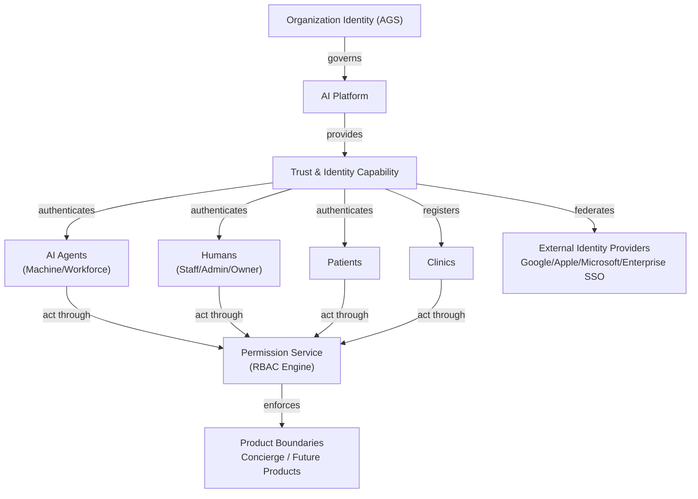
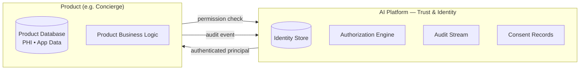
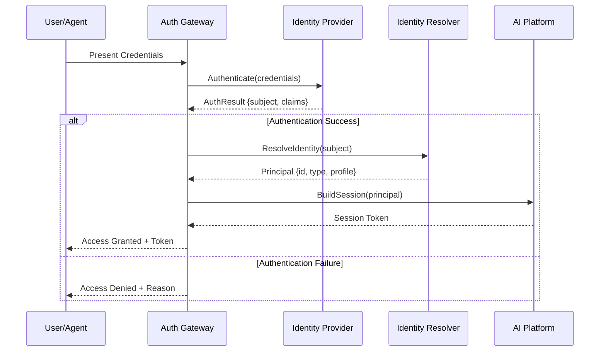
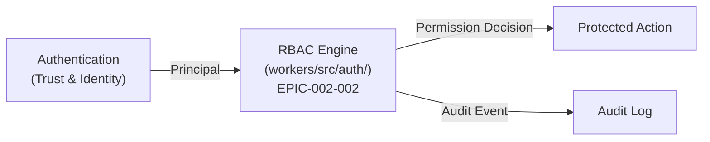
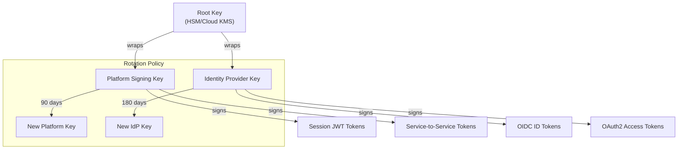
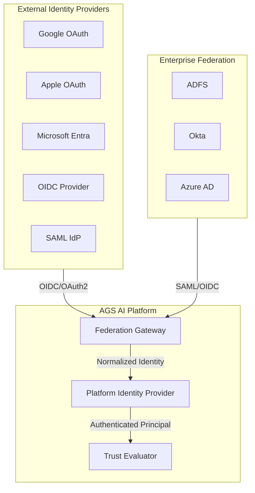

# Trust & Identity — AI Platform Capability

> **Reusable AI Platform capability — NOT Concierge-specific.**
> This document defines the Trust & Identity domain as a first-class AI Platform service that all products (Concierge, future products) consume through stable contracts.
>
> **Status:** Phase 2 — Wave 1 (Architecture & Planning)
> **Version:** 1.0.0
> **Last Updated:** 2026-07-26

---

## Governance Header

```
Company:        AGS
Platform:       AI Platform
Product:        Concierge (consumer)
Public Brand:   AG Synergy
Repository:     concierge-website
Capability:     Trust & Identity (AI Platform)
Phase:          Phase 2 — Wave 1 (Architecture)
Status:         Architecture Complete — Awaiting Implementation
```

---

## 1. Domain Overview

### 1.1 Purpose

The Trust & Identity capability provides **provider-agnostic identity and trust services** for the entire AI Platform. It is a **reusable platform capability** — every product (Concierge, future products) consumes these interfaces rather than implementing product-specific identity logic.

### 1.2 Why a Platform Capability

| Dimension | Embedded (Anti-pattern) | Platform (Correct) |
|---|---|---|
| Identity logic | Each product reinvents auth | Single identity service consumed by all products |
| Provider lock-in | Hardcoded Google/Microsoft OAuth | Provider-neutral interface, swappable backends |
| Workforce identity | Agents use product credentials | Agents have platform-level identity separate from any product |
| Audit | Scattered log tables across products | Centralized audit stream across all identity events |
| Compliance | PHI/PII mixed in app databases | Clear PHI boundary at the identity layer |
| Trust evaluation | Per-app trust decisions | Platform-wide trust evaluation for every principal |

### 1.3 Relationship to Existing Authorization Engine

The existing `workers/src/auth/` engine (Phase 1, EPIC-002-002) provides:
- Principal building from resolved identity
- Data-driven RBAC permission resolution
- Audit on every allow/deny decision
- Provider-agnostic `IdentityResolver` registry

The Trust & Identity domain **extends** this foundation by adding:
- Identity provisioning and lifecycle (not just resolution)
- Authentication (not just authorization)
- Consent management and delegation
- Agent identity (machine/workforce identities)
- Trust evaluation and risk scoring
- Federation across identity providers

The existing `workers/src/auth/` engine becomes a **consumer** of the Trust & Identity capability, receiving authenticated principals from it rather than resolving them ad-hoc.

---

## 2. Domain Model

### 2.1 Identity Types

| Identity Type | Description | Lifecycle | Examples |
|---|---|---|---|
| **Patient Identity** | Person receiving fertility services | Register → Verify → Active → Suspended → Archived | Patient creating a portal account |
| **Staff Identity** | Concierge staff (human operators) | Onboard → Active → Offboard | Concierge staff member |
| **Clinic Identity** | Partner clinic entity | Register → Verify → Active → Suspended → Deactivated | Clinic with portal access |
| **AI Agent Identity** | Autonomous workforce agent | Register → Activate → Monitor → Retire | Operations Bot, Admin Bot |
| **Machine Identity** | Service-to-service identity | Provision → Rotate → Revoke | Worker-to-Worker API calls |
| **Service Account** | Automated system identity | Provision → Active → Revoke | CI/CD pipelines, scheduled jobs |
| **Future Workforce Identity** | Expandable workforce | Same lifecycle as AI Agent | Future agent types (Phase 3+) |
| **Organization Identity** | AGS as a legal entity | Permanent | Company registry, global signing key |

### 2.2 Identity Relationships



### 2.3 Key Architectural Principle: Identity-Product Separation

**Identity must be isolated from PHI and product data.**



- The Identity Store contains **only identity attributes** (name, email, external IDs, credential hashes).
- Product databases contain **only product data** (consultations, medical records, PHI).
- The link is an **opaque principal ID** — product code never accesses identity raw data.
- This enables independent encryption, retention, and compliance policies for identity vs. product data.

---

## 3. Identity Lifecycle

### 3.1 Patient Identity Lifecycle

```
Register → Verify → Active → Suspended → Archived → Deleted (after retention)
  │          │         │          │
  │          │         ├── Password Reset
  │          │         ├── MFA Enrollment
  │          │         └── Consent Update
  │          │
  │          └── Verification Methods:
  │              ├── Email OTP
  │              ├── SMS OTP
  │              └── Document Verification (future)
  │
  └── Registration Methods:
      ├── Self-Service (sign up)
      ├── Invitation (concierge staff creates)
      └── Federation (Google/Apple/Microsoft)

States:
- REGISTERED: Initial state. Identity created but not usable.
- VERIFIED: Email/phone verified. Can authenticate.
- ACTIVE: Full access. MFA may be required.
- SUSPENDED: Temporary restriction (security, non-payment).
- ARCHIVED: No longer active. Data retained per retention policy.
- DELETED: Data removed after retention period. Irreversible.
```

### 3.2 Staff Identity Lifecycle

```
Onboarded → Active → Offboarded → Retired
  │           │           │
  │           ├── Role Assignment
  │           ├── Permission Profile
  │           └── MFA Required
  │
  └── Onboarding requires:
      - Organization owner approval
      - Background verification (future)

States:
- ONBOARDED: Created in system. No access yet.
- ACTIVE: Full operational access with MFA.
- OFFBOARDED: Access revoked. Audit trail preserved.
- RETIRED: Data retention period expired.
```

### 3.3 AI Agent Identity Lifecycle

```
Registered → Activated → Active → Suspended → Retired
  │            │          │          │
  │            │          ├── Permission Scoping
  │            │          ├── Credential Rotation
  │            │          └── Trust Score Evaluation
  │            │
  │            └── Activation requires:
  │                - Owner approval
  │                - Permission profile signed
  │                - Trust baseline met
  │
  └── Registration fields:
      - Agent name, type, owner
      - Capability declaration
      - Required permissions
      - Default: inactive

States:
- REGISTERED: Metadata exists. No credentials issued.
- ACTIVATED: Credentials issued. Can authenticate.
- ACTIVE: Full operational capability.
- SUSPENDED: Temporary halt. Credentials revoked.
- RETIRED: Permanently removed.
```

### 3.4 Machine Identity Lifecycle

```
Provisioned → Active → Rotating → Revoked
  │            │          │
  │            ├── Key Rotation (time-based)
  │            └── Certificate Re-issuance
  │
  └── Machine identities are:
      - Short-lived by default
      - Auto-rotated on schedule
      - Bound to a specific service/workload
```

---

## 4. Authentication Architecture

### 4.1 Provider Abstraction

See [IDENTITY_PROVIDER_ABSTRACTION.md](./IDENTITY_PROVIDER_ABSTRACTION.md) for the complete provider abstraction design.

### 4.2 Authentication Flow



### 4.3 Supported Authentication Methods

| Method | Provider | Use Case | Security Level |
|---|---|---|---|
| Email + Password | Local | Patient accounts | Medium (requires MFA) |
| Magic Link (email) | Local | Passwordless login | Medium |
| Magic Link (SMS) | Local | Phone-based login | Medium |
| Google OAuth | Google | Consumer identity | High |
| Apple OAuth | Apple | Consumer identity | High (privacy) |
| Microsoft OAuth | Microsoft | Enterprise identity | High |
| Passkeys (WebAuthn) | Local/Platform | Strong auth | Very High |
| OIDC | Federation | Enterprise SSO | High |
| OAuth2 | Federation | API authorization | High |
| SAML | Federation | Enterprise SSO | High |
| API Token | Machine | Service accounts | Medium (rotation) |
| mTLS | Machine | Service-to-service | Very High |
| SSH Key | Machine | Infrastructure | High |
| JWT (workforce) | Platform | AI Agent identity | High |

### 4.4 MFA Strategy

| Factor Type | Examples | When Required |
|---|---|---|
| Knowledge | Password, PIN | Baseline (Level 1) |
| Possession | TOTP, SMS OTP, Security Key | Staff access (Level 2) |
| Inherence | Biometrics (via platform) | PHI access (Level 3) |
| Location | IP range, Geo-fence | Conditional |
| Device | Device enrollment | High-risk actions |

**MFA tiers:**
- **Tier 0** — No MFA (public content, unauthenticated)
- **Tier 1** — Single factor (patient portal read)
- **Tier 2** — Two factor (patient write actions, staff)
- **Tier 3** — MFA + device trust (PHI access, admin actions, owner operations)

---

## 5. Authorization Integration

### 5.1 Authorization Flow (Existing + New)

The Trust & Identity capability feeds authenticated principals into the existing RBAC engine:



### 5.2 Permission Domains (Extended)

The existing RBAC engine uses permission keys (`leads.read`, `leads.update`, etc.). The Trust & Identity domain adds:

| Domain | Permission Pattern | Examples |
|---|---|---|
| Identity Management | `identity:*` | `identity:read`, `identity:create`, `identity:admin` |
| Consent Management | `consent:*` | `consent:read`, `consent:write`, `consent:revoke` |
| Session Management | `session:*` | `session:read`, `session:revoke` |
| Trust Evaluation | `trust:*` | `trust:evaluate`, `trust:admin` |
| Delegation | `delegation:*` | `delegation:grant`, `delegation:revoke` |
| Audit | `audit:*` | `audit:read`, `audit:export` |
| Agent Identity | `agent:*` | `agent:register`, `agent:activate`, `agent:admin` |

---

## 6. Session Management

### 6.1 Session Model

```ts
interface Session {
  id: string;
  principalId: string;
  identityType: IdentityType;
  authMethod: AuthMethod;
  mfaLevel: MFATier;
  startedAt: DateTime;
  expiresAt: DateTime;
  lastActivityAt: DateTime;
  deviceFingerprint?: string;
  ipAddress?: string;
  riskScore: number;        // 0.0 – 1.0
  consentSnapshot: ConsentSnapshot;
  delegationChain?: Delegation[];
}
```

### 6.2 Session Types

| Session Type | Duration | Refresh | Termination |
|---|---|---|---|
| Browser (patient) | 24h | Sliding (renew on activity) | Logout, expire, revoke |
| Browser (staff) | 8h | Sliding | Logout, expire, idle timeout (30m) |
| API Token | Configurable (default 1h) | Explicit refresh | Revoke, expire |
| Agent (workforce) | Until task completion | N/A (task-scoped) | Task complete, timeout |
| Machine (mTLS) | Certificate lifetime | Certificate rotation | Revoke, cert expiry |
| Admin Session | 4h | No sliding (hard limit) | Logout, expire |

### 6.3 Session Storage

| Backend | Use Case | Durability |
|---|---|---|
| Signed JWT (stateless) | Browser sessions (read-mostly) | No server storage |
| D1 (stateful) | Staff/admin sessions (revocable) | Persistent |
| KV (ephemeral) | Rate limiting, OTP flow | TTL-based |
| Durable Objects | Real-time session sync (future) | Coordinated |

---

## 7. Consent Management

### 7.1 Consent Model

```ts
enum ConsentType {
  DATA_PROCESSING = "data_processing",     // PHI processing
  DATA_SHARING = "data_sharing",            // Share with clinics
  COMMUNICATIONS = "communications",       // Email/SMS notifications
  RESEARCH = "research",
  THIRD_PARTY = "third_party",
}

interface ConsentRecord {
  id: string;
  patientId: string;
  consentType: ConsentType;
  granted: boolean;
  grantedAt: DateTime;
  expiresAt?: DateTime;
  revokedAt?: DateTime;
  version: number;
  auditId: string;
}

interface ConsentSnapshot {
  consentId: string;
  timestamp: DateTime;
  activeConsents: ConsentRecord[];
  hash: string;  // Integrity check
}
```

### 7.2 Consent Lifecycle

```
Requested → Granted → Active → Modified → Revoked
  │           │         │          │
  │           │         ├── Re-consent on policy change
  │           │         └── Periodic re-confirmation
  │           │
  │           └── Consent types are independent:
  │               - Data processing can be granted
  │               - Data sharing can be separately revoked
  │               - Communications can be toggled independently
```

### 7.3 Consent Integrity

- Every consent change produces an audit event
- Consent is snapshot-bound to sessions (not live-queried every request, but periodically refreshed)
- Consent records are immutable append-log (no UPDATE, only INSERT with version increment)
- Consent is PHI-adjacent data — stored WITH identity boundary, not with product data

---

## 8. Delegation Model

### 8.1 Delegation Types

| Type | Description | Example |
|---|---|---|
| Staff → Staff | Temporary authority transfer | Concierge staff A delegates to B during leave |
| Patient → Proxy | Patient grants access to a proxy | Patient designates a family member |
| AI Agent | Agent acts on behalf of a principal | Operations Bot acts for Lead Manager |
| Service → Service | Delegated machine access | Worker A calls Worker B on behalf of Worker C |

### 8.2 Delegation Chain

```ts
interface Delegation {
  delegatorId: string;
  delegateId: string;
  permissions: string[];
  scope: DelegationScope;
  issuedAt: DateTime;
  expiresAt: DateTime;
  maxDepth: number;           // Chain limit (default 1)
  revocable: boolean;
  auditId: string;
}

enum DelegationScope {
  SPECIFIC_RESOURCE = "specific",
  RESOURCE_TYPE = "type",
  PRODUCT = "product",
  GLOBAL = "global",
}
```

### 8.3 Delegation Rules

- Delegation chains default to max depth 1 (no transitive delegation without explicit approval)
- Delegations are always temporary (must have an expiry)
- Delegations are audited at every link
- Delegations are revocable at any link in the chain
- Delegation scope is always equal-to or narrower-than delegator's scope
- AI agents may receive delegation but cannot further delegate (depth 0 for agents)

---

## 9. Audit Architecture

### 9.1 Audit Events (Identity Domain)

```ts
interface IdentityAuditEvent {
  id: string;
  eventType: IdentityEventType;
  principalId: string;
  targetId?: string;
  timestamp: DateTime;
  outcome: "SUCCESS" | "FAILURE" | "REVOKED";
  metadata: Record<string, unknown>;
  sessionId?: string;
}
```

| Event Type | Category | Examples |
|---|---|---|
| `identity.created` | Lifecycle | Patient registered, staff onboarded |
| `identity.verified` | Lifecycle | Email verified, document verified |
| `identity.updated` | Lifecycle | Profile update, MFA enrolled |
| `identity.deactivated` | Lifecycle | Account suspended, offboarded |
| `identity.deleted` | Lifecycle | Account removal (retention expired) |
| `auth.login` | Authentication | Successful login, failed login |
| `auth.logout` | Authentication | Explicit logout, session expired |
| `auth.mfa` | Authentication | MFA challenge, MFA enrolled |
| `auth.otp` | Authentication | OTP sent, OTP verified |
| `auth.password.reset` | Authentication | Password reset requested, completed |
| `consent.granted` | Consent | Patient granted processing consent |
| `consent.modified` | Consent | Consent version updated |
| `consent.revoked` | Consent | Patient revoked consent |
| `session.created` | Session | New session established |
| `session.revoked` | Session | Session terminated by admin |
| `delegation.granted` | Delegation | Staff delegated to staff |
| `delegation.revoked` | Delegation | Delegation chain terminated |
| `trust.evaluated` | Trust | Risk score calculated for request |
| `agent.activated` | Workforce | AI agent activated |
| `agent.deactivated` | Workforce | AI agent suspended/retired |
| `agent.credential.rotated` | Workforce | Agent credential rotated |
| `identity.federation` | Federation | External IdP identity linked |

### 9.2 Audit Storage

- Identity audit events are stored in a **separate audit store** from product audit events
- Identity audit is append-only, immutable
- Retention: minimum 7 years (compliance baseline for PHI-adjacent systems)
- Audit store is provider-agnostic (D1 initially, dedicated audit database in future)

---

## 10. Key Management

### 10.1 Key Hierarchy



### 10.2 Key Management Principles

| Principle | Implementation |
|---|---|
| Keys never leave the key store | All signing/encryption operations happen inside Cloudflare/HSM |
| Key rotation is mandatory | Platform signing keys: 90 days. Identity provider keys: 180 days. |
| Key revocation is instant | Revoked keys are rejected by all verifiers immediately |
| No embedded secrets | Keys are never in source code, environment variables, or config files |
| Audit on every crypto operation | Every sign/verify/encrypt/decrypt is logged |
| Backup keys for disaster recovery | Offline backup in encrypted, access-controlled storage |

---

## 11. Zero Trust Architecture

See [ZERO_TRUST_ARCHITECTURE.md](./ZERO_TRUST_ARCHITECTURE.md) for the complete Zero Trust model.

---

## 12. PHI Security Architecture

See [PHI_SECURITY_ARCHITECTURE.md](./PHI_SECURITY_ARCHITECTURE.md) for the complete PHI boundary design.

---

## 13. Platform Identity Interfaces

See [PLATFORM_IDENTITY_INTERFACES.md](./PLATFORM_IDENTITY_INTERFACES.md) for the complete interface contracts.

---

## 14. Workforce Identity

See [WORKFORCE_IDENTITY.md](./WORKFORCE_IDENTITY.md) for the workforce readiness design.

---

## 15. Trust Evaluation & Risk Scoring

### 15.1 Trust Factors

| Factor | Weight | Source | Notes |
|---|---|---|---|
| Identity verification level | High | Auth method, MFA tier | Verified > unverified |
| Device trust | Medium | Device fingerprint, enrollment | Known device vs. new device |
| Location/IP reputation | Medium | Geo-IP, VPN/Tor detection | Unusual location = higher risk |
| Behavioral pattern | Low (future) | Session activity, typing pattern | Phase 3+ |
| Session age | Low | Time since auth | New session = higher risk |
| Delegation depth | Medium | Chain length | Deep delegation = higher risk |
| Consent validity | High | Consent snapshot age, revoked | Expired consent = block |
| Previous violations | High | Audit lookup | Repeat violator = higher risk |

### 15.2 Risk Score Calculation

```ts
interface RiskEvaluation {
  score: number;           // 0.0 (trusted) – 1.0 (block)
  factors: RiskFactor[];
  decision: RiskDecision;
  evaluatedAt: DateTime;
}

enum RiskDecision {
  ALLOW = "allow",
  CHALLENGE = "challenge",       // Request additional verification
  DENY = "deny",
  REVIEW = "review",             // Flag for human review
}
```

### 15.3 Future Adaptive Access

In future phases, the trust engine will support:
- **Adaptive MFA** — Challenge only when risk exceeds threshold
- **Behavioral baselines** — Learn normal patterns, flag anomalies
- **Step-up authentication** — Escalate auth on sensitive operations
- **Continuous verification** — Re-evaluate risk during long sessions
- **Machine learning risk model** — Improved accuracy over time

---

## 16. Federation Architecture

### 16.1 Federation Model



### 16.2 Federation Principles

1. **Platform is the authority** — Federation providers are sources of identity claims; the platform is the authority on identity resolution, permission, and trust.
2. **Normalized identity** — All external identities are mapped to a canonical platform identity. No product code sees the external identity provider.
3. **No provider lock-in** — Federation is provider-agnostic. Adding/removing a provider is a configuration change.
4. **Account linking** — A single platform identity may have multiple federated logins (e.g., Google + email/password).
5. **Privacy-preserving** — By default, only the `sub` (subject) claim is used. No profile data is stored without explicit consent.

---

## 17. Risk Register

| Risk | Likelihood | Impact | Mitigation |
|---|---|---|---|
| Identity provider compromise | Low | Critical | Provider abstraction limits blast radius; audit detects anomalous patterns |
| Session token theft | Medium | High | Short-lived tokens, MFA, device binding, risk-based challenges |
| Consent record tampering | Low | High | Append-only consent log, integrity hashing, audit |
| PHI-identity boundary crossing | Low | Critical | Separate stores, independent encryption keys, audit of all cross-boundary access |
| Workforce agent credential leak | Medium | High | Short-lived agent tokens, automated rotation, revocation on security events |
| Delegation chain abuse | Low | Medium | Max depth = 1, audited at every link, revocable at any point |
| Federation provider outage | Medium | High | Multiple provider support, graceful degradation, cached sessions |
| Passkey/phishing resistance | Low | Medium | WebAuthn origin binding, RP ID scoping |

---

## 18. Compliance Roadmap

| Regulation | Scope | Target Phase | Key Requirements |
|---|---|---|---|
| PIPEDA | Canadian personal data | Phase 2 | Consent, access, correction, retention, safeguards |
| PHIPA (Ontario) | Ontario health info | Phase 3+ | PHI custody, clinic agent controls, breach notification |
| HIPAA (US) | US health data | Phase 3+ (if US expansion) | BAA, EDI, privacy rule, security rule, breach notification |
| AGS Internal | Org security policy | Phase 2 | Audit, least privilege, approved providers, MFA for staff |

---

## 19. Related Documents

| Document | Path | Description |
|---|---|---|
| Identity Provider Abstraction | [IDENTITY_PROVIDER_ABSTRACTION.md](./IDENTITY_PROVIDER_ABSTRACTION.md) | Provider-neutral IdP interfaces |
| Open-Source Identity Comparison | [IDENTITY_PROVIDER_COMPARISON.md](./IDENTITY_PROVIDER_COMPARISON.md) | Evaluation of Keycloak, Authentik, ORY |
| Zero Trust Architecture | [ZERO_TRUST_ARCHITECTURE.md](./ZERO_TRUST_ARCHITECTURE.md) | Zero Trust model and trust boundaries |
| PHI Security Architecture | [PHI_SECURITY_ARCHITECTURE.md](./PHI_SECURITY_ARCHITECTURE.md) | PHI boundary and security controls |
| Platform Identity Interfaces | [PLATFORM_IDENTITY_INTERFACES.md](./PLATFORM_IDENTITY_INTERFACES.md) | Reusable interface contracts |
| Workforce Identity | [WORKFORCE_IDENTITY.md](./WORKFORCE_IDENTITY.md) | AI workforce identity and lifecycle |
| Threat Model | [THREAT_MODEL.md](./THREAT_MODEL.md) | Security threat assessment |
| ADR-010 | [ADR-010-trust-identity-platform-capability.md](../../docs/decisions/ADR-010-trust-identity-platform-capability.md) | Architecture decision record |

---

*This document is architecture-only. No application code, database migrations, API changes, or UI work is authorized by this document.*