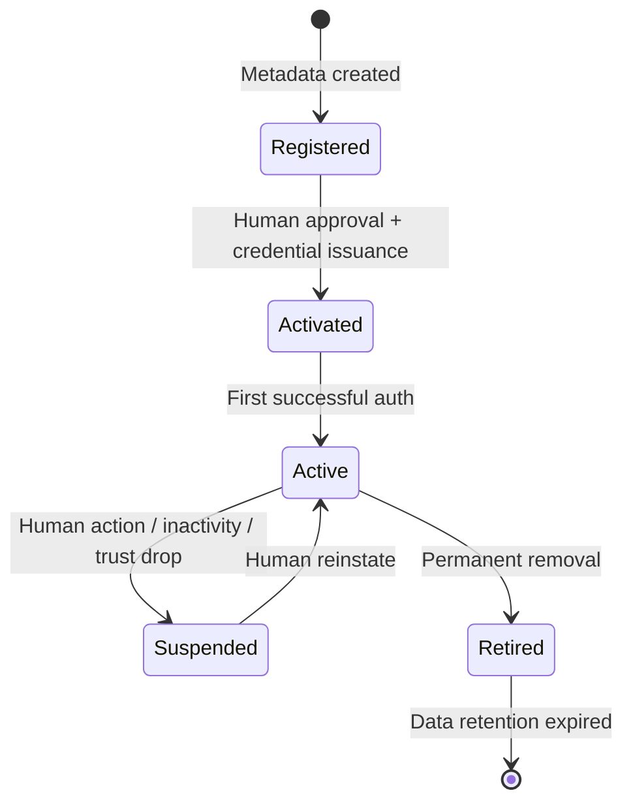
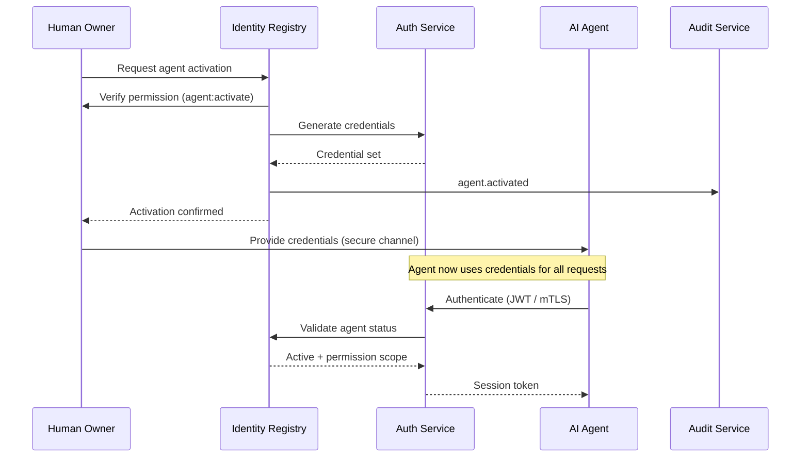
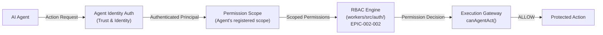
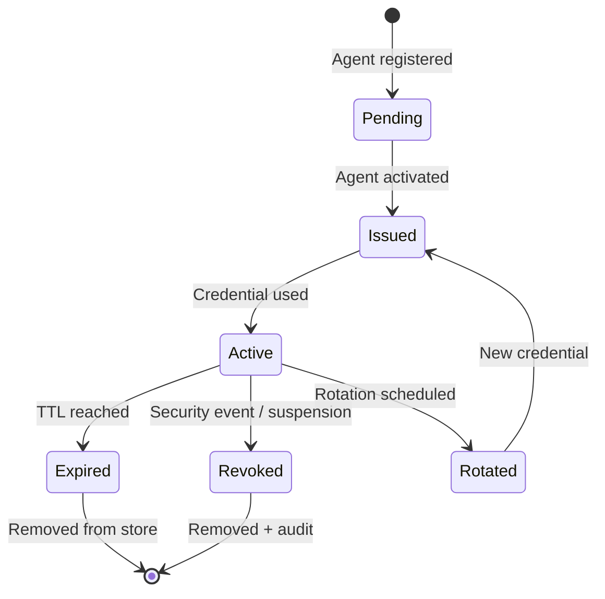
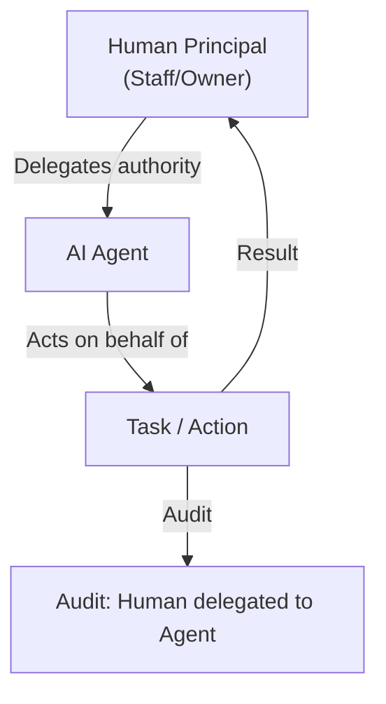
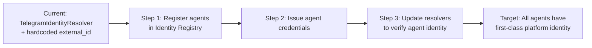

# Workforce Identity Architecture

> **AI workforce authentication, authorization, and lifecycle management.**
> Every AI agent has a first-class platform identity with full lifecycle governance.
>
> **Status:** Phase 2 — Wave 1 (Architecture)
> **Version:** 1.0.0
> **Last Updated:** 2026-07-26

---

## Governance Header

```
Company:        AGS
Platform:       AI Platform
Product:        Concierge (consumer)
Public Brand:   AG Synergy
Repository:     concierge-website
Capability:     Trust & Identity — Workforce Identity
```

---

## 1. Design Principles

| # | Principle | Why |
|---|---|---|
| 1 | **Every agent has an identity** | No anonymous execution. Every action is attributable to a specific agent identity. |
| 2 | **Identities are platform-level, not product-level** | Agents are AI Platform resources, assigned to products, not owned by them. |
| 3 | **Agents are inactive by default** | Registration creates metadata only. Activation requires explicit human approval. |
| 4 | **Credentials are short-lived and rotatable** | No permanent credentials. Automated rotation with configurable intervals. |
| 5 | **Permissions are scoped, never global** | Each agent has a defined permission scope that cannot exceed their assigned products. |
| 6 | **No transitive delegation** | Agents may receive delegation (act on behalf of a human) but cannot further delegate. |
| 7 | **Trust scores constrain autonomy** | Agents with low trust scores get additional oversight (human review gates). |
| 8 | **Full audit of every action** | Every agent action is traceable to a specific identity, session, and permission decision. |

---

## 2. Agent Identity Model

### 2.1 Agent Identity Structure

```ts
interface Agent {
  id: string;                     // Platform-wide unique
  name: string;                   // Human-readable
  description: string;            // Role description
  type: AgentType;
  status: IdentityStatus;
  owner: string;                  // Responsible human principal
  permissionScope: AgentPermissionScope;
  capabilities: string[];         // What the agent can do
  assignedProducts: string[];     // Products this agent serves
  trustScore: number;             // 0.0 – 1.0
  inactivityTimeout: number;      // Minutes before auto-suspend
  createdAt: DateTime;
  activatedAt?: DateTime;
  lastActivityAt?: DateTime;
  credentialStatus: CredentialStatus;
  metadata: Record<string, unknown>;
}
```

### 2.2 Agent Types

| Agent Type | Description | Typical Permissions | Trust Baseline |
|---|---|---|---|
| **Operations Agent** | Deploy, monitor, remediate infrastructure | Ops-scoped, no owner creds | 0.7 |
| **Security Agent** | Secret scan, vuln watch, compliance check | Read-only + alert | 0.9 |
| **QA Agent** | Test, validate, report | Test env only | 0.7 |
| **Documentation Agent** | Generate/maintain docs | Write docs/ only | 0.8 |
| **Monitoring Agent** | Health, metrics, alerts | Read telemetry | 0.8 |
| **Research Agent** | Market, tech, competitive analysis | Public/web only | 0.6 |
| **Developer Agent** | Code generation, review | Sandboxed, human-gated commit | 0.5 |
| **Intelligence Agent** | Dashboards, KPIs, forecasting | Read-only aggregated data | 0.7 |
| **Customer Support Agent** | User-facing help | App-scoped, no admin | 0.6 |
| **Lead Agent** | Lead management, assignment | Business operations | 0.6 |
| **Scheduling Agent** | Appointment management | Calendar/time scoped | 0.6 |
| **Medical Agent** | Patient coordination, clinical | PHI-scoped, human-supervised | 0.5 |
| **Future Agent Types** | Expandable | Configurable per type | TBD |

---

## 3. Agent Identity Lifecycle

### 3.1 Lifecycle States



### 3.2 Lifecycle Events

| Event | Trigger | Actions |
|---|---|---|
| **Registered** | Owner creates agent in Identity Registry | Metadata stored, status=REGISTERED, no credentials issued |
| **Activated** | Human approves activation | Credentials generated, status=ACTIVATED, audit logged |
| **Authenticated** | Agent first uses credentials | Status=ACTIVE, session created, trust evaluation |
| **Suspended** | Human action, inactivity timeout, or trust drop | Credentials revoked, status=SUSPENDED, notification sent |
| **Reinstated** | Human approves | New credentials issued, status=ACTIVATED |
| **Retired** | Permanent removal requested | Credentials revoked, status=RETIRED, audit finalized |
| **Credential Rotated** | Schedule or security event | New credentials generated, old ones expired |
| **Trust Update** | Trust score threshold crossed | May trigger suspension if below product threshold |

### 3.3 Activation Flow



---

## 4. Agent Authorization

### 4.1 Permission Scoping

Every agent operates within a **scoped permission boundary**:

```ts
interface AgentPermissionScope {
  // Which products this agent may access
  products: string[];

  // Which permissions are granted (from product's RBAC)
  permissions: string[];

  // Optional: specific resource constraints
  resources?: {
    type: string;           // e.g., "leads", "consultations"
    ids?: string[];         // Specific resource IDs (or null = all)
  }[];

  // Maximum delegation depth (0 = cannot delegate)
  maxDelegationDepth: number;

  // Additional constraints
  constraints: {
    maxSessionDuration?: number;  // Minutes
    allowedIPs?: string[];
    allowedTimeRange?: {
      start: string;   // "08:00"
      end: string;     // "20:00"
    };
    maxRequestsPerMinute?: number;
    requireHumanApproval?: string[];  // Permission keys requiring human gate
  };
}
```

### 4.2 Permission Resolution

Agent permission resolution follows this chain:

1. **Agent Identity** — Who is this agent? (Agent ID, type, status)
2. **Permission Scope** — What is this agent allowed to do? (From registered scope)
3. **Product Assignment** — Which products can this agent act on? (From assignment)
4. **Delegation Context** — Is this agent acting on behalf of a human? (If delegated)
5. **Trust Check** — Is the agent's trust score above the product threshold?
6. **Execution Gate** — Does the action pass the execution gateway? (`canAgentAct()`)

### 4.3 Permission Flow (Existing + New)



---

## 5. Credential Management

### 5.1 Credential Types

| Type | Use Case | Lifetime | Rotation |
|---|---|---|---|
| JWT (self-issued) | Agent authentication | 1 hour (task-scoped max 24h) | Every new task |
| API Token | Service-to-service | 30 days | Every 30 days |
| mTLS Certificate | Infrastructure services | 90 days | Every 90 days |
| SSH Key | Infrastructure access | 180 days | Every 180 days |
| Refresh Token | Long-lived agent tasks | 7 days | On use |

### 5.2 Credential Lifecycle



### 5.3 Credential Security

| Concern | Mitigation |
|---|---|
| Token theft | Short TTL, scope-bound, no elevation on re-use |
| Replay attacks | Token binding (include nonce, timestamp) |
| Credential leakage | Automated rotation, audit on every access |
| Revocation latency | Check credential status on every auth |
| Credential storage | Platform secret store (never in agent manifest) |

---

## 6. Trust Scoring for Agents

### 6.1 Trust Factors

| Factor | Weight | Source |
|---|---|---|
| Identity verification level | High | Auth method used, credential age |
| Permission scope compliance | High | Has agent attempted actions outside scope? |
| Task completion rate | Medium | Ratio of successful to failed tasks |
| Error/violation rate | High | Audit lookup for violations |
| Session behavior | Medium | Session duration, idle time, unusual patterns |
| Delegation depth | Medium | Never delegated = higher score |
| Human oversight | Low-Medium | Human-gated actions = lower risk |
| Credential age | Low | Recently rotated = higher score |

### 6.2 Trust Score Thresholds

| Score Range | Level | Actions Available | Oversight |
|---|---|---|---|
| 0.8 – 1.0 | High Trust | All scoped actions | Periodic audit review |
| 0.5 – 0.79 | Medium Trust | All scoped actions | Human approval for sensitive operations |
| 0.2 – 0.49 | Low Trust | Read-only actions | Human approval for all operations |
| 0.0 – 0.19 | Suspended | No actions | Investigation required |

### 6.3 Trust Score Updates

- Score is recalculated after every agent action
- Score can decrease immediately (on violation)
- Score increases gradually (over successful actions)
- Score threshold crossing triggers notification to owner

---

## 7. Delegation for Agents

### 7.1 Agent Delegation Model



### 7.2 Delegation Rules

| Rule | Implementation |
|---|---|
| **No transitive delegation** | `maxDelegationDepth = 0` for all agents (cannot delegate further) |
| **Time-bound** | Delegation expires with the task or session |
| **Scope-limited** | Agent can only receive delegation for permissions in its registered scope |
| **Revocable** | Human can revoke delegation at any time (task continues or terminates) |
| **Audited** | Every delegation action is logged with both delegator and agent IDs |
| **No automatic re-delegation** | Each new task requires explicit delegation context |

---

## 8. Autonomous Workforce Expansion

### 8.1 Adding New Agents

Adding a new agent type follows this process:

1. **Define agent type** — Capabilities, permission pattern, trust baseline
2. **Register in Identity Registry** — Creates agent identity (status = REGISTERED)
3. **Assign to product** — Links agent to product(s) it will serve
4. **Activate** — Human approval + credential issuance (status = ACTIVE)
5. **Assign to tasks** — Agent begins executing authorized actions

No architectural changes required — the agent identity model is extensible by design.

### 8.2 Agent Identity Registry Extension

```ts
// Registering a new agent type
registry.register({
  identityType: "agent",
  type: "new-agent-type",       // e.g., "scheduling-agent"
  name: "Scheduling Agent",
  description: "Manages appointment scheduling",
  owner: "ops-team",
  permissionScope: {
    products: ["concierge"],
    permissions: ["appointments:read", "appointments:create", "appointments:update"],
    constraints: {
      maxSessionDuration: 60,
      allowedTimeRange: { start: "08:00", end: "20:00" },
    },
  },
  capabilities: ["scheduling", "notification"],
});
```

---

## 9. Existing Workforce Integration

### 9.1 Current Agent Inventory

| Agent | Identity Model | Migration Path |
|---|---|---|
| **Hermes Agent** (primary) | Host system user | Register as workforce agent identity; transition to JWT auth |
| **Operations Bot** (Telegram) | `TelegramIdentityResolver` | Register as agent identity; update resolver to use agent credentials |
| **Admin Bot** (Telegram) | `TelegramIdentityResolver` | Register as agent identity; update resolver to use agent credentials |
| **Future agents** | None | Register via Identity Registry before activation |

### 9.2 Migration Strategy



---

*This document is architecture-only. No application code, database migrations, API changes, or UI work is authorized by this document.*