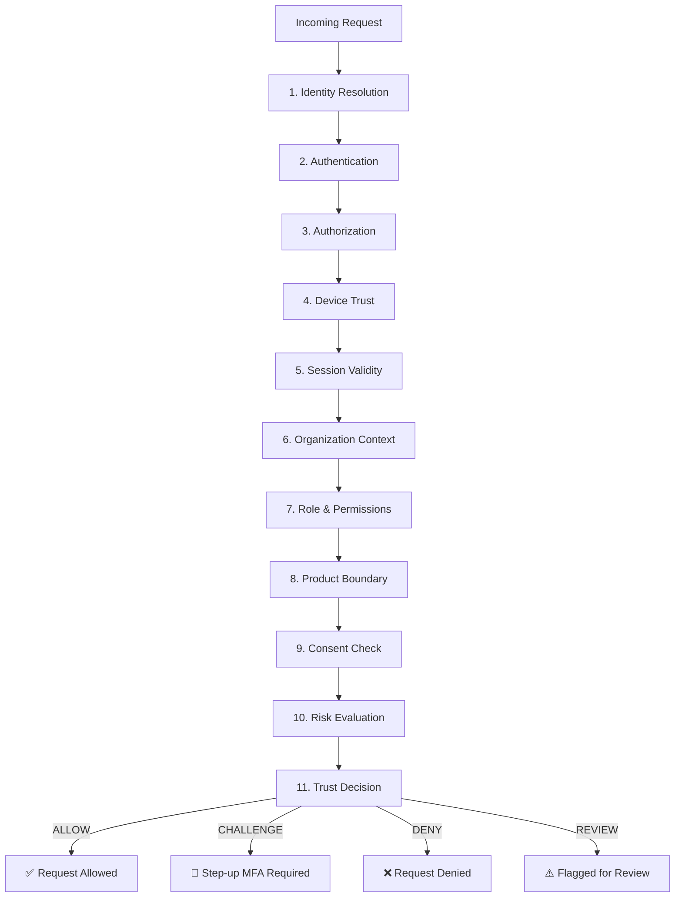
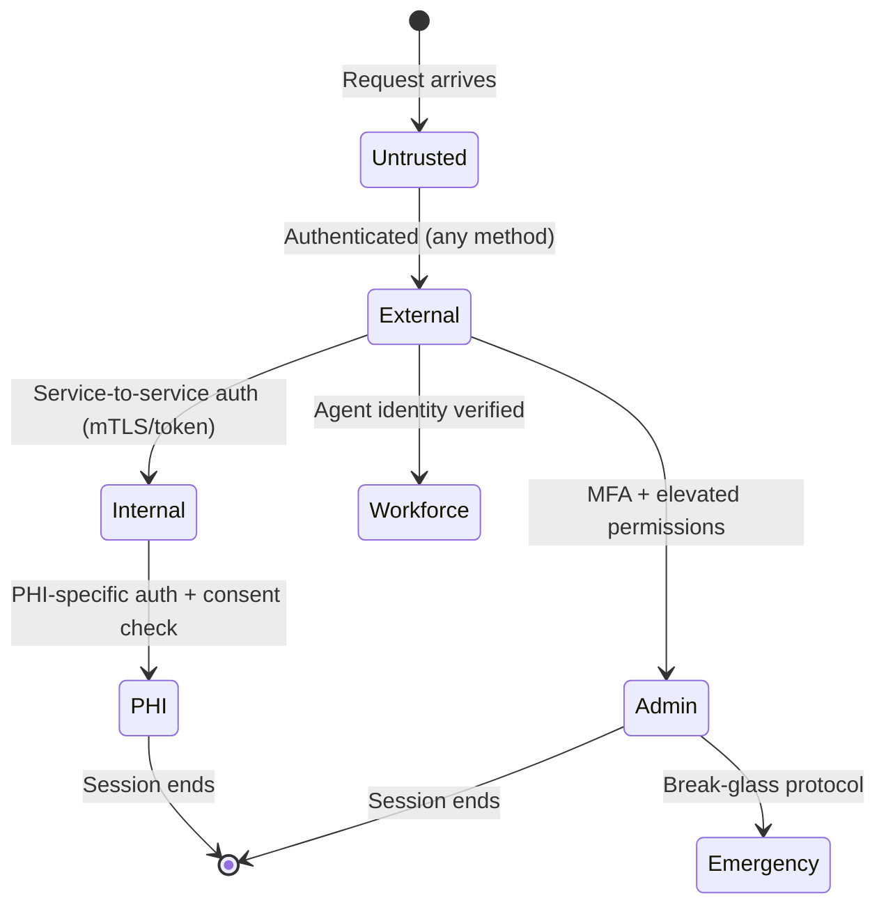
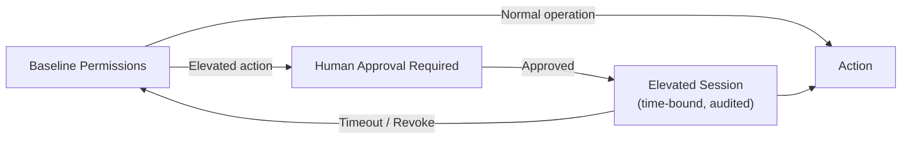
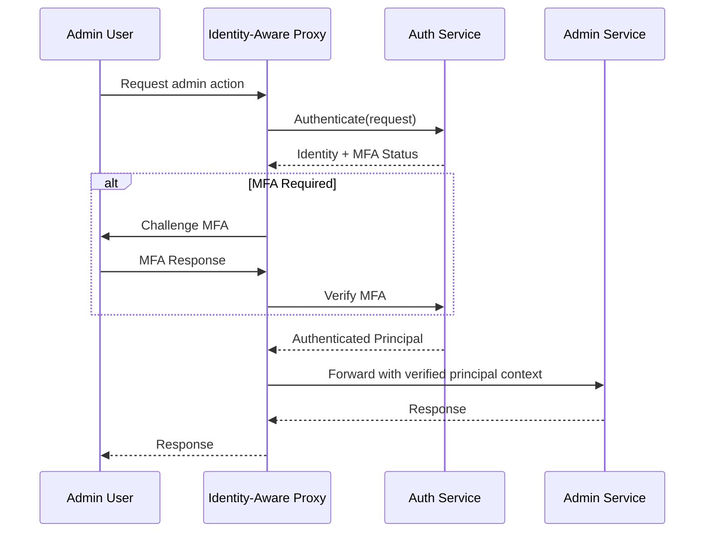

# Zero Trust Architecture

> **Reusable AI Platform trust model.**
> Every request — human, agent, or machine — is untrusted until authenticated, authorized, and risk-evaluated.
>
> **Status:** Phase 2 — Wave 1 (Architecture)
> **Version:** 1.0.0
> **Last Updated:** 2026-07-26

---

## Governance Header

```
Company:        AGS
Platform:       AI Platform
Product:        Concierge (consumer)
Public Brand:   AG Synergy
Repository:     concierge-website
Capability:     Trust & Identity — Zero Trust
```

---

## 1. Zero Trust Principles

| # | Principle | Application |
|---|---|---|
| 1 | **Never trust, always verify** | Every request is authenticated and authorized — no implicit trust for internal network, service-to-service, or agent-to-platform calls |
| 2 | **Least privilege** | Every principal gets the minimum permissions needed for their role — no elevation without explicit approval |
| 3 | **Assume breach** | Design for containment: a compromised identity, session, or agent cannot compromise other tenants or products |
| 4 | **Explicit verification** | Every request is evaluated on: identity, authentication, authorization, device, session, organization, role, product, consent, risk |
| 5 | **Continuous verification** | Trust is not a one-time check — risk is re-evaluated throughout the session |
| 6 | **Fail closed** | Any ambiguity in verification results in denial — never default-allow |
| 7 | **Audit everything** | Every trust decision is recorded in the immutable audit log |

---

## 2. Trust Decision Model

### 2.1 Every Request Evaluates



### 2.2 Trust Dimensions

```ts
interface TrustEvaluation {
  identity: IdentityResult;
  authentication: AuthenticationResult;
  authorization: AuthorizationResult;
  device: DeviceResult;
  session: SessionResult;
  organization: OrganizationResult;
  role: RoleResult;
  product: ProductResult;
  consent: ConsentResult;
  risk: RiskResult;
  overall: "ALLOW" | "CHALLENGE" | "DENY" | "REVIEW";
  evaluatedAt: DateTime;
  expiresAt: DateTime;
  auditId: string;
}
```

---

## 3. Trust Boundary Maps

### 3.1 External Trust Boundary

```
                    ┌──────────────────────────────────────┐
                    │         Public Internet               │
                    │  Patient Browser │ External API │ Bot │
                    └────────┬─────────────────────────────┘
                             │ TLS 1.3
                             ▼
                    ┌──────────────────────────────────────┐
                    │      Cloudflare Edge (WAF + TLS)      │
                    │  ┌────────────────────────────────┐   │
                    │  │   Zero Trust Gateway           │   │
                    │  │  - Authenticate                │   │
                    │  │  - Authorize (every request)   │   │
                    │  │  - Enforce MFA (when required) │   │
                    │  │  - Rate limit                  │   │
                    │  │  - Session validate            │   │
                    │  │  - Risk evaluate               │   │
                    │  └────────────────────────────────┘   │
                    └──────────────────────────────────────┘
                             │
                             ▼
                    ┌──────────────────────────────────────┐
                    │         Trusted Internal Zone          │
                    │  ┌────────────────────────────────┐   │
                    │  │   Platform Workers             │   │
                    │  │   Product Workers              │   │
                    │  │   Workforce Agents             │   │
                    │  │   D1 / R2 / KV / Queues       │   │
                    │  └────────────────────────────────┘   │
                    └──────────────────────────────────────┘
```

### 3.2 Internal Trust Boundary

```
                    ┌──────────────────────────────────────┐
                    │      Service Mesh (Service-to-Service) │
                    │                                       │
                    │  Every internal call re-authenticates: │
                    │  - mTLS or service token               │
                    │  - Scoped, short-lived                 │
                    │  - Audited                             │
                    │                                       │
                    │  NO implicit trust between Workers     │
                    └──────────────────────────────────────┘
```

---

## 4. Trust Zone Architecture

### 4.1 Zones

| Zone | Description | Trust Level | Access Pattern |
|---|---|---|---|
| **Untrusted** | Public internet, unauthenticated requests | None | Rate-limited, DDoS-protected |
| **External** | Authenticated external users (patients, staff) | Medium | Authenticated + authorized |
| **Internal** | Platform services, product services | High | mTLS + service identity |
| **Admin** | Administrative actions, owner operations | Very High | MFA + device trust + audit |
| **Workforce** | AI agent operations | Medium-High | Agent identity + permission scope |
| **PHI** | Protected health information access | Critical | All above + PHI-specific controls |
| **Emergency** | Break-glass access | Elevated | Requires dual-authorization, full audit |

### 4.2 Zone Transitions



---

## 5. Least Privilege Model

### 5.1 Permission Scoping

Every principal (human, agent, machine) operates within a **permission scope**:

```
Principal Scope = Organization ∩ Product ∩ Resource ∩ Action
```

Example:
```
Agent: Operations Bot
  Organization: AGS
  Product: Concierge
  Resource: leads
  Action: read, update
  Constraints: no PHI, no delete, time-bound (8am-8pm)
```

### 5.2 Permission Elevation



### 5.3 Default Deny

- All permissions are **explicitly granted** — no implicit "everything else"
- Unrecognized permissions → deny
- Permission not checked → deny (fail-closed)
- Permission evaluation failure → deny

---

## 6. Trust Boundary Documentation

### 6.1 Boundary 1: External / Internal

| Property | Value |
|---|---|
| **Interface** | Public-facing API endpoints |
| **Trust decision** | Authenticate + authorize every request |
| **Controls** | TLS, WAF, rate limiting, IP reputation, account enumeration protection |
| **Breach impact** | Compromised external auth → limited to single user's scope |
| **Recovery** | Revoke session, reset credentials, audit trail |

### 6.2 Boundary 2: Internal / Admin

| Property | Value |
|---|---|
| **Interface** | Admin API endpoints, workforce orchestration |
| **Trust decision** | MFA enforcement, elevated permission check, device trust |
| **Controls** | Step-up MFA, short-lived tokens, action-level audit |
| **Breach impact** | Admin compromise → access to operations but not PHI |
| **Recovery** | Immediate session revocation, owner notification, full audit replay |

### 6.3 Boundary 3: Internal / PHI

| Property | Value |
|---|---|
| **Interface** | Patient data endpoints, document access |
| **Trust decision** | PHI-specific authorization + consent check + encryption |
| **Controls** | Field-level encryption, consent snapshot validation, access logging |
| **Breach impact** | PHI exposure — critical. Full incident response required |
| **Recovery** | PHI boundaries sealed, all sessions revoked, compliance notification triggered |

### 6.4 Boundary 4: Workforce / Internal

| Property | Value |
|---|---|
| **Interface** | Agent execution paths |
| **Trust decision** | Agent identity verification, capability scope check, delegation validation |
| **Controls** | Agent credentials (JWT), permission scope, execution gate, audit |
| **Breach impact** | Compromised agent has bounded capability scope |
| **Recovery** | Suspend agent, revoke credentials, audit all agent actions |

---

## 7. Identity-Aware Proxy Pattern

All administrative access flows through an identity-aware proxy:



This pattern ensures:
- No admin service ever sees raw credentials
- MFA is enforced at the proxy, not per service
- Auth failures are handled before reaching target services
- All admin access is logged at the proxy boundary

---

## 8. Trust Evaluation Matrix

| Dimension | Caching | Re-evaluation | Stale data action |
|---|---|---|---|
| Identity | Session duration | On session refresh | Deny |
| Authentication | Token lifetime | On token expiry | Deny |
| Authorization | Per-request | Every request | N/A (live) |
| Device | Per-session (browser)/per-request (API) | On change detected | Challenge |
| Session | Stored until expiry | On expiry | Deny |
| Organization | Session duration | On context switch | Deny |
| Role | Session duration (with DB refresh) | On permission change | Refresh from DB |
| Product | Request-bound | Every request | N/A (live) |
| Consent | Session duration | On consent change event | Challenge re-consent |
| Risk | Per-request | Every request | N/A (live) |

---

## 9. Future Adaptive Access

### 9.1 Risk-Adaptive Controls

| Risk Level | Threshold | Controls Applied |
|---|---|---|
| Low | < 0.3 | Standard auth, no additional challenges |
| Medium | 0.3 – 0.6 | Step-up MFA (TOTP or push notification) |
| High | 0.6 – 0.9 | Step-up MFA + device verification |
| Critical | > 0.9 | Deny + security team alert |

### 9.2 Continuous Verification

In Phase 3+, the trust evaluator will support:
- **Session risk monitoring** — Re-evaluate risk during long sessions
- **Behavioral baselines** — Learn normal access patterns
- **Anomaly detection** — Flag unusual access (geo, time, resource, velocity)
- **Real-time revocation** — Invalidate sessions when risk spikes
- **Context-aware step-up** — Only challenge when risk indicates need

---

*This document is architecture-only. No application code, database migrations, API changes, or UI work is authorized by this document.*