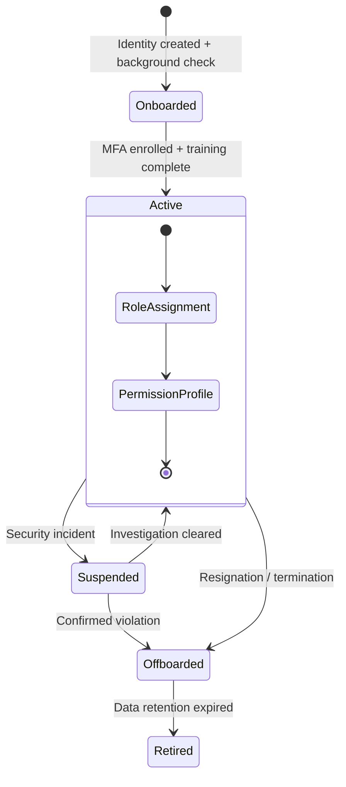
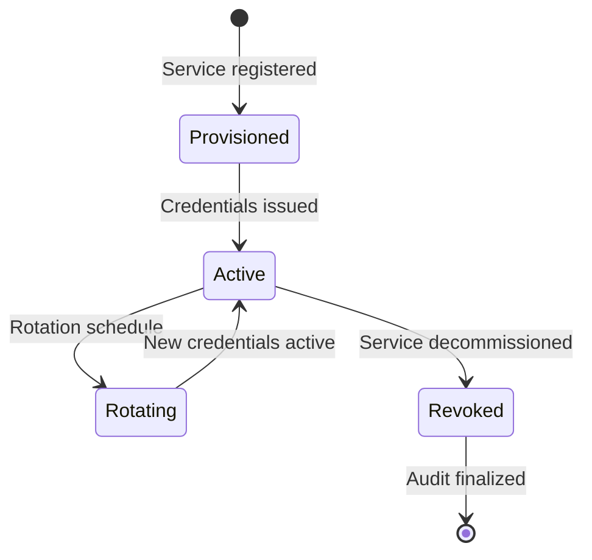
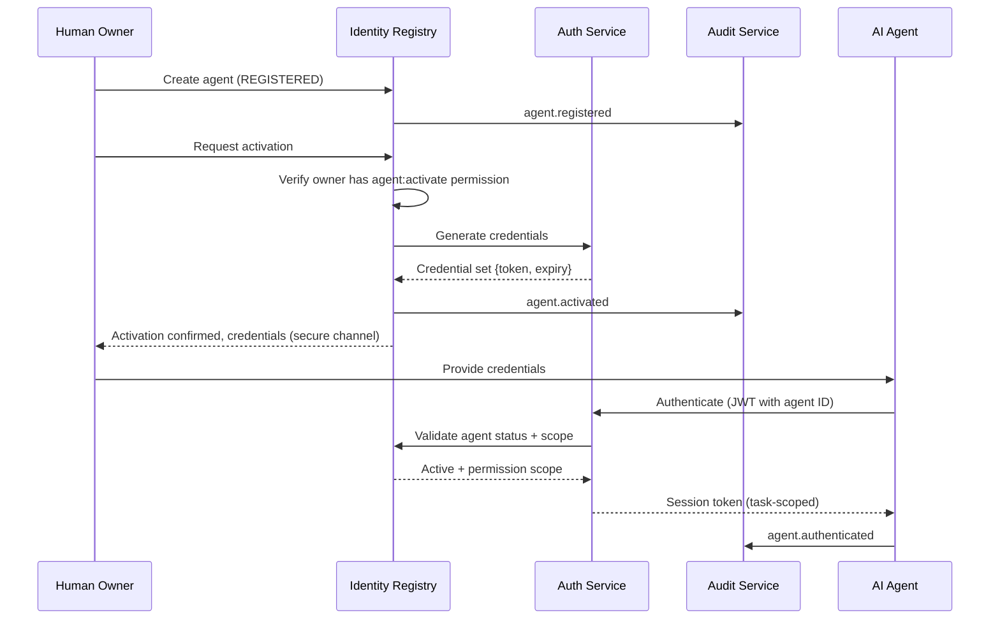
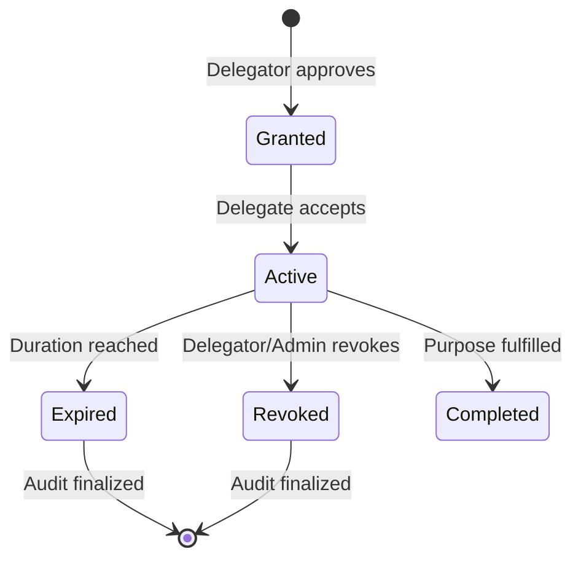
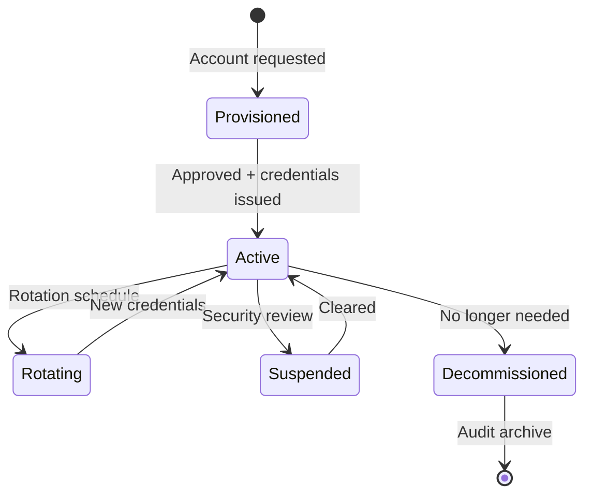
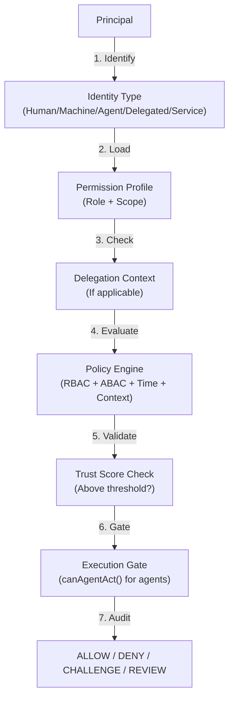
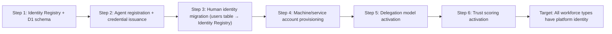

# Workforce Identity — AI Platform Capability

> **Expanded workforce identity architecture.**
> Every AI workforce member — human, machine, agent, delegation, service account — has a first-class platform identity with full lifecycle governance.
>
> **Status:** Phase 2 — Wave 2 (Architecture — Expanded)
> **Version:** 2.0.0
> **Last Updated:** 2026-07-26

---

## Governance Header

```
Company:        AGS
Platform:       AI Platform
Product:        Concierge (consumer)
Public Brand:   AG Synergy
Repository:     concierge-website
Capability:     Trust & Identity — Workforce Identity (Expanded)
Phase:          Phase 2 — Wave 2 (Architecture)
Status:         Architecture Complete — Awaiting Implementation
```

---

## 1. Identity Types

### 1.1 Workforce Identity Taxonomy

```mermaid
graph TD
    Workforce["Workforce Identities"] --> Human["Human Identities"]
    Workforce --> Machine["Machine Identities"]
    Workforce --> Agent["Agent Identities"]
    Workforce --> Delegated["Delegated Identities"]
    Workforce --> Service["Service Accounts"]
    
    Human --> Staff["Staff (Concierge)"]
    Human --> Admin["Admin / Owner"]
    Human --> Operator["Operator"]
    
    Machine --> Worker["Worker-to-Worker"]
    Machine --> CI["CI/CD Pipeline"]
    Machine --> Cron["Cron / Scheduler"]
    
    Agent --> Hermes["Hermes Agent"]
    Agent --> OpsBot["Operations Bot"]
    Agent --> AdminBot["Admin Bot"]
    Agent --> FutureAgent["Future Agents"]
    
    Delegated --> StaffDelegate["Staff → Staff Delegation"]
    Delegated --> AgentDelegate["Human → Agent Delegation"]
    Delegated --> Proxy["Patient → Proxy"]
    
    Service --> ScheduledJobs["Scheduled Jobs"]
    Service --> DataSync["Data Sync Services"]
    Service --> Webhook["Webhook Consumers"]
```



| Identity Type | Description | Lifecycle | Authentication Method | Typical Permissions |
|---|---|---|---|---|
| **Human — Staff** | Concierge staff, operators | Onboard → Active → Offboard | OIDC, MFA, SSO | Business operations |
| **Human — Admin** | Platform administrators | Onboard → Active → Offboard | MFA (Tier 3) | Platform administration |
| **Machine — Worker** | Worker-to-Worker API calls | Provision → Rotate → Revoke | mTLS, JWT | Service-scoped |
| **Machine — CI/CD** | Pipeline automation | Provision → Active → Rotate | API Token | Deploy + test |
| **Machine — Cron** | Scheduled tasks | Provision → Active → Retire | API Token | Task-scoped |
| **Agent — Hermes** | Primary platform agent | Register → Activate → Active → Retire | JWT (task-scoped) | Broad devops |
| **Agent — Operations** | Telegram business operations | Register → Activate → Active → Retire | JWT (task-scoped) | Business ops |
| **Agent — Admin** | Telegram administration | Register → Activate → Active → Retire | JWT (task-scoped) | Read-only admin |
| **Agent — Future** | Extensible agent types | Register → Activate → Active → Retire | JWT (task-scoped) | Per-type |
| **Delegated — Staff→Staff** | Temporary authority transfer | Grant → Active → Expire | Via delegator auth | Delegated scope |
| **Delegated — Human→Agent** | Agent acts on human behalf | Grant → Active → Task Complete | Via agent auth | Scoped + time-bound |
| **Delegated — Proxy** | Patient designates proxy | Grant → Active → Revoke | Via patient auth | Patient-scoped |
| **Service Account** | Automated system identity | Provision → Active → Retire | API Token, mTLS | System-scoped |

---

## 2. Human Identities

### 2.1 Human Identity Types

| Human Type | Description | MFA Required | Session Duration | Approval Authority |
|---|---|---|---|---|
| **Owner** | Platform owner (full access) | ✅ Tier 3 | 4h | N/A |
| **Admin** | Platform administrator | ✅ Tier 2 | 8h | Owner |
| **Staff — Concierge** | Business operations staff | ✅ Tier 2 | 8h | Admin |
| **Staff — Clinical** | Clinical coordinators | ✅ Tier 2 | 8h | Admin |
| **Staff — Support** | Technical support | ✅ Tier 1 | 8h | Admin |
| **Operator** | Operations bot operator | ❌ (Tier 1) | 24h | Admin |

### 2.2 Human Identity Lifecycle



| Lifecycle Event | Trigger | Actions |
|---|---|---|
| **Onboarded** | HR process, identity created | User registered in Identity Registry, status=ONBOARDED |
| **Active** | MFA enrolled, permissions assigned | Status=ACTIVE, session active, audit logged |
| **Suspended** | Security incident, policy violation | Sessions revoked, status=SUSPENDED, notification sent |
| **Reinstated** | Investigation cleared | New MFA enrollment, status=ACTIVE |
| **Offboarded** | Resignation, termination | All sessions revoked, credentials revoked, status=OFFBOARDED, access audit finalized |
| **Retired** | Data retention period expired | Personal data anonymized, audit references preserved |

### 2.3 Human Permission Model

Humans can hold multiple roles simultaneously:

- **Primary role** — Defines base permissions
- **Additional roles** — Expand permissions (never exceed primary scope without approval)
- **Temporary roles** — Time-bound role grants
- **Delegation** — Can delegate authority to other humans or agents

Permission resolution:
1. Sum of all role permissions (with deny-wins override)
2. Add temporary role permissions
3. Apply delegation context
4. Pass through Policy Engine

---

## 3. Machine Identities

### 3.1 Machine Identity Types

| Machine Type | Use Case | Credential Type | Rotation Interval |
|---|---|---|---|
| **Worker Identity** | Worker-to-Worker API auth | JWT (self-issued) | Per task (max 24h) |
| **CI/CD Identity** | Pipeline automation | API Token | 30 days |
| **Cron Identity** | Scheduled tasks | API Token | 30 days |
| **Data Sync** | Cross-service data sync | mTLS cert | 90 days |
| **Webhook Consumer** | Webhook authentication | Shared secret + HMAC | 90 days |

### 3.2 Machine Identity Lifecycle



| Lifecycle Event | Trigger | Actions |
|---|---|---|
| **Provisioned** | New service registered | Identity created, status=PROVISIONED |
| **Active** | Credentials issued | Token/cert generated, status=ACTIVE |
| **Rotating** | Rotation schedule or security event | New credentials generated, old ones expired after overlap period |
| **Revoked** | Service decommissioned, security incident | All credentials revoked, status=REVOKED |
| **Archived** | Audit retention period met | Anonymized, audit references preserved |

### 3.3 Machine Identity Scoping

```typescript
interface MachineIdentityScope {
  service: string;                      // Service name
  allowedEndpoints: string[];           // Permitted API endpoints
  allowedResources: string[];           // Permitted resource types
  rateLimits: {
    maxRequestsPerMinute: number;
    maxBurst: number;
  };
  constraints: {
    allowedIPs?: string[];
    allowedTimeRange?: { start: string; end: string };
    maxSessionDuration?: number;
  };
}
```

---

## 4. Agent Identities

### 4.1 Agent Identity Model

Expanded from the Phase 1 Workforce Identity model. Every agent has:

- **Platform identity** — Registered in Identity Registry
- **Permission scope** — Explicitly declared and enforced
- **Trust score** — Dynamic, evaluated per action
- **Credentials** — Short-lived, rotatable
- **Audit trail** — Full lifecycle and action traceability

### 4.2 Agent Types (Expanded)

| Agent Type | Description | Trust Baseline | Human Oversight | Typical Permissions |
|---|---|---|---|---|
| **Hermes Agent** | Primary platform agent | 0.8 | Human-gated deploy | Broad devops, admin read |
| **Operations Bot** | Telegram business operations | 0.7 | None (read-only) | `leads.*`, `consultations.*` |
| **Admin Bot** | Telegram administration | 0.9 | None (read-only) | `hermes:admin:read`, `audit:read` |
| **Security Agent** | Automated security scanning | 0.9 | Alert on finding | Read-only + alert |
| **Scheduling Agent** | Appointment management | 0.7 | Human approval for cancellations | `appointments.*` |
| **Notification Agent** | Multi-channel notification dispatch | 0.8 | None | Send-only |
| **Document Agent** | Document processing and classification | 0.6 | Human review for PHI | Document read/classify |
| **Research Agent** | Market/tech research | 0.6 | None | Public/web only |
| **Monitoring Agent** | Health and metric monitoring | 0.8 | Alert on threshold | Read telemetry |
| **Audit Agent** | Audit log analysis and reporting | 0.9 | None | Audit read |
| **QA Agent** | Automated testing | 0.7 | Human review for prod | Test env only |
| **Developer Agent** | Code generation and review | 0.5 | Human-gated commit | Sandboxed |
| **Lead Agent** | Lead management automation | 0.7 | None | `leads.*` |
| **Messaging Agent** | Patient communication | 0.6 | Template-only | Send messages (templates) |
| **Medical Agent** | Clinical coordination | 0.5 | Full human supervision | PHI-scoped |

### 4.3 Agent Activation Flow



---

## 5. Delegated Identities

### 5.1 Delegation Model

| Delegation Type | Description | Max Depth | Duration | Audit Requirement |
|---|---|---|---|---|
| **Staff → Staff** | Temporary authority transfer | 1 (non-transitive) | Configurable (default 7 days) | Full |
| **Human → Agent** | Agent acts on human behalf | 0 (agent cannot delegate) | Task-scoped | Full |
| **Patient → Proxy** | Patient grants access to a representative | 0 (non-transitive) | Configurable (default 30 days) | Full |
| **Admin → Staff** | Temporary elevated access | 1 (non-transitive) | Max 24h | Full |

### 5.2 Delegation Lifecycle



### 5.3 Delegation Constraints

| Constraint | Implementation |
|---|---|
| **Time-bound** | Every delegation has a mandatory expiry |
| **Scope-limited** | Delegate receives subset of delegator's permissions |
| **Non-transitive** | Default max depth = 1 (can't re-delegate) |
| **Revocable** | Any link in the chain can revoke |
| **Audited** | Every grant, use, and revocation is recorded |
| **No implicit elevation** | Delegate cannot exceed delegator's permissions |

---

## 6. Service Accounts

### 6.1 Service Account Types

| Account Type | Use Case | Authentication | Credential Lifetime |
|---|---|---|---|
| **System Account** | Internal system processes | API Token, mTLS | 90 days |
| **Integration Account** | Third-party / partner integrations | API Token + IP whitelist | 90 days |
| **Cron Account** | Scheduled job execution | API Token | 180 days |
| **CI/CD Account** | Pipeline automation | API Token (ephemeral) | Per-run |

### 6.2 Service Account Lifecycle



---

## 7. Temporary Credentials

### 7.1 Temporary Credential Types

| Type | Lifetime | Use Case | Renewal |
|---|---|---|---|
| **Task-scoped JWT** | Max 24h | Agent task execution | New task = new credential |
| **Session token** | 4–24h (per session type) | Human sessions | Sliding refresh (configurable) |
| **One-time token** | 5–15 minutes | Password reset, MFA enrollment | New request |
| **API token (ephemeral)** | 1–7 days | Short-lived integration | Manual refresh |
| **Delegation token** | Scope duration | Delegated authority | New delegation |

### 7.2 Credential Rotation

| Identity Type | Rotation Trigger | Rotation Method | Overlap Period |
|---|---|---|---|
| Machine (mTLS) | 90-day schedule | New cert issued, old cert revoked after grace period | 24h |
| Machine (API Token) | 30-day schedule | New token issued, old token expires | 24h |
| Agent (JWT) | Per task | New task = new JWT | 0 (no overlap) |
| Service Account | 90-day schedule | New credentials issued | 24h |
| Delegation | Per delegation | New delegation = new token | 0 (no overlap) |

---

## 8. Trust Scoring

### 8.1 Trust Factors (Expanded)

| Trust Factor | Weight | Source | Update Frequency |
|---|---|---|---|
| Identity verification level | 0.15 | Auth method used, credential age | Per auth |
| Permission scope compliance | 0.20 | Out-of-scope action attempts | Per action |
| Task completion rate | 0.10 | Successful vs failed task ratio | Per task |
| Error/violation rate | 0.20 | Audit lookup for violations | Per violation |
| Session behaviour | 0.10 | Session duration, idle time, unusual patterns | Per session |
| Delegation depth | 0.05 | Never delegated = higher | Per delegation |
| Human oversight | 0.10 | Human-gated actions = lower risk | Per action |
| Credential age | 0.05 | Recently rotated = higher | Per rotation |
| Location trust | 0.05 | Expected location, geo-velocity | Per request |

### 8.2 Trust Thresholds (Expanded)

| Score Range | Level | Actions Available | Oversight |
|---|---|---|---|
| 0.90 – 1.00 | **High Trust** | All scoped actions | Periodic audit review, auto-reporting |
| 0.70 – 0.89 | **Elevated Trust** | All scoped actions | Quarterly review |
| 0.50 – 0.69 | **Medium Trust** | All scoped actions | Human approval for sensitive operations |
| 0.25 – 0.49 | **Low Trust** | Read-only actions | Human approval for all operations |
| 0.00 – 0.24 | **Suspended** | No actions | Investigation required |

---

## 9. Permission Evaluation

### 9.1 Permission Resolution Pipeline



### 9.2 Permission Evaluation for Each Identity Type

| Identity Type | Policy Strategy | Trust Check | Execution Gate |
|---|---|---|---|
| Human — Staff | RBAC (role-based) + Time | Level 2+ | N/A |
| Human — Admin | RBAC + ABAC (resource sensitivity) | Level 3+ | N/A |
| Machine | RBAC (service-scoped) + Rate | Level 2+ | N/A |
| Agent | RBAC + ABAC + Time + Consent | Level 2+ | ✅ Required |
| Delegated | RBAC (delegated scope) + Depth | Level 2+ | If agent delegate |
| Service Account | RBAC (function-scoped) + Time | Level 1+ | N/A |

---

## 10. Session Management

| Identity Type | Session Type | Duration | Refresh | Re-authentication |
|---|---|---|---|---|
| Human — Staff | Browser session | 8h | Sliding (30m idle timeout) | Every 24h |
| Human — Admin | Admin session | 4h | No sliding (hard limit) | Every session |
| Machine | Service call | Per-call | N/A | Per call (mTLS/JWT) |
| Agent | Task session | Task duration | Task-level | New task |
| Delegated | Delegation session | Scope duration | Per action | New delegation |
| Service Account | Token session | Token lifetime | Token refresh | New token |

---

## 11. Revocation

| Identity Type | Revocation Trigger | Revocation Effect | Credential Handling |
|---|---|---|---|
| Human — Staff | Offboarding, security incident | All sessions revoked, status=OFFBOARDED | Tokens revoked, no reissue |
| Human — Admin | Offboarding, security incident | All sessions revoked, status=OFFBOARDED | Tokens revoked |
| Machine | Decommission, incident | Credentials revoked, status=REVOKED | All tokens/certs revoked |
| Agent | Manual suspension, trust drop | Credentials revoked, status=SUSPENDED | Active tasks terminated |
| Delegated | Delegator revokes, expiry | Delegation token invalidated | No further delegated actions |
| Service Account | Decommission, incident | Credentials revoked, status=DECOMMISSIONED | Active operations terminated |

---

## 12. Administration

### 12.1 Workforce Administration API

```typescript
interface WorkforceAdminService {
  // Identity lifecycle
  registerIdentity(request: RegisterIdentityRequest): Promise<PlatformIdentity>;
  activateIdentity(identityId: string): Promise<void>;
  suspendIdentity(identityId: string, reason: string): Promise<void>;
  reinstateIdentity(identityId: string): Promise<void>;
  retireIdentity(identityId: string, reason: string): Promise<void>;
  
  // Credential management
  issueCredentials(identityId: string): Promise<Credentials>;
  rotateCredentials(identityId: string): Promise<Credentials>;
  revokeCredentials(identityId: string, reason: string): Promise<void>;
  getCredentialStatus(identityId: string): Promise<CredentialStatus>;
  
  // Permission management
  assignRole(principalId: string, roleId: string): Promise<void>;
  removeRole(principalId: string, roleId: string): Promise<void>;
  getEffectivePermissions(principalId: string): Promise<string[]>;
  
  // Trust management
  getTrustScore(principalId: string): Promise<TrustScore>;
  updateTrustFactors(principalId: string, factors: TrustFactor[]): Promise<void>;
  
  // Session management
  listActiveSessions(principalId: string): Promise<Session[]>;
  revokeSession(sessionId: string, reason: string): Promise<void>;
  revokeAllSessions(principalId: string, reason: string): Promise<void>;
  
  // Delegation
  grantDelegation(request: DelegationGrantRequest): Promise<Delegation>;
  revokeDelegation(delegationId: string, reason: string): Promise<void>;
  listActiveDelegations(principalId: string): Promise<Delegation[]>;
  
  // Audit
  getAuditTrail(principalId: string, since?: DateTime): Promise<AuditEvent[]>;
  getActivityReport(principalId: string, dateRange: DateRange): Promise<ActivityReport>;
}
```

### 12.2 Workforce Dashboard

The workforce administration dashboard (future) should expose:

- Workforce inventory (all identity types)
- Health status per identity (active/suspended/retired)
- Trust scores and trends
- Active sessions
- Delegation map
- Audit trail viewer
- Credential rotation status
- Permission scope viewer

---

## 13. Audit

Every workforce identity lifecycle event is audited:

| Event | Description |
|---|---|
| `workforce.registered` | Identity created |
| `workforce.activated` | Identity activated |
| `workforce.suspended` | Identity suspended |
| `workforce.reinstated` | Identity reinstated |
| `workforce.retired` | Identity retired |
| `workforce.credentials.issued` | Credentials generated |
| `workforce.credentials.rotated` | Credentials rotated |
| `workforce.credentials.revoked` | Credentials revoked |
| `workforce.delegation.granted` | Delegation created |
| `workforce.delegation.revoked` | Delegation terminated |
| `workforce.trust.updated` | Trust score changed |
| `workforce.session.revoked` | Session terminated by admin |

---

## 14. Migration Path

### 14.1 Current State → Target State

| Current | Target | Migration |
|---|---|---|
| Hermes Agent: host system user | Registered agent identity | Register in Identity Registry; issue JWT creds |
| Operations Bot: `TelegramIdentityResolver` | Registered agent identity | Same resolver, new identity backend |
| Admin Bot: `TelegramIdentityResolver` | Registered agent identity | Same resolver, new identity backend |
| Human staff: D1 `users` table | Registered human identity | Sync users → Identity Registry; migrate auth flow |
| No machine identities | Machine identity registration | Create service accounts; issue credentials |

### 14.2 Migration Steps



---

## 15. Risks

| Risk | Likelihood | Impact | Mitigation |
|---|---|---|---|
| Agent credential theft | Medium | High | Short TTL, scope-bound, audit every access |
| Human offboarding gap | Medium | High | Automated offboarding detection; periodic access review |
| Delegation abuse | Low | Medium | Max depth = 1, time-bound, audited |
| Machine identity sprawl | Medium | Low | Registry with lifecycle enforcement; auto-rotation |
| Trust score gaming | Low | Medium | Multiple factor weights; human review for anomalies |

---

*This document is architecture-only. No application code, database migrations, API changes, or UI work is authorized by this document.*
*Status: Architecture Complete — Awaiting Implementation (Phase 2 Wave 3+)*