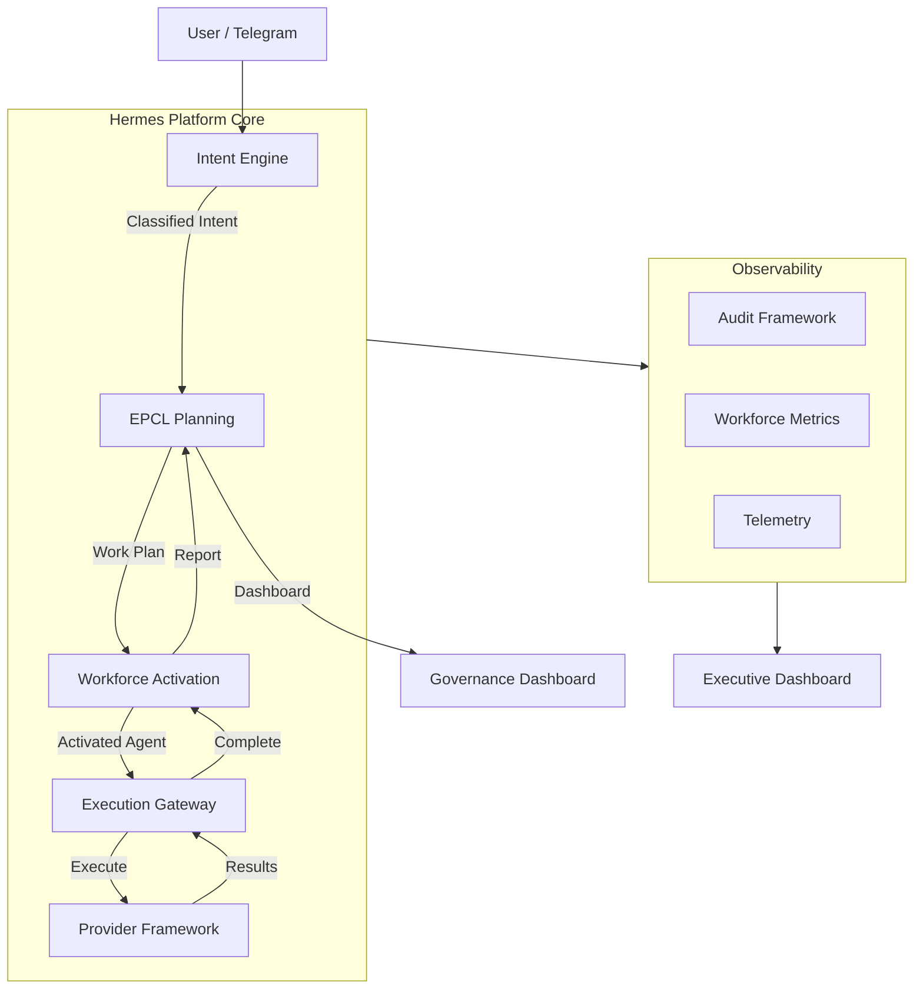
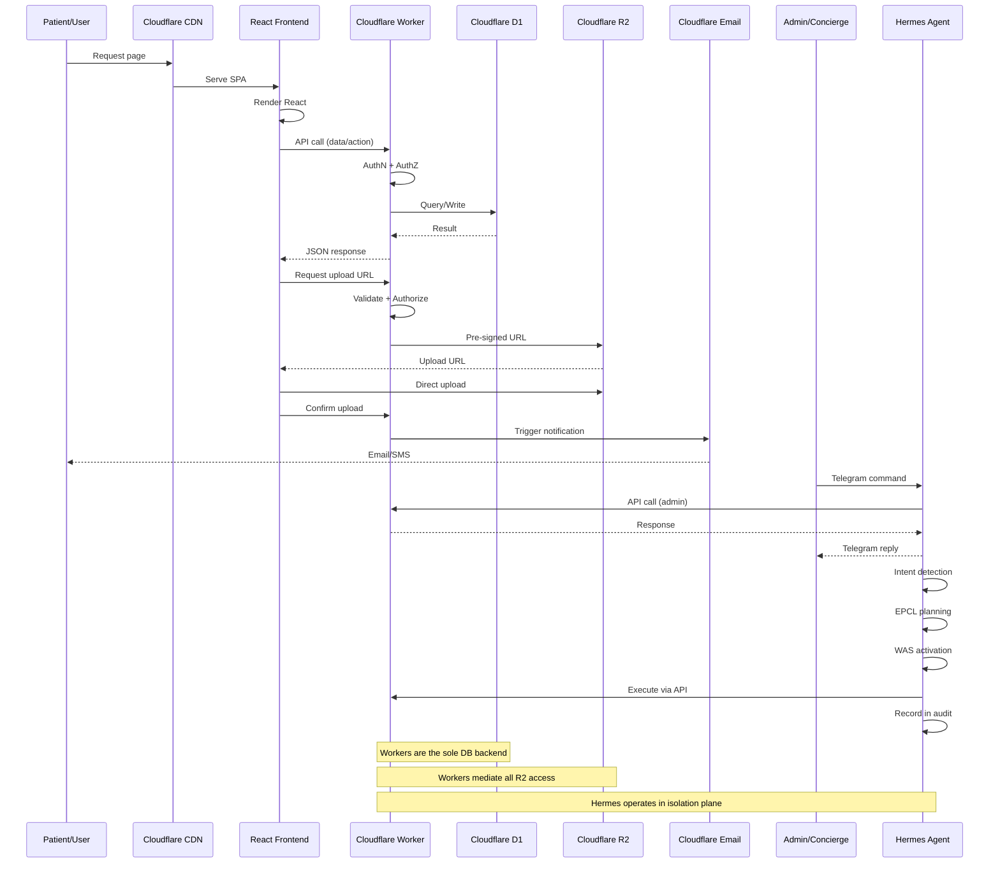
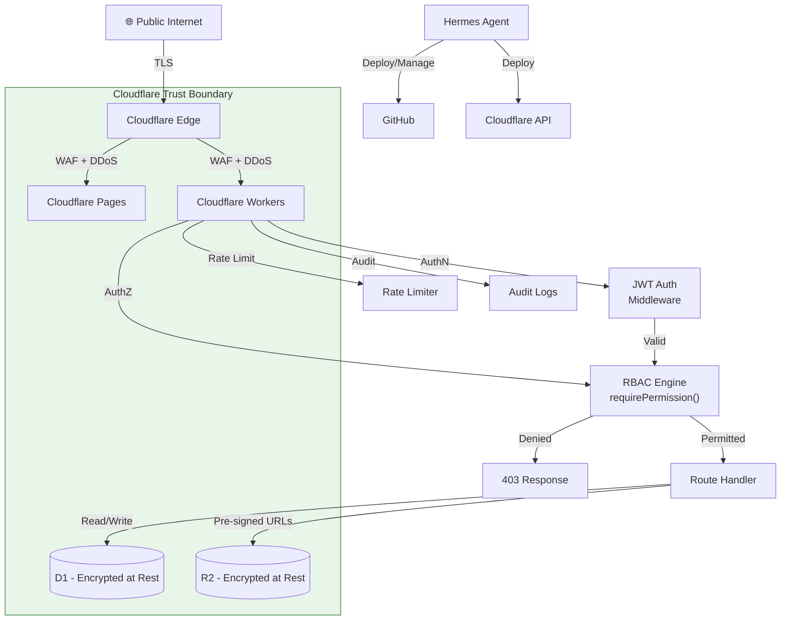
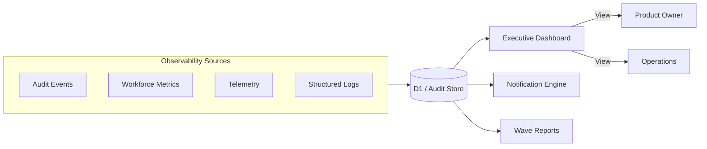
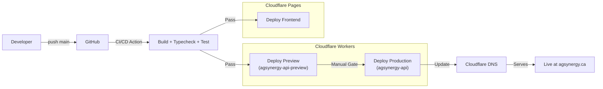

# Volume 04: Target Architecture

> **Version:** 1.0 | **Date:** 2026-08-03
> **Authority:** PMO — Desired future architecture, ratified from existing decisions
> **Status:** ⚡ RATIFIED — All components verified against repository

---

## 1. Architecture Overview

### 1.1 Two-Layer Platform Model

```
┌─────────────────────────────────────────────────────────────────────┐
│                     AG SYNERGY PRODUCT LAYER                         │
│                                                                     │
│  ┌────────────┐  ┌────────────┐  ┌────────────┐  ┌──────────────┐  │
│  │  Patient   │  │  Concierge │  │   Clinic   │  │  Admin/      │  │
│  │  Portal    │  │  Dashboard │  │  Portal    │  │  Operations  │  │
│  └────────────┘  └────────────┘  └────────────┘  └──────────────┘  │
│         │               │               │               │          │
│         └───────────────┼───────────────┴───────────────┘          │
│                         ▼                                           │
│              ┌──────────────────────┐                               │
│              │  Cloudflare Workers   │                               │
│              │  (API + Business Logic)│                              │
│              └──────────────────────┘                               │
│                         │                                           │
├─────────────────────────┼───────────────────────────────────────────┤
│                         ▼                                           │
│              HERMES PLATFORM LAYER                                   │
│                                                                     │
│  ┌────────┐ ┌──────────┐ ┌──────────┐ ┌────────┐ ┌──────────────┐ │
│  │ Intent │ │ Planning │ │Workforce  │ │Security│ │ Governance   │ │
│  │ Engine │ │  (EPCL)  │ │  (WAS)   │ │  Ops   │ │  Dashboard   │ │
│  └────────┘ └──────────┘ └──────────┘ └────────┘ └──────────────┘ │
│         │         │            │           │            │          │
│         └─────────┴────────────┴───────────┴────────────┘          │
│                           │                                         │
│                    ┌──────┴──────┐                                  │
│                    │   D1 / R2   │                                  │
│                    │ (Persistence)│                                  │
│                    └─────────────┘                                  │
└─────────────────────────────────────────────────────────────────────┘
```

### 1.2 Architectural Principles (Immutable)

1. **Cloudflare-first** — Workers, D1, R2, Pages. No multi-cloud without ADR.
2. **TypeScript everywhere** — Single language across all layers.
3. **Frontend never touches D1/R2 directly** — Workers API is sole backend entry.
4. **Patient data never flows through AI** — Hermes operates in isolated operations plane.
5. **Fail-closed default** — All gates deny access unless explicitly granted.
6. **Provider-agnostic seams** — Every dependency is behind an interface.
7. **Documentation is code** — Updated in same PR as implementation.

---

## 2. Hermes Platform Architecture

### 2.1 Core Component Interaction



### 2.2 Intent Engine

**Purpose:** Deterministically classify user intents and route to appropriate handlers.

**Components:**
- `Detector` — Determine whether input is a command or an intent
- `Classifier` — Classify intent type (plan, execute, query, governance, etc.)
- `Compiler` — Compile intent into structured execution plan
- `Router` — Route to appropriate handler
- `Validator` — Validate intent against constitution
- `Telemetry` — Emit telemetry on intent processing

**Status:** ✅ Production — Full implementation in Hermes services.

### 2.3 Executive Planning & Control Layer (EPCL)

**Purpose:** Decompose roadmap items into executable units with budget-aware planning.

**Components:**
- `PlanningEngine` — Decompose goals into plans
- `RoadmapEngine` — Prioritize and sequence roadmap items
- `DisciplineRouter` — Route work to appropriate discipline
- `ContextBudgetManager` — Manage context window budget
- `TokenBudgetManager` — Manage token allocation
- `ExecutiveDashboard` — Executive visibility
- `FeatureFlags` — Feature toggling
- `PlanAtomService` — Plan atom decomposition

**Status:** ✅ Production — Full implementation in Hermes services + Workers EPCL.

### 2.4 Workforce Activation Service (WAS)

**Purpose:** 8-state activation machine for workforce agents.

**State Machine:**
```
              ┌─────────┐
              │ PENDING │
              └────┬────┘
                   │ activate
                   ▼
           ┌───────────────┐
           │  ACTIVATING   │
           └───────┬───────┘
                   │
         ┌─────────┼─────────┐
         ▼         ▼         ▼
    ┌────────┐ ┌────────┐ ┌─────────────┐
    │ ACTIVE │ │FAILED  │ │ ROLLING_BACK│
    └───┬────┘ └────────┘ └──────┬──────┘
        │                        │
        ▼                        ▼
   ┌─────────┐             ┌──────────┐
   │DEACTIVATED│            │ REVERTED  │
   └──────────┘             └──────────┘
        │
        ▼
   ┌──────────┐
   │ REJECTED │
   └──────────┘
```

**Status:** ✅ Production — Full 8-state implementation.

### 2.5 Execution Gateway

**Purpose:** Central execution coordination with fail-closed safety.

**Components:**
- `PolicyEvaluator` — Evaluate execution policies
- `ApprovalRef` — Track approval references
- `RuntimeGuard` — Provider runtime guard
- `ExecutionCoordinator` — Coordinate execution lifecycle
- `Idempotency` — Request-level deduplication
- `Lease` — Execution lease management
- `Trust` — Trust evaluation

**Status:** ✅ Production — Full implementation.

### 2.6 Provider Framework

**Purpose:** Provider-neutral execution with discovery, loading, transport, and trust.

**Components:**
- `Discovery` — Provider discovery
- `Loader` — Provider class loading
- `Manager` — Provider lifecycle management
- `Capability` — Capability registration
- `Transport` — CLI/MCP transport
- `Runtime Guard` — 8-dimension security guard
- `Trust Lifecycle` — Provider trust management
- `Marketplace` — Provider marketplace (deferred)

**Status:** ✅ Production (except Marketplace — deferred).

---

## 3. AG Synergy Product Architecture

### 3.1 Frontend Architecture (React + Vite + Tailwind)

```
Cloudflare Pages
└── React Application
    ├── Pages (routes)
    │   ├── Home / Landing
    │   ├── Treatment Information
    │   ├── Clinic Profiles
    │   ├── FAQ
    │   ├── Patient Dashboard (Phase 2)
    │   ├── Login / Register (Phase 2)
    │   ├── Profile / Settings (Phase 2)
    │   ├── Documents (Phase 2)
    │   ├── Appointments (Phase 2)
    │   ├── Messaging (Phase 2)
    │   └── Timeline / Journey (Phase 2)
    ├── API Client
    │   ├── Auth client
    │   ├── Consultation client
    │   ├── Document client
    │   ├── Appointment client
    │   ├── Messaging client
    │   └── Timeline client
    └── Styling
        └── Tailwind CSS 4
```

### 3.2 Backend Architecture (Cloudflare Workers)

```
Workers (agsynergy-api)
├── Router (URLPattern-based, zero deps)
├── Middleware
│   ├── JWT Auth
│   ├── RBAC Authorization
│   ├── Rate Limiting
│   ├── Security Headers
│   ├── Turnstile (CAPTCHA)
│   └── Structured Logging
├── Routes
│   ├── /api/v1/health
│   ├── /api/v1/consultations
│   ├── /api/v1/clinics
│   ├── /api/v1/faqs
│   ├── /api/v1/services
│   ├── /api/v1/leads
│   ├── /api/v1/ops/*
│   ├── /api/v1/identity/*
│   ├── /api/v1/documents/*
│   ├── /api/v1/appointments/*
│   ├── /api/v1/messages/*
│   ├── /api/v1/trust/*
│   ├── /api/v1/timeline/*
│   ├── /telegram/webhook (Ops Bot)
│   ├── /admin/webhook (Admin Bot)
│   └── /api/v1/coordination/*
└── Platform Services
    ├── Identity (AuthN, MFA, sessions, OAuth)
    ├── Trust (Policy, consent, risk)
    ├── Documents (R2 upload, metadata)
    ├── Appointments (Scheduling, reminders)
    ├── Messaging (Secure patient ↔ concierge)
    ├── Notifications (Multi-channel)
    ├── Timeline (Journey tracking)
    ├── Release Management
    ├── EPCL (Planning control)
    ├── WAS (Workforce activation)
    └── Workflow Engine
```

---

## 4. Data Architecture

### 4.1 Database (D1) Schema Map

```
agsynergy-db (Cloudflare D1 - SQLite)
│
├── Product Data (Concierge)
│   ├── leads, contacts, consultations
│   ├── clinics, services
│   └── faqs
│
├── Auth & RBAC
│   ├── roles, permissions, role_permissions
│   ├── users, user_permissions
│   └── audit_logs
│
├── Identity Core (Wave 3)
│   ├── identity tables
│   └── session tables
│
├── Trust Runtime (Wave 4)
│   ├── policy tables
│   ├── consent tables
│   └── trust score tables
│
├── Documents (Wave 6)
│   ├── document metadata
│   └── consent records
│
├── Workforce (Phase 5+)
│   ├── workforce_agents
│   ├── agent_activation_requests
│   ├── agent_audit_events
│   ├── workforce_metrics
│   └── workflows
│
├── Workflow Engine (Wave 8)
│   ├── workflow state
│   ├── task queues
│   └── timers
│
└── Notifications (Wave 7)
    ├── notification state
    └── delivery logs
```

### 4.2 Data Flow Diagram



---

## 5. Security Architecture



---

## 6. Observability Architecture



---

## 7. Deployment Architecture



---

## 8. Responsibility Matrix (RACI)

| Activity | Hermes Agent | PMO | Human PO | CI/CD | Workers |
|----------|-------------|-----|----------|-------|---------|
| Architecture Design | Proposes | Governs | Approves | — | — |
| Implementation | Executes | Specifies | — | — | Hosts |
| Testing | Runs | Audits | — | Runs | — |
| Code Review | Participates | — | Approves | — | — |
| Deployment (Preview) | Executes | — | — | Automates | Receives |
| Deployment (Production) | — | — | **Approves** | Automates | Receives |
| Documentation | Updates | Validates | — | — | — |
| Security Monitoring | — | Oversees | — | Scans | Hosts |
| Incident Response | Assists | Coordinates | Decides | — | — |
| Roadmap Updates | Proposes | Governs | **Decides** | — | — |

---

## 9. Phase 3 Target Architecture (Clinic Collaboration Platform)

When Phase 3 activates, the following architecture changes:

**New Components:**
- Clinic Portal (React frontend, separate route group)
- Clinic API routes (under `/api/v1/clinic/*`)
- Clinic IdentityResolver for RBAC
- Shared journey views (existing data, new presentation)
- Clinic-side document management (existing R2 + new routes)

**Architectural Seams Used:**
- Worker Router (`/api/v1/clinic/*` routes without modifying existing)
- D1 Schema (extension tables via migration, existing tables accommodate)
- React Router (`/clinic/` route group)
- RBAC Engine (new Clinic-staff IdentityResolver)

**What Does NOT Change:**
- Frontend remains React + Vite + Tailwind
- Backend remains Cloudflare Workers
- Database remains D1 (new migrations only)
- Auth remains JWT + RBAC
- Hermes remains in operations plane

---

## 10. Phase 4 Target Architecture (Ecosystem)

When Phase 4 activates:

**New Components:**
- Third-party API gateway (rate-limited, authenticated)
- Advanced analytics pipeline (Workers + D1 + R2)
- AI-assisted intelligence (new Hermes capabilities)
- Multi-clinic coordination services

**Architectural Seams Used:**
- Worker Router (versioned API for third parties)
- D1 Schema (analytics tables)
- Provider Framework (new external integrations)

**Immutable Guarantees:**
- Patient data never touches AI
- Frontend remains presentation-only
- Workers remain sole backend entry
- Cloudflare-first remains

---

*End of Volume 04 — Target architecture fully specified and verified against repository.*